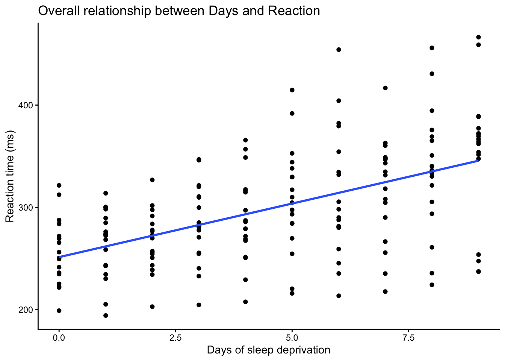
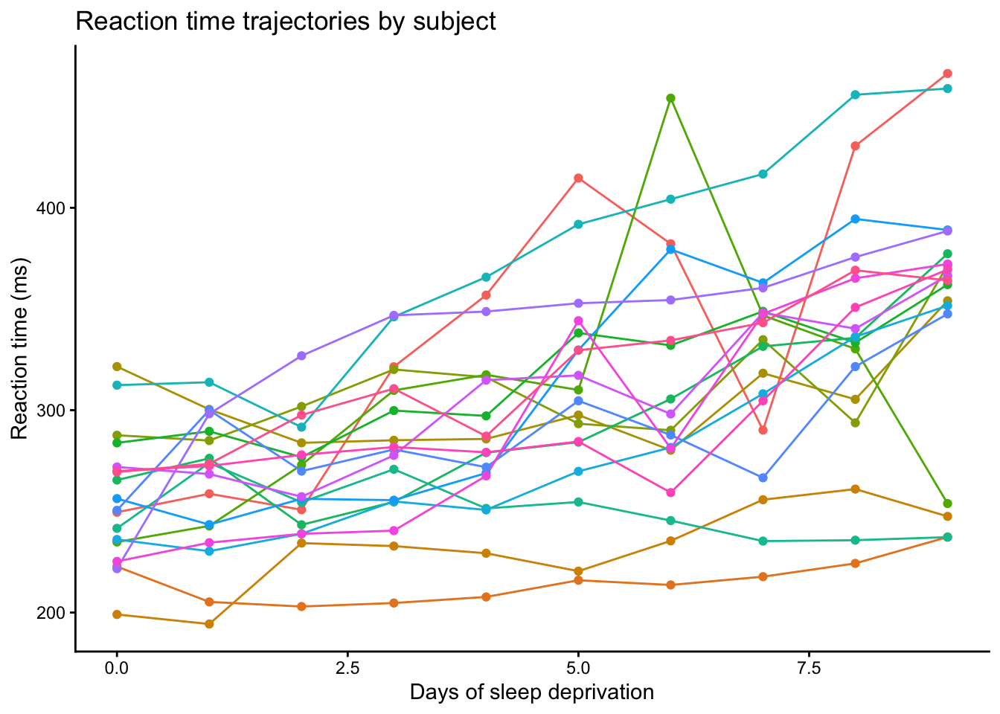
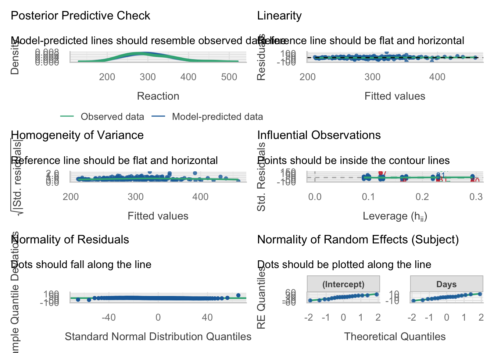

This tutorial provides a simple introduction to mixed linear models using the `sleepstudy` dataset from the `lme4` package. The goal is to show why a standard linear model is limited for repeated-measures data, and how a mixed linear model can better account for subject-level variation.


::: {.cell}

```{.r .cell-code}
library(lme4) #commonly used to fit mixed linear models
library(ggplot2)
library(dplyr)
library(performance)
library(see)
```
:::


## Dataset


::: {.cell}

```{.r .cell-code}
data("sleepstudy") #for a detailed explanation of sleepstudy dataset use this: help("sleepstudy")

head(sleepstudy) #view the first few rows of the dataset
```

::: {.cell-output .cell-output-stdout}

```
  Reaction Days Subject
1 249.5600    0     308
2 258.7047    1     308
3 250.8006    2     308
4 321.4398    3     308
5 356.8519    4     308
6 414.6901    5     308
```


:::

```{.r .cell-code}
str(sleepstudy)
```

::: {.cell-output .cell-output-stdout}

```
'data.frame':	180 obs. of  3 variables:
 $ Reaction: num  250 259 251 321 357 ...
 $ Days    : num  0 1 2 3 4 5 6 7 8 9 ...
 $ Subject : Factor w/ 18 levels "308","309","310",..: 1 1 1 1 1 1 1 1 1 1 ...
```


:::
:::


The `sleepstudy` dataset comes from a sleep deprivation study and contains reaction time measurements collected from subjects over multiple days. In this dataset, the outcome variable is `Reaction`, which represents the average reaction time in milliseconds. The variable `Days` indicates the number of study days, and `Subject` identifies the participant from whome the measurement was taken.

This dataset is a data frame with 180 observations, and 3 variables. `Reaction` and `Days` are numeric, while `Subject` is a factor with 18 levels. Since 180 observations are spread across 18 subjects, each subject contributes multiple measurements over time.

Before fitting any models, let's first visualize the data.


::: {.cell}

```{.r .cell-code}
ggplot(sleepstudy, aes(x = Days, y = Reaction)) +
  geom_point() +
  geom_smooth(method = "lm", se = FALSE) +
  labs(title = "Overall relationship between Days and Reaction",
       x = "Days of sleep deprivation",
       y = "Reaction time (ms)") +
  theme_classic()
```

::: {.cell-output-display}
{width=672}
:::
:::


The above plot shows the overall relationship between days of sleep deprivation and reaction time. Overall, reaction time tends to increase as the number of days increases, suggesting that sleep deprivation may be associated with slower responses. If we looked only at this figure, a simple linear model might seem like a reasonable starting point.

However, this overall plot does not show that the observations come from repeated measurements within the same subjects. To better examine the structure of the data, it is helpful to look at the trajectories for each subject separately.


::: {.cell}

```{.r .cell-code}
ggplot(sleepstudy, aes(x = Days, y = Reaction, group = Subject, color = Subject)) +
  geom_line() +
  geom_point() +
  labs(title = "Reaction time trajectories by subject",
       x = "Days of sleep deprivation",
       y = "Reaction time (ms)") +
  theme_classic() +
  theme(legend.position = "none")
```

::: {.cell-output-display}
{width=672}
:::
:::


The second plot makes the repeated-measures structure much clearer. Each subject contributes multiple observations over time, so the data points are not independent. It also appears that subjects differ in their baseline reaction times, and that some subjects may change more quickly over time than others. In other words, the subject-specific trajectories suggest possible differences in both intercepts and slopes across subjects.

These visual patterns suggest that subject-level variation should be considered when modeling the data. However, plots alone are not enough to determine the most appropriate model. As a statistical starting point, we will first fit a simple linear model, and then use that as a baseline for understanding why a mixed linear model may be more suitable for these repeated-measures data.

## A Simple Linear Model

The simple linear model below treats `Days` as a predictor of `Reaction` and ignores the repeated-measures structure of the data.


::: {.cell}

```{.r .cell-code}
lm1 <- lm(Reaction ~ Days, data = sleepstudy)
summary(lm1)
```

::: {.cell-output .cell-output-stdout}

```

Call:
lm(formula = Reaction ~ Days, data = sleepstudy)

Residuals:
     Min       1Q   Median       3Q      Max 
-110.848  -27.483    1.546   26.142  139.953 

Coefficients:
            Estimate Std. Error t value Pr(>|t|)    
(Intercept)  251.405      6.610  38.033  < 2e-16 ***
Days          10.467      1.238   8.454 9.89e-15 ***
---
Signif. codes:  0 '***' 0.001 '**' 0.01 '*' 0.05 '.' 0.1 ' ' 1

Residual standard error: 47.71 on 178 degrees of freedom
Multiple R-squared:  0.2865,	Adjusted R-squared:  0.2825 
F-statistic: 71.46 on 1 and 178 DF,  p-value: 9.894e-15
```


:::
:::


In the output, the estimated intercept is 251.41, meaning that the predicted reaction time at day 0 is about 251 ms. The estimated coefficient for `Days` is 10.47, suggesting that reaction time increases by about 10.47 ms for each additional day of sleep deprivation.

The model also gives an $R^2$ of 0.2865 (adjusted $R^2$ = 0.2825), meaning that `Days` alone explains about 28% of the variation in reaction time. This suggests that although there is a clear overall time trend, much of the variability remains unexplained. Some of this unexplained variation may reflect differences between subjects, such as different baseline reaction times or different rates of change over time.

However, this simple linear model assumes that all 180 observations are independent. As shown earlier, the dataset contains repeated measurements from only 18 subjects, so this assumption is unlikely to hold. For that reason, the simple linear model may not be the most appropriate model for these data; a **mixed linear model** extends the linear model by allowing us to model both the overall population-level trend and the subject-level variation in the data.

## Mixed Linear Models (MLM)

A mixed linear model is a regression model that includes both fixed effects and random effects. Like a standard linear model, it can estimate the average relationship between a predictor and an outcome. However, it also allows observations from the same subject to be related to one another by introducing subject-specific effects.

- **Fixed effects** describe the average relationship for the population as a whole. In this example, the effect of `Days` is a fixed effect because we want to estimate the overall change in reaction time as days of sleep deprivation increase.

- **Random effects** describe how individual subjects vary around that overall trend. They allow the model to account for subject-specific differences that are NOT captured by a standard linear model. Two common types of random effects are random intercepts and random slopes:

  - A **random intercept** allows each subject to have their own baseline reaction time. This means that some subjects may start with faster or slower reaction times than others.

  - A **random slope** allows the effect of `Days` to vary across subjects. This means that some subjects may show a steeper increase in reaction time over time, while others may change more gradually.

In the `sleepstudy` dataset, it seems reasonable to consider both a random intercept and a random slope for `Subject`. The earlier plots suggest that subjects differ in their starting reaction times, and they may also differ in how their reaction time changes over days. We will therefore begin with a random-intercept model and then extend it to a model that also includes a random slope.

### MLM with a random intercept

We first fit a mixed linear model with a random intercept for `Subject`. This model still estimates the overall effect of `Days` on `Reaction`, but it also allows each subject to have their own baseline reaction time.


::: {.cell}

```{.r .cell-code}
mlm1 <- lmer(Reaction ~ Days + (1 | Subject), data = sleepstudy)
summary(mlm1)
```

::: {.cell-output .cell-output-stdout}

```
Linear mixed model fit by REML ['lmerMod']
Formula: Reaction ~ Days + (1 | Subject)
   Data: sleepstudy

REML criterion at convergence: 1786.5

Scaled residuals: 
    Min      1Q  Median      3Q     Max 
-3.2257 -0.5529  0.0109  0.5188  4.2506 

Random effects:
 Groups   Name        Variance Std.Dev.
 Subject  (Intercept) 1378.2   37.12   
 Residual              960.5   30.99   
Number of obs: 180, groups:  Subject, 18

Fixed effects:
            Estimate Std. Error t value
(Intercept) 251.4051     9.7467   25.79
Days         10.4673     0.8042   13.02

Correlation of Fixed Effects:
     (Intr)
Days -0.371
```


:::
:::


In the model formula `Reaction ~ Days + (1 | Subject)`, `Days` is included as a fixed effect, meaning that we estimate an average effect of days of sleep deprivation across all subjects. The term `(1 | Subject)` specifies a random intercept for each subject, meaning that each subject is allowed to have their own starting level of reaction time.

The fixed-effects results show that the estimated intercept is 251.41, which is the predicted reaction time when `Days = 0`. The estimated coefficient for `Days` is 10.47, suggesting that reaction time increases by about 10.47 ms for each additional day of sleep deprivation, on average.

The random-effects output shows that the variance of the subject-specific intercepts, suggesting that subjects differ meaningfully in their baseline reaction times. In other words, some subjects start the study with faster reaction times, while others start with slower ones. The residual variance represents the remaining variability after accounting for the fixed effect of `Days` and the random intercept for `Subject`.

Although this model assumes that subjects differ in their baseline reaction times, it still assumes that the effect of `Days` is the same for everyone. In other words, all subjects are assumed to follow the same slope over time. However, the earlier subject-level plots suggest that some subjects may change more quickly than others. To account for this, we can fit a model that also includes a random slope for `Days`.

### MLM with both a random intercept and a random slope


::: {.cell}

```{.r .cell-code}
mlm2 <- lmer(Reaction ~ Days + (1 + Days | Subject), data = sleepstudy)
summary(mlm2)
```

::: {.cell-output .cell-output-stdout}

```
Linear mixed model fit by REML ['lmerMod']
Formula: Reaction ~ Days + (1 + Days | Subject)
   Data: sleepstudy

REML criterion at convergence: 1743.6

Scaled residuals: 
    Min      1Q  Median      3Q     Max 
-3.9536 -0.4634  0.0231  0.4634  5.1793 

Random effects:
 Groups   Name        Variance Std.Dev. Corr 
 Subject  (Intercept) 612.10   24.741        
          Days         35.07    5.922   0.07 
 Residual             654.94   25.592        
Number of obs: 180, groups:  Subject, 18

Fixed effects:
            Estimate Std. Error t value
(Intercept)  251.405      6.825  36.838
Days          10.467      1.546   6.771

Correlation of Fixed Effects:
     (Intr)
Days -0.138
```


:::
:::


In the model formula `Reaction ~ Days + (1 + Days | Subject)`, `Days` is still included as a fixed effect like before, where the term `(1 + Days | Subject)` allows each subject to have both their own intercept and their own slope for `Days`. This means that subjects can differ not only in their baseline reaction times, but also in how their reaction times change over time.

The fixed-effects results are very similar to those from the previous models, while the random-effects output now includes variability in both intercepts and slopes. The variance of the random intercept still indicates that subjects differ in their baseline reaction times, while the variance of the random slope for `Days` suggests the effect of `Days` varies across subjects. In other words, some subjects show a steeper increase in reaction time over time than others.

The correlation between the random intercept and random slope is 0.07, which is close to zero. This suggests that, in this model, baseline reaction time and rate of change over time are not strongly related. The residual variance still represents the remaining variation after accounting for both the fixed effect of `Days` and the subject-specific intercepts and slopes.

Compared with the random-intercept model, this model is more flexible because it allows subjects to differ not only in where they start, but also in how they change over time. This matches the earlier plots, which suggested that the trajectories were not identical across subjects.

After fitting a mixed linear model, it is important to check whether the model assumptions are reasonably met. As with a standard linear model, we want to examine whether the residuals show any strong patterns, whether the variance appears roughly constant, and whether the residuals are approximately normally distributed.

## Model Diagnostics

The `check_model()` function provides a quick set of diagnostic plots for the fitted mixed model, including residual checks and normality assessments.


::: {.cell}

```{.r .cell-code}
check_model(mlm2)
```

::: {.cell-output-display}
{width=672}
:::
:::


The **posterior predictive check** suggests that the model-predicted distribution is broadly similar to the observed distribution of reaction times. This indicates that the model captures the overall shape of the data reasonably well.

The **linearity** plot does not show a strong systematic pattern, and the smoothed reference line is fairly close to horizontal. This suggests that the assumption of a roughly linear relationship is reasonable.

The **homogeneity of variance** plot shows some variation in spread across fitted values, but there is no strong funnel-shaped pattern. This suggests that heteroscedasticity is not a major concern, although the variance may not be perfectly constant.

The **influential observations** plot suggests that most points fall within the expected range, although a few observations appear to stand out more than others. These points may have some influence on the fitted model, so they should be noted when interpreting the results.

The **normality of residual** plot suggests that most residuals follow the expected pattern reasonably well, although there are some deviations in the tails. This indicates that the residuals are approximately normal, but not perfectly so.

The **normality of random effects** (Q-Q plots for the random effects) suggest that the random intercepts and random slopes are approximately normally distributed, although there is some deviation from the reference line. Overall, the assumption of normal random effects appears reasonable.

Overall, these diagnostic plots suggest that the mixed linear model with a random slope provides a reasonable fit to the data. The assumptions of linearity and approximate normality appear broadly acceptable, and there is no strong evidence of severe heteroscedasticity. However, a few observations may be somewhat influential, and there are mild deviations from normality in the tails. These issues do not appear severe enough to invalidate the model, but they should be kept in mind when interpreting the results.

## Summary

In this tutorial, we used the `sleepstudy` dataset to introduce mixed linear models for repeated-measures data. We first explored the structure of the dataset and saw that it contained repeated reaction time measurements from the same subjects across multiple days of sleep deprivation.

We began with a simple linear model, which showed an overall positive relationship between `Days` and `Reaction`. However, the earlier plots made it clear that the observations were clustered within subjects, and that subjects appeared to differ both in their baseline reaction times and in how their reaction times changed over time.

We then fit two mixed linear models. The first model included a random intercept for `Subject`, which allowed each subject to have their own baseline reaction time. The second model included both a random intercept and a random slope for `Days`, which allowed subjects to differ not only in where they started, but also in how their reaction times changed over time.

Overall, the mixed-model results suggested that reaction time increased as days of sleep deprivation increased, while also accounting for important subject-level variation. The diagnostic plots indicated that the final model fit the data reasonably well, with no major violations of model assumptions.

This example shows why mixed linear models are useful for repeated-measures data: they allow us to estimate an overall population-level trend while also accounting for the fact that observations from the same subject are not independent.

## Session Info


::: {.cell}

```{.r .cell-code}
sessionInfo()
```

::: {.cell-output .cell-output-stdout}

```
R version 4.6.0 (2026-04-24)
Platform: aarch64-apple-darwin23
Running under: macOS Tahoe 26.5

Matrix products: default
BLAS:   /Library/Frameworks/R.framework/Versions/4.6/Resources/lib/libRblas.0.dylib 
LAPACK: /Library/Frameworks/R.framework/Versions/4.6/Resources/lib/libRlapack.dylib;  LAPACK version 3.12.1

locale:
[1] en_US.UTF-8/en_US.UTF-8/en_US.UTF-8/C/en_US.UTF-8/en_US.UTF-8

time zone: America/Detroit
tzcode source: internal

attached base packages:
[1] stats     graphics  grDevices utils     datasets  methods   base     

other attached packages:
[1] see_0.13.0         performance_0.16.0 dplyr_1.2.1        ggplot2_4.0.3     
[5] lme4_2.0-1         Matrix_1.7-5      

loaded via a namespace (and not attached):
 [1] gtable_0.3.6       jsonlite_2.0.0     compiler_4.6.0     tidyselect_1.2.1  
 [5] Rcpp_1.1.1-1.1     splines_4.6.0      scales_1.4.0       boot_1.3-32       
 [9] yaml_2.3.12        fastmap_1.2.0      lattice_0.22-9     R6_2.6.1          
[13] patchwork_1.3.2    labeling_0.4.3     generics_0.1.4     knitr_1.51        
[17] rbibutils_2.4.1    MASS_7.3-65        tibble_3.3.1       nloptr_2.2.1      
[21] insight_1.5.0      minqa_1.2.8        pillar_1.11.1      RColorBrewer_1.1-3
[25] rlang_1.2.0        xfun_0.57          parameters_0.29.0  S7_0.2.2          
[29] datawizard_1.3.1   cli_3.6.6          mgcv_1.9-4         withr_3.0.2       
[33] magrittr_2.0.5     Rdpack_2.6.6       digest_0.6.39      grid_4.6.0        
[37] lifecycle_1.0.5    nlme_3.1-169       reformulas_0.4.4   vctrs_0.7.3       
[41] evaluate_1.0.5     glue_1.8.1         farver_2.1.2       bayestestR_0.17.0 
[45] rmarkdown_2.31     pkgconfig_2.0.3    tools_4.6.0        htmltools_0.5.9   
```


:::
:::

