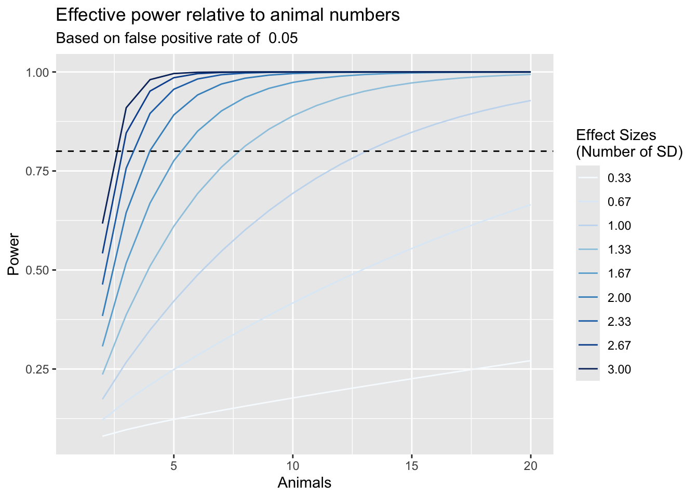

Commonly we want to know how to design our experiments (*a priori*), or how estimate how big of an effect we could have seen (*a posteriori*). We use two different methods for doing these kinds of analyses. One is using the [pwr package](https://github.com/heliosdrm/pwr) in R. Alternatively sometimes we use [G\*Power](https://www.psychologie.hhu.de/arbeitsgruppen/allgemeine-psychologie-und-arbeitspsychologie/gpower.html), a standalone software with somewhat more functionality. Here we will focus on pwr, which is sufficient for most of our needs.

# Some Definitions

Effect Size

:   The effect you expect to see, generally given as Cohen's *d* which is calculated as expected difference between groups divided by the standard deviation $d=\frac{mean(group1)-mean(group2)}{sd}$. If you are asking for the correlation between two parameters it is related to interested in the correlation coefficient rather than the difference between groups (r), you can use this formula $d= \frac{2r}{\sqrt{1 - r^2}}$

Power

:   The likelihood of being able to observe the effect size (if such an effect exists). Generally for prospective design purposes we use a power of 0.8. This is the same as one minus the false negative rate (FNR; the likelihood that an effect exists, but we cannot detect it, sometimes refered to as $\beta$), so $Power = 1-FNR$. Therefore conventionally $\beta=0.2$. Therefore retrospectively the power says that for some particular effect size, n, and false positive rate, how likely we were to observe that effect.

False Positive Rate

:   The likelihood that we think there is a difference, when there is none, conventionally set as $\alpha=0.05$.

Sample Size

:   The number used, be it number of participants, number of experimntal animals. **Not** the number of technical replicates

These four parameters are related to each other such that if you know three of them, you can calculate the fourth. Some examples:

| Missing Value | Use Case                                 |
|---------------|------------------------------------------|
| n             | Calculate how many needed in a group     |
| Power         | Calculate likelihood of seeing an effect |
| Effect size   | Calculate detectable difference          |

# Power Analysis


::: {.cell}

```{.r .cell-code}
library(pwr)
#desired effect size in standard deviations
effect.size <- 5 # expected difference in absolute terms
assay.sd <- 3 # the standard deviation of the assay, in the same units as the effect size
effect.size.sd <- effect.size/assay.sd
#desired false positive rate
fpr <- 0.05
#desired power (inverse of false negative rate)
power <- 0.8
#calculate required n
required.animals <- pwr.t.test(d=effect.size.sd,
                               power=power,
                               sig.level=fpr,
                               alternative="greater",
                               type="two.sample")$n
```
:::


The assumptions set in this analysis are:

-   The desired effect size is 5. This is what we want to power our analysis to be able to detect.
-   The standard deviation of the measurement is 3, in the same units as the effect size.
-   Therefore Cohen's *d* is 1.6666667 or the number of standard deviations we want to be able to detect.
-   The acceptable false positive rate is 0.05. This is the percent chance that we observe something that is not actually true.
-   The acceptable false negative rate is 0.2. This is the percent chance that we miss something that is actually true.
-   The power of our analysis is set at 0.8.

## Calculate Number of Animals

At a standard power of 0.8 with a false positive rate of 0.05 and a desired effect size of a 5 difference in percent fat mass we would need **5.283492** animals in each group.

## Calculate Detectable Effect Size


::: {.cell}

```{.r .cell-code}
required.animals.effect <- round(required.animals)
effective.d <- pwr.t.test(power=power,
                               n=required.animals.effect,
                               sig.level=fpr,
                               alternative="greater",
                               type="two.sample")$d
```
:::


Based on the design above we should expect to detect an effect size of 1.7245893 standard deviations with 0.8 power, 5 animals and a FPR of 0.05.

## Calculate Effective Power


::: {.cell}

```{.r .cell-code}
required.animals.power <- round(required.animals)
effective.power <- pwr.t.test(d=effect.size.sd,
                               n=required.animals.power,
                               sig.level=fpr,
                               alternative="greater",
                               type="two.sample")$power
```
:::


Based on the design above we have a 77.5993902% chance of seeing a difference of 1.6666667 with 5 animals and a FPR of 0.05.

The plot below shows how likely we are to detect a difference (the power) as we vary the number of animals (x-axis) and the desired effect size.


::: {.cell}

```{.r .cell-code}
animals <- seq(1:20) #animal range to test
effect.sizes <- seq(1,9,by=1) # effect size range to test
power.table <- expand.grid(animals=animals,effect.sizes=effect.sizes)
power.table$effect.sizes.sd <- power.table$effect.sizes/assay.sd

for (effect.size.sd in power.table$effect.sizes.sd){
for (n.test in power.table$animals){
  power.table[power.table$animals==n.test&power.table$effect.sizes.sd==effect.size.sd,'power'] <- 
    pwr.t.test(d=effect.size.sd,
               n=n.test,
               sig.level=fpr,
               alternative="greater",
               type="two.sample")$power
}
}


library(ggplot2)
library(RColorBrewer)

power.table$effect.sizes.sd <- as.factor(format(round(power.table$effect.sizes.sd,2),nsmall=2))
p <- ggplot(power.table, aes(y=power,x=animals))
p + geom_line(aes(col=effect.sizes.sd)) +
  labs(y="Power",
       x="Animals",
       title="Effective power relative to animal numbers",
       subtitle=paste("Based on false positive rate of ", fpr)) +
  geom_hline(yintercept=0.8, lty=2) + 
  scale_colour_manual("Effect Sizes \n(Number of SD)", values=brewer.pal(10,'Blues'))
```

::: {.cell-output-display}
{width=672}
:::
:::


# Session Information


::: {.cell}

```{.r .cell-code}
sessionInfo()
```

::: {.cell-output .cell-output-stdout}
```
R version 4.4.1 (2024-06-14)
Platform: x86_64-apple-darwin20
Running under: macOS Monterey 12.7.6

Matrix products: default
BLAS:   /Library/Frameworks/R.framework/Versions/4.4-x86_64/Resources/lib/libRblas.0.dylib 
LAPACK: /Library/Frameworks/R.framework/Versions/4.4-x86_64/Resources/lib/libRlapack.dylib;  LAPACK version 3.12.0

locale:
[1] en_US.UTF-8/en_US.UTF-8/en_US.UTF-8/C/en_US.UTF-8/en_US.UTF-8

time zone: America/Detroit
tzcode source: internal

attached base packages:
[1] stats     graphics  grDevices utils     datasets  methods   base     

other attached packages:
[1] RColorBrewer_1.1-3 ggplot2_3.5.1      pwr_1.3-0         

loaded via a namespace (and not attached):
 [1] vctrs_0.6.5       cli_3.6.3         knitr_1.48        rlang_1.1.4      
 [5] xfun_0.46         generics_0.1.3    jsonlite_1.8.8    labeling_0.4.3   
 [9] glue_1.7.0        colorspace_2.1-1  htmltools_0.5.8.1 scales_1.3.0     
[13] fansi_1.0.6       rmarkdown_2.27    grid_4.4.1        evaluate_0.24.0  
[17] munsell_0.5.1     tibble_3.2.1      fastmap_1.2.0     yaml_2.3.10      
[21] lifecycle_1.0.4   compiler_4.4.1    dplyr_1.1.4       pkgconfig_2.0.3  
[25] farver_2.1.2      digest_0.6.36     R6_2.5.1          tidyselect_1.2.1 
[29] utf8_1.2.4        pillar_1.9.0      magrittr_2.0.3    withr_3.0.0      
[33] tools_4.4.1       gtable_0.3.5     
```
:::
:::
