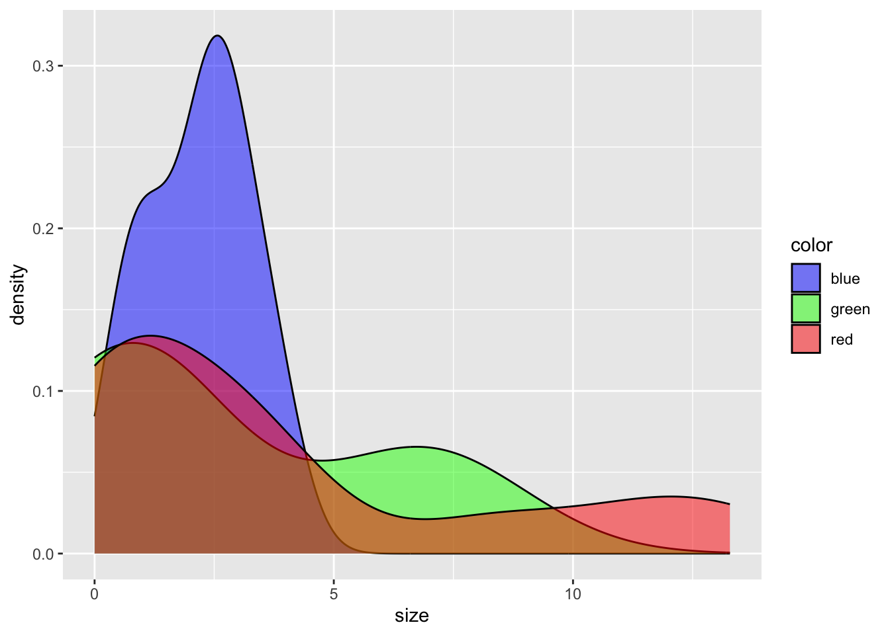
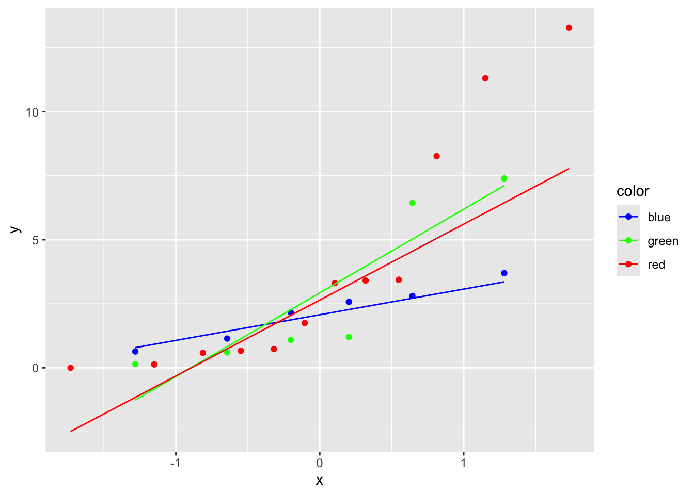

## Explanation of How to Do An ANOVA or Linear Model

Here is some sample data we will use throughout.  In this case there are three colors, 2 shapes and some sizes.  This analysis presumes size is a *continuous independent variable* and shape/color is a *discrete dependent variable* 


::: {.cell}

```{.r .cell-code}
set.seed(45)
balloon.data <- data.frame(color=as.factor(c(rep("green",6), rep("red",12), rep("blue",6))),
                          shape = as.factor(rep(c("square", "circle"),12)),
                          size = rpois(24, lambda=5)*abs(rnorm(24)))
```
:::


## One Way ANOVA

This is used when you have one variable, with either predictor.  That predictor could have several levels.  In this example you have three colors of balloons and are testing the hypothesis that size is affected by balloon color.

I prefer to use the `broom` package to make nice visualizations of the summary tables.


::: {.cell}

```{.r .cell-code}
library(broom) #for tidy
library(dplyr) #for chaining commands
```

::: {.cell-output .cell-output-stderr}

```

Attaching package: 'dplyr'
```


:::

::: {.cell-output .cell-output-stderr}

```
The following objects are masked from 'package:stats':

    filter, lag
```


:::

::: {.cell-output .cell-output-stderr}

```
The following objects are masked from 'package:base':

    intersect, setdiff, setequal, union
```


:::

```{.r .cell-code}
library(knitr) #for kables

#one way anova (two types)
aov(size~color, data=balloon.data) %>% tidy %>% kable(caption="ANOVA testing effects of shape on size")
```

::: {.cell-output-display}


Table: ANOVA testing effects of shape on size

|term      | df|     sumsq|    meansq| statistic|   p.value|
|:---------|--:|---------:|---------:|---------:|---------:|
|color     |  2|  13.24855|  6.624277| 0.4861405| 0.6217469|
|Residuals | 21| 286.15152| 13.626263|        NA|        NA|


:::
:::


### Interpreting a Univariable ANOVA

This is what is konwn as an *omnibus* test, so it is not saying whether there are any specific between-group differences (not testing red vs blue), but instead is testing whether there is a general difference between groups (ballon color matters).  In this case the p-value is 0.6217469 so we would not consider this a significant effect of color on size.

## Two-Way ANOVA

This is used when you have two (or more) potential variables which affect your dependent variable.  This is also known as a *multivariable* regression.  Here are two ways to analyse this data, the first presumes **independence** between shape and color, the second is testing whether there is an **interaction** between shape and color (*e.g*. blue squares are different from what you would expect from something being blue + being a square).  For interactions you can write this as `color*shape` or `color + shape + color:shape`.


::: {.cell}

```{.r .cell-code}
#two way anova, with interaction
aov(size~color+shape, data=balloon.data) %>% tidy %>% kable(caption="2x2 ANOVA testing for effects of color and shape on size")
```

::: {.cell-output-display}


Table: 2x2 ANOVA testing for effects of color and shape on size

|term      | df|     sumsq|    meansq| statistic|   p.value|
|:---------|--:|---------:|---------:|---------:|---------:|
|color     |  2|  13.24855|  6.624277| 0.5010345| 0.6133087|
|shape     |  1|  21.72753| 21.727529| 1.6433856| 0.2145235|
|Residuals | 20| 264.42399| 13.221199|        NA|        NA|


:::

```{.r .cell-code}
#two way anova, without interaction
aov(size~color*shape, data=balloon.data) %>% tidy %>% kable(caption="2x2 ANOVA testing for effects of color and shape on size, including and interaction term")
```

::: {.cell-output-display}


Table: 2x2 ANOVA testing for effects of color and shape on size, including and interaction term

|term        | df|     sumsq|    meansq| statistic|   p.value|
|:-----------|--:|---------:|---------:|---------:|---------:|
|color       |  2|  13.24855|  6.624277| 0.4784560| 0.6273996|
|shape       |  1|  21.72753| 21.727529| 1.5693283| 0.2263358|
|color:shape |  2|  15.21194|  7.605971| 0.5493614| 0.5866966|
|Residuals   | 18| 249.21204| 13.845114|        NA|        NA|


:::
:::


### Interactions

 Our typical practice is to first test for an interaction, then based on whether it is significant (generally $\alpha<0.05$).  If the interaction term is significant then the two main effects are not useful, so just report the interaction term then do a pairwise analysis of each of the groups. 

For a more detailed discussion of interpreting interactions see @nieuwenhuisErroneousAnalysesInteractions2011

### Looking at Individual Factor Contributions

The omnibus ANOVA analysis just says there is some difference between groups but does not specify how the groups differ.  This can be done using the `lm` command.


::: {.cell}

```{.r .cell-code}
lm(size~color, data=balloon.data) %>% 
  tidy %>% 
  kable(caption="2x2 linear model testing for effects of color and shape on size.  This does not include the reference value for color (blue), which instead is included in the intercept")
```

::: {.cell-output-display}


Table: 2x2 linear model testing for effects of color and shape on size.  This does not include the reference value for color (blue), which instead is included in the intercept

|term        |  estimate| std.error| statistic|   p.value|
|:-----------|---------:|---------:|---------:|---------:|
|(Intercept) | 2.1695956|  1.506998| 1.4396802| 0.1646993|
|colorgreen  | 0.6426212|  2.131217| 0.3015278| 0.7659777|
|colorred    | 1.7360938|  1.845688| 0.9406213| 0.3575939|


:::

```{.r .cell-code}
lm(size~color+0, data=balloon.data) %>% 
  tidy %>% 
  kable(caption="2x2 linear model testing for effects of color and shape on size including the reference value")
```

::: {.cell-output-display}


Table: 2x2 linear model testing for effects of color and shape on size including the reference value

|term       | estimate| std.error| statistic|   p.value|
|:----------|--------:|---------:|---------:|---------:|
|colorblue  | 2.169596|  1.506998|  1.439680| 0.1646993|
|colorgreen | 2.812217|  1.506998|  1.866105| 0.0760561|
|colorred   | 3.905689|  1.065609|  3.665219| 0.0014424|


:::
:::


### Assumptions of ANOVA Analyses

Although when group sizes are equal, ANOVA is quite robust to non-normality and non-equal variance, you should test these assumptions.  

#### Testing Normality 

## Check Distribution of Your Data

One way is to test the normality of each group of your data.  First it is best to do this visually, for example with a density plot:


::: {.cell}

```{.r .cell-code}
library(ggplot2)

ggplot(balloon.data,aes(x=size,fill=color)) +
  geom_density(alpha=0.5) +
  scale_fill_manual(values=c('blue','green','red'))
```

::: {.cell-output-display}
{width=672}
:::
:::


Visually you are looking for a nice bell curve (such as blue but not red).

Another useful plot is what is known as a qqplot


::: {.cell}

```{.r .cell-code}
ggplot(balloon.data, aes(sample = size,color=color)) +
  stat_qq() +
  stat_qq_line() +
  scale_color_manual(values=c('blue','green','red'))
```

::: {.cell-output-display}
{width=672}
:::
:::


A normal distribution (such as blue) would have the points near the line, but a non-normal distribution would have values that dont fit the line well (green or red).

### Statistical Methods to Test for Normality


::: {.cell}

```{.r .cell-code}
balloon.data %>%
  group_by(color) %>%
  summarize(Shapiro.Wilk.Test = shapiro.test(size)$p.value) %>% #extracts the p-value from the shapiro wilk tests 
  kable(caption="Shapiro-Wilk tests for normality when grouped by color")
```

::: {.cell-output-display}


Table: Shapiro-Wilk tests for normality when grouped by color

|color | Shapiro.Wilk.Test|
|:-----|-----------------:|
|blue  |         0.8797698|
|green |         0.0311985|
|red   |         0.0096922|


:::

```{.r .cell-code}
balloon.data %>%
  group_by(color,shape) %>% #now with color and shape
  summarize(Shapiro.Wilk.Test = shapiro.test(size)$p.value) %>% #extracts the p-value from the shapiro wilk tests 
  kable(caption="Shapiro-Wilk tests for normality when grouped by color and shape")
```

::: {.cell-output .cell-output-stderr}

```
`summarise()` has grouped output by 'color'. You can override using the
`.groups` argument.
```


:::

::: {.cell-output-display}


Table: Shapiro-Wilk tests for normality when grouped by color and shape

|color |shape  | Shapiro.Wilk.Test|
|:-----|:------|-----------------:|
|blue  |circle |         0.5437592|
|blue  |square |         0.5474969|
|green |circle |         0.1448867|
|green |square |         0.2593481|
|red   |circle |         0.0163393|
|red   |square |         0.1048015|


:::
:::


We interpret this that if $p_{shapiro-wilk}<0.05$ then the data are not normally distributed, which is the case here.  If the data is not normal, you could transform your dependent variable (ie look at log(size) rather than size).  You could also use a non-parametric test such as a Kruskal-Wallis test (for groups) or Mann-Whitney test (for pairs).

The second way to test for normality is to evaluate the residuals of your model for normality.  The residuals are the difference between the model-predicted value and the measured value.  These should be normally ditributed.


::: {.cell}

```{.r .cell-code}
aov(size~color, data=balloon.data) %>% 
  residuals %>% 
  shapiro.test %>%
  tidy %>%
  kable(caption="Shapiro-Wilk test for the residuals of the model.")
```

::: {.cell-output-display}


Table: Shapiro-Wilk test for the residuals of the model.

| statistic|  p.value|method                      |
|---------:|--------:|:---------------------------|
| 0.8707586| 0.005444|Shapiro-Wilk normality test |


:::
:::


## Post-Hoc Tests

If you get a significant result from the omnibus ANOVA, you often will want to do further post-hoc testing to look at pairwise comparisons.  As a general rule, we test the omnibus test first prior to proceeding to pairwise analyses.  There are three main ways to do this:

* Pairwise *t*-Tests (remember to check the assumptions of normality and equal variance when choosing a test)
* Tukey's Honest Significant Difference -- Compares all combinations
* Dunnett's Test -- Compares all values to a control


::: {.cell}

```{.r .cell-code}
#save an anova object
balloon.aov <- aov(size~color,  data=balloon.data)
#can run a Tukey's test on this
TukeyHSD(balloon.aov) %>% 
  tidy %>%
  kable(caption="One method for performing a Tukey's HSD test.")
```

::: {.cell-output-display}


Table: One method for performing a Tukey's HSD test.

|term  |contrast   | null.value|  estimate|  conf.low| conf.high| adj.p.value|
|:-----|:----------|----------:|---------:|---------:|---------:|-----------:|
|color |green-blue |          0| 0.6426212| -4.729262|  6.014504|   0.9512327|
|color |red-blue   |          0| 1.7360938| -2.916094|  6.388281|   0.6213220|
|color |red-green  |          0| 1.0934726| -3.558715|  5.745660|   0.8256367|


:::

```{.r .cell-code}
#this is the same as:
library(multcomp)
```

::: {.cell-output .cell-output-stderr}

```
Loading required package: mvtnorm
```


:::

::: {.cell-output .cell-output-stderr}

```
Loading required package: survival
```


:::

::: {.cell-output .cell-output-stderr}

```
Loading required package: TH.data
```


:::

::: {.cell-output .cell-output-stderr}

```
Loading required package: MASS
```


:::

::: {.cell-output .cell-output-stderr}

```

Attaching package: 'MASS'
```


:::

::: {.cell-output .cell-output-stderr}

```
The following object is masked from 'package:dplyr':

    select
```


:::

::: {.cell-output .cell-output-stderr}

```

Attaching package: 'TH.data'
```


:::

::: {.cell-output .cell-output-stderr}

```
The following object is masked from 'package:MASS':

    geyser
```


:::

```{.r .cell-code}
glht(balloon.aov, linfct=mcp(color="Tukey")) %>% 
  tidy %>% 
  kable(caption="Tukey's HSD tests for baloon color, using glht")
```

::: {.cell-output-display}


Table: Tukey's HSD tests for baloon color, using glht

|term  |contrast     | null.value|  estimate| std.error| statistic| adj.p.value|
|:-----|:------------|----------:|---------:|---------:|---------:|-----------:|
|color |green - blue |          0| 0.6426212|  2.131217| 0.3015278|   0.9509435|
|color |red - blue   |          0| 1.7360938|  1.845688| 0.9406213|   0.6198169|
|color |red - green  |          0| 1.0934726|  1.845688| 0.5924470|   0.8247665|


:::

```{.r .cell-code}
#Can also use glht for Dunnett's tests
#define the control group to what you want to compare to
balloon.data$color <- relevel(balloon.data$color, ref="blue")
#run a dunnett's test
glht(balloon.aov, linfct=mcp(color="Dunnett")) %>% 
  tidy %>% 
  kable(caption="Dunnett's test comparing to blue")
```

::: {.cell-output-display}


Table: Dunnett's test comparing to blue

|term  |contrast     | null.value|  estimate| std.error| statistic| adj.p.value|
|:-----|:------------|----------:|---------:|---------:|---------:|-----------:|
|color |green - blue |          0| 0.6426212|  2.131217| 0.3015278|   0.9324820|
|color |red - blue   |          0| 1.7360938|  1.845688| 0.9406213|   0.5394621|


:::

```{.r .cell-code}
#default is single-step but can manually set FDR adjustment methods
glht(balloon.aov, linfct=mcp(color="Dunnett")) %>% 
  summary(adjusted(type="BH")) %>% 
  tidy %>% 
  kable(caption="Benjamini-Hochberg adjusted dunnett's test for effect of color on size")
```

::: {.cell-output-display}


Table: Benjamini-Hochberg adjusted dunnett's test for effect of color on size

|term  |contrast     | null.value|  estimate| std.error| statistic| adj.p.value|
|:-----|:------------|----------:|---------:|---------:|---------:|-----------:|
|color |green - blue |          0| 0.6426212|  2.131217| 0.3015278|   0.7659777|
|color |red - blue   |          0| 1.7360938|  1.845688| 0.9406213|   0.7151879|


:::

```{.r .cell-code}
glht(balloon.aov, linfct=mcp(color="Dunnett")) %>% 
  summary(adjusted(type="bonferroni")) %>% 
  tidy %>%
  kable(caption="Bonferroni adjusted dunnett's test for effect of color on size")
```

::: {.cell-output-display}


Table: Bonferroni adjusted dunnett's test for effect of color on size

|term  |contrast     | null.value|  estimate| std.error| statistic| adj.p.value|
|:-----|:------------|----------:|---------:|---------:|---------:|-----------:|
|color |green - blue |          0| 0.6426212|  2.131217| 0.3015278|   1.0000000|
|color |red - blue   |          0| 1.7360938|  1.845688| 0.9406213|   0.7151879|


:::
:::


### Pairwise *t*-tests

As with `glht` your post-hoc tests may benefit from adjusting for multiple hypotheses.  Two common methods are Bonferroni (reference is @dunn1961multiple) or @Benjamini1995.


::: {.cell}

```{.r .cell-code}
pairwise.t.test(balloon.data$size, balloon.data$color) %>% tidy %>% kable(caption="Pairwise tests usint color and size")
```

::: {.cell-output-display}


Table: Pairwise tests usint color and size

|group1 |group2 | p.value|
|:------|:------|-------:|
|green  |blue   |       1|
|red    |blue   |       1|
|red    |green  |       1|


:::

```{.r .cell-code}
#default is Holm but can set to whatever you want or none
pairwise.t.test(balloon.data$size, balloon.data$color, p.adjust.method="BH")%>% tidy %>% kable(caption="Pairwise tests usint color and size, p-values adjusted by BH methods")
```

::: {.cell-output-display}


Table: Pairwise tests usint color and size, p-values adjusted by BH methods

|group1 |group2 |   p.value|
|:------|:------|---------:|
|green  |blue   | 0.7659777|
|red    |blue   | 0.7659777|
|red    |green  | 0.7659777|


:::

```{.r .cell-code}
pairwise.t.test(balloon.data$size, balloon.data$color, p.adjust.method="none") %>% tidy %>% kable(caption="Pairwise tests usint color and size, no p-value adjustments")
```

::: {.cell-output-display}


Table: Pairwise tests usint color and size, no p-value adjustments

|group1 |group2 |   p.value|
|:------|:------|---------:|
|green  |blue   | 0.7659777|
|red    |blue   | 0.3575939|
|red    |green  | 0.5598772|


:::
:::


## Session Information


::: {.cell}
::: {.cell-output .cell-output-stdout}

```
R version 4.4.1 (2024-06-14)
Platform: x86_64-apple-darwin20
Running under: macOS Sonoma 14.7

Matrix products: default
BLAS:   /Library/Frameworks/R.framework/Versions/4.4-x86_64/Resources/lib/libRblas.0.dylib 
LAPACK: /Library/Frameworks/R.framework/Versions/4.4-x86_64/Resources/lib/libRlapack.dylib;  LAPACK version 3.12.0

locale:
[1] en_US.UTF-8/en_US.UTF-8/en_US.UTF-8/C/en_US.UTF-8/en_US.UTF-8

time zone: America/Detroit
tzcode source: internal

attached base packages:
[1] stats     graphics  grDevices utils     datasets  methods   base     

other attached packages:
[1] multcomp_1.4-26 TH.data_1.1-2   MASS_7.3-61     survival_3.7-0 
[5] mvtnorm_1.3-1   ggplot2_3.5.1   knitr_1.48      dplyr_1.1.4    
[9] broom_1.0.6    

loaded via a namespace (and not attached):
 [1] Matrix_1.7-0      gtable_0.3.5      jsonlite_1.8.8    compiler_4.4.1   
 [5] tidyselect_1.2.1  stringr_1.5.1     tidyr_1.3.1       splines_4.4.1    
 [9] scales_1.3.0      yaml_2.3.10       fastmap_1.2.0     lattice_0.22-6   
[13] R6_2.5.1          labeling_0.4.3    generics_0.1.3    htmlwidgets_1.6.4
[17] backports_1.5.0   tibble_3.2.1      munsell_0.5.1     pillar_1.9.0     
[21] rlang_1.1.4       utf8_1.2.4        stringi_1.8.4     xfun_0.47        
[25] cli_3.6.3         withr_3.0.1       magrittr_2.0.3    digest_0.6.37    
[29] grid_4.4.1        rstudioapi_0.16.0 sandwich_3.1-1    lifecycle_1.0.4  
[33] vctrs_0.6.5       evaluate_0.24.0   glue_1.7.0        farver_2.1.2     
[37] codetools_0.2-20  zoo_1.8-12        fansi_1.0.6       colorspace_2.1-1 
[41] rmarkdown_2.28    purrr_1.0.2       tools_4.4.1       pkgconfig_2.0.3  
[45] htmltools_0.5.8.1
```


:::
:::


# References

::: {#refs}
:::