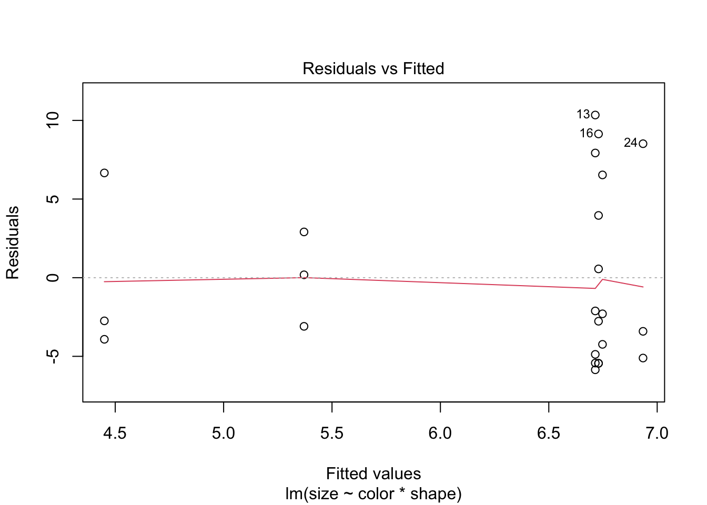

::: {.cell}

```{.r .cell-code}
library(tidyverse)
library(emmeans)
library(car)
```
:::


::: {.cell}

```{.r .cell-code}
set.seed(42)
balloon.data <- data.frame(
  color = c(rep("green", 6), rep("red", 12), rep("blue", 6)),
  shape = rep(c("square", "circle"), 12),
  size  = rpois(24, lambda = 5) * abs(rnorm(24))
) |>
  mutate(
    color = factor(color, levels = c("blue", "green", "red")),
    shape = factor(shape, levels = c("circle", "square"))
  )
```
:::


Setting factor levels explicitly (here `blue` and `circle` are the reference categories) ensures that contrasts have the direction you expect when interpreting results.

# Check Distribution of Your Data

First check the distribution of your groups using a Shapiro-Wilk test for normality, then check the assumption of equal variance with Levene's test.


::: {.cell}

```{.r .cell-code}
with(balloon.data, tapply(size, shape,
                          FUN = function(x) shapiro.test(x)$p.value))
```

::: {.cell-output .cell-output-stdout}

```
    circle     square 
0.03432664 0.03150771 
```


:::

```{.r .cell-code}
with(balloon.data, tapply(size, list(color, shape),
                          FUN = function(x) shapiro.test(x)$p.value))
```

::: {.cell-output .cell-output-stdout}

```
         circle     square
blue  0.2187580 0.89890626
green 0.3246265 0.19338723
red   0.4407332 0.05066155
```


:::
:::


::: {.cell}

```{.r .cell-code}
leveneTest(size ~ color * shape, data = balloon.data)
```

::: {.cell-output .cell-output-stdout}

```
Levene's Test for Homogeneity of Variance (center = median)
      Df F value Pr(>F)
group  5  0.2413 0.9388
      18               
```


:::
:::


If the data are non-normal or variances are unequal, consider transforming the dependent variable (e.g. `log(size)`) or using a non-parametric alternative (see the Assumptions section).

# One-Way ANOVA

Use a one-way ANOVA when you have a single categorical predictor.


::: {.cell}

```{.r .cell-code}
# Two-level factor — equivalent to a two-sample t-test with equal variances
summary(aov(size ~ shape, data = balloon.data))
```

::: {.cell-output .cell-output-stdout}

```
            Df Sum Sq Mean Sq F value Pr(>F)
shape        1    5.7    5.68   0.178  0.677
Residuals   22  700.9   31.86               
```


:::

```{.r .cell-code}
t.test(size ~ shape, data = balloon.data, var.equal = TRUE)
```

::: {.cell-output .cell-output-stdout}

```

	Two Sample t-test

data:  size by shape
t = 0.4222, df = 22, p-value = 0.677
alternative hypothesis: true difference in means between group circle and group square is not equal to 0
95 percent confidence interval:
 -3.805946  5.751716
sample estimates:
mean in group circle mean in group square 
            6.785265             5.812380 
```


:::

```{.r .cell-code}
# Three-level factor
summary(aov(size ~ color, data = balloon.data))
```

::: {.cell-output .cell-output-stdout}

```
            Df Sum Sq Mean Sq F value Pr(>F)
color        2    5.2    2.61   0.078  0.925
Residuals   21  701.4   33.40               
```


:::
:::


## Post-Hoc Comparisons for One-Way ANOVA

A significant omnibus F-test tells you that *some* groups differ, but not which ones. Use `emmeans` [@lenth2016; @emmeans] to compute estimated marginal means and pairwise contrasts with automatic multiplicity adjustment.


::: {.cell}

```{.r .cell-code}
balloon.lm.color <- lm(size ~ color, data = balloon.data)

# Estimated marginal means
emmeans(balloon.lm.color, ~ color)
```

::: {.cell-output .cell-output-stdout}

```
 color emmean   SE df lower.CL upper.CL
 blue    6.15 2.36 21    1.246     11.1
 green   5.60 2.36 21    0.692     10.5
 red     6.72 1.67 21    3.252     10.2

Confidence level used: 0.95 
```


:::

```{.r .cell-code}
# All pairwise contrasts, Tukey-adjusted
emmeans(balloon.lm.color, ~ color) |>
  pairs(adjust = "tukey")
```

::: {.cell-output .cell-output-stdout}

```
 contrast     estimate   SE df t.ratio p.value
 blue - green    0.554 3.34 21   0.166  0.9849
 blue - red     -0.569 2.89 21  -0.197  0.9789
 green - red    -1.123 2.89 21  -0.389  0.9204

P value adjustment: tukey method for comparing a family of 3 estimates 
```


:::
:::


`emmeans` works with any model object (`lm`, `lmer`, `glm`, etc.) and integrates cleanly into tidyverse pipelines, making it more flexible than the older `TukeyHSD()` or `glht()` approaches.

# Two-Way ANOVA

Use a two-way ANOVA when two categorical predictors may jointly affect your outcome.

## Always Fit the Full Interaction Model


::: {.cell}

```{.r .cell-code}
balloon.lm <- lm(size ~ color * shape, data = balloon.data)
anova(balloon.lm)
```

::: {.cell-output .cell-output-stdout}

```
Analysis of Variance Table

Response: size
            Df Sum Sq Mean Sq F value Pr(>F)
color        2   5.22   2.608  0.0681 0.9344
shape        1   5.68   5.679  0.1482 0.7048
color:shape  2   5.91   2.955  0.0771 0.9261
Residuals   18 689.77  38.321               
```


:::
:::


`anova()` gives an F-test for each term, including the `color:shape` interaction. The interaction p-value tests whether the effect of color depends on shape (and vice versa).

### Why Not Drop the Interaction and Refit an Additive Model?

A common but problematic workflow is: *if the interaction p ≥ 0.05, drop the term and refit `size ~ color + shape`*. This should be avoided for three reasons [@mundry2009; @gelman2005]:

1. **Pre-testing inflates Type I error.** Conditioning the reported main-effect inference on the outcome of the interaction test miscalibrates standard errors and p-values in the second model. Type I error rates can drift to 7–10% even when the nominal level is 5%.

2. **Failure to reject ≠ no interaction.** Interaction tests are underpowered relative to main-effect tests — you typically need ~4× the sample size to detect an interaction of equivalent magnitude. Especially with small group sizes, you will almost always fail to reject the interaction null, but that does not mean the interaction is absent.

3. **The additive model assumes additivity.** Fitting `size ~ color + shape` when the true data-generating process includes an interaction underestimates uncertainty and can bias main-effect estimates.

The solution is to **always retain the interaction model and use `emmeans` to extract the quantities of interest** — marginal main effects and, when warranted, simple effects — all from the same fit with one residual variance estimate.

## Cell Means

Cell means are the model-predicted group averages at every combination of the two factors.


::: {.cell}

```{.r .cell-code}
emmeans(balloon.lm, ~ color * shape)
```

::: {.cell-output .cell-output-stdout}

```
 color shape  emmean   SE df lower.CL upper.CL
 blue  circle   6.93 3.57 18   -0.574     14.4
 green circle   6.75 3.57 18   -0.761     14.3
 red   circle   6.73 2.53 18    1.420     12.0
 blue  square   5.37 3.57 18   -2.138     12.9
 green square   4.45 3.57 18   -3.059     12.0
 red   square   6.71 2.53 18    1.405     12.0

Confidence level used: 0.95 
```


:::
:::


## Marginal Main Effects

Marginal main effects answer: *what is the average effect of color, averaging across all shapes?* These should always be reported alongside the interaction test.


::: {.cell}

```{.r .cell-code}
# Average effect of color (averaged over both shapes)
emmeans(balloon.lm, ~ color) |>
  pairs(adjust = "tukey")
```

::: {.cell-output .cell-output-stdout}

```
 contrast     estimate   SE df t.ratio p.value
 blue - green    0.554 3.57 18   0.155  0.9869
 blue - red     -0.569 3.10 18  -0.184  0.9816
 green - red    -1.123 3.10 18  -0.363  0.9303

Results are averaged over the levels of: shape 
P value adjustment: tukey method for comparing a family of 3 estimates 
```


:::

```{.r .cell-code}
# Average effect of shape (averaged over all colors)
emmeans(balloon.lm, ~ shape) |>
  pairs(adjust = "tukey")
```

::: {.cell-output .cell-output-stdout}

```
 contrast        estimate   SE df t.ratio p.value
 circle - square     1.29 2.66 18   0.485  0.6335

Results are averaged over the levels of: color 
```


:::
:::


These contrasts come from the same interaction model — `emmeans` computes them by averaging the cell means over the levels of the other factor. They represent the *average* simple effect, without assuming the effect is constant across levels of the other factor.

## Simple Effects

Simple effects answer: *what is the effect of color within each level of shape separately?* Report these when the interaction term is large or scientifically meaningful.


::: {.cell}

```{.r .cell-code}
# Effect of color within each shape
emmeans(balloon.lm, ~ color | shape) |>
  pairs(adjust = "tukey")
```

::: {.cell-output .cell-output-stdout}

```
shape = circle:
 contrast     estimate   SE df t.ratio p.value
 blue - green   0.1870 5.05 18   0.037  0.9992
 blue - red     0.2053 4.38 18   0.047  0.9988
 green - red    0.0183 4.38 18   0.004  1.0000

shape = square:
 contrast     estimate   SE df t.ratio p.value
 blue - green   0.9210 5.05 18   0.182  0.9819
 blue - red    -1.3435 4.38 18  -0.307  0.9495
 green - red   -2.2645 4.38 18  -0.517  0.8639

P value adjustment: tukey method for comparing a family of 3 estimates 
```


:::

```{.r .cell-code}
# Effect of shape within each color
emmeans(balloon.lm, ~ shape | color) |>
  pairs(adjust = "tukey")
```

::: {.cell-output .cell-output-stdout}

```
color = blue:
 contrast        estimate   SE df t.ratio p.value
 circle - square    1.564 5.05 18   0.309  0.7606

color = green:
 contrast        estimate   SE df t.ratio p.value
 circle - square    2.298 5.05 18   0.455  0.6548

color = red:
 contrast        estimate   SE df t.ratio p.value
 circle - square    0.015 3.57 18   0.004  0.9967
```


:::
:::


## What to Report

| Quantity | Question answered | Code |
|---|---|---|
| Interaction F-test | Do effects combine non-additively? | `anova(balloon.lm)` |
| Cell EMMs | Predicted mean at each group combination | `emmeans(fit, ~ color * shape)` |
| Marginal main effects | Average effect of A across levels of B | `emmeans(fit, ~ A) |> pairs()` |
| Simple effects | Effect of A within each level of B | `emmeans(fit, ~ A | B) |> pairs()` |

Always report the interaction test and marginal main effects. If the interaction is large or scientifically meaningful, additionally report simple effects. Use the same model throughout — no refitting.

## Multiple Testing Across Many Outcomes

If you test the same design across many outcomes (e.g. multiple genes or proteins), adjust p-values across outcomes using the Benjamini-Hochberg false discovery rate to control the proportion of false positives:


::: {.cell}

```{.r .cell-code}
# Example: collect contrast p-values from many outcomes then adjust together
results |>
  mutate(p.adj = p.adjust(p.value, method = "BH"))
```
:::


# Assumptions of ANOVA Analyses

Although ANOVA is fairly robust to non-normality when group sizes are equal, the assumptions should be checked.


::: {.cell}

```{.r .cell-code}
# Residual normality
shapiro.test(residuals(balloon.lm))
```

::: {.cell-output .cell-output-stdout}

```

	Shapiro-Wilk normality test

data:  residuals(balloon.lm)
W = 0.85559, p-value = 0.002781
```


:::

```{.r .cell-code}
# Fitted vs. residuals plot to check homoscedasticity
plot(balloon.lm, which = 1)
```

::: {.cell-output-display}
{width=672}
:::
:::


If data are non-normal, consider transforming the dependent variable (e.g. `log(size)`). For one-way designs a non-parametric Kruskal-Wallis test is also available, though it does not extend naturally to factorial designs.


::: {.cell}

```{.r .cell-code}
kruskal.test(size ~ color, data = balloon.data)
```

::: {.cell-output .cell-output-stdout}

```

	Kruskal-Wallis rank sum test

data:  size by color
Kruskal-Wallis chi-squared = 0.24, df = 2, p-value = 0.8869
```


:::
:::


# References

::: {#refs}
:::

# Session Information


::: {.cell}
::: {.cell-output .cell-output-stdout}

```
R version 4.5.3 (2026-03-11)
Platform: aarch64-apple-darwin20
Running under: macOS Tahoe 26.4.1

Matrix products: default
BLAS:   /Library/Frameworks/R.framework/Versions/4.5-arm64/Resources/lib/libRblas.0.dylib 
LAPACK: /Library/Frameworks/R.framework/Versions/4.5-arm64/Resources/lib/libRlapack.dylib;  LAPACK version 3.12.1

locale:
[1] en_US.UTF-8/en_US.UTF-8/en_US.UTF-8/C/en_US.UTF-8/en_US.UTF-8

time zone: America/Detroit
tzcode source: internal

attached base packages:
[1] stats     graphics  grDevices utils     datasets  methods   base     

other attached packages:
 [1] car_3.1-3       carData_3.0-5   emmeans_2.0.1   lubridate_1.9.4
 [5] forcats_1.0.1   stringr_1.6.0   dplyr_1.1.4     purrr_1.2.1    
 [9] readr_2.1.6     tidyr_1.3.2     tibble_3.3.1    ggplot2_4.0.1  
[13] tidyverse_2.0.0

loaded via a namespace (and not attached):
 [1] sandwich_3.1-1     generics_0.1.4     stringi_1.8.7      lattice_0.22-9    
 [5] hms_1.1.4          digest_0.6.39      magrittr_2.0.4     evaluate_1.0.5    
 [9] grid_4.5.3         timechange_0.3.0   estimability_1.5.1 RColorBrewer_1.1-3
[13] mvtnorm_1.3-3      fastmap_1.2.0      Matrix_1.7-4       jsonlite_2.0.0    
[17] Formula_1.2-5      survival_3.8-6     multcomp_1.4-29    scales_1.4.0      
[21] TH.data_1.1-5      codetools_0.2-20   abind_1.4-8        cli_3.6.5         
[25] rlang_1.1.7        splines_4.5.3      withr_3.0.2        yaml_2.3.12       
[29] otel_0.2.0         tools_4.5.3        tzdb_0.5.0         coda_0.19-4.1     
[33] vctrs_0.6.5        R6_2.6.1           zoo_1.8-15         lifecycle_1.0.5   
[37] htmlwidgets_1.6.4  MASS_7.3-65        pkgconfig_2.0.3    pillar_1.11.1     
[41] gtable_0.3.6       glue_1.8.0         xfun_0.55          tidyselect_1.2.1  
[45] rstudioapi_0.17.1  knitr_1.51         dichromat_2.0-0.1  xtable_1.8-4      
[49] farver_2.1.2       htmltools_0.5.9    rmarkdown_2.30     compiler_4.5.3    
[53] S7_0.2.1          
```


:::
:::

