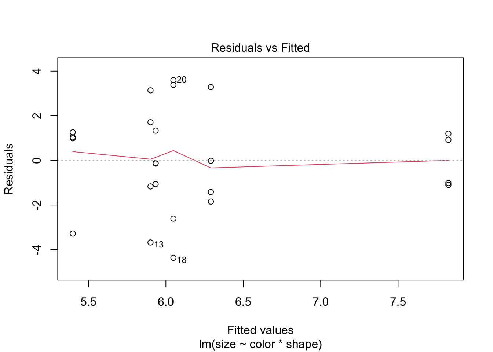

::: {.cell}

```{.r .cell-code}
library(tidyverse)
library(emmeans)
library(car)
library(broom)
library(knitr)
```
:::


::: {.cell}

```{.r .cell-code}
set.seed(42)
balloon.data <- data.frame(
  color = rep(c("blue", "green", "red"), each = 8),
  shape = rep(c("circle", "square"), 12),
  size  = c(rnorm(8, mean = 6, sd = 2),
            rnorm(8, mean = 5, sd = 2),
            rnorm(8, mean = 7, sd = 2))
) |>
  mutate(
    color = factor(color, levels = c("blue", "green", "red")),
    shape = factor(shape, levels = c("circle", "square"))
  )
```
:::


Setting factor levels explicitly (here `blue` and `circle` are the reference categories) ensures that contrasts have the direction you expect when interpreting results. The design is balanced — 8 observations per color — which simplifies the sums-of-squares decomposition (see the Two-Way ANOVA section).

# Check Distribution of Your Data

Before fitting models, screen for gross departures from normality using Shapiro-Wilk tests and check the assumption of equal variance with Levene's test.

**Important caveat on power:** with small group sizes (n = 6–8), these pre-screening tests have very low statistical power — a non-significant result does not guarantee normality or equal variance. The more reliable check is a Shapiro-Wilk test on the model *residuals* after fitting, which pools information across all groups and is what ANOVA actually assumes. See the Assumptions section for that test. The cell-by-cell checks here are only a rough initial screen.


::: {.cell}

```{.r .cell-code}
balloon.data |>
  group_by(shape) |>
  summarise(
    W       = shapiro.test(size)$statistic,
    p.value = shapiro.test(size)$p.value,
    .groups = "drop"
  ) |>
  kable(digits = 3, caption = "Shapiro-Wilk test by shape")
```

::: {.cell-output-display}


Table: Shapiro-Wilk test by shape

|shape  |     W| p.value|
|:------|-----:|-------:|
|circle | 0.874|   0.073|
|square | 0.937|   0.461|


:::
:::


::: {.cell}

```{.r .cell-code}
balloon.data |>
  group_by(color, shape) |>
  summarise(
    W       = shapiro.test(size)$statistic,
    p.value = shapiro.test(size)$p.value,
    .groups = "drop"
  ) |>
  kable(digits = 3, caption = "Shapiro-Wilk test by color and shape")
```

::: {.cell-output-display}


Table: Shapiro-Wilk test by color and shape

|color |shape  |     W| p.value|
|:-----|:------|-----:|-------:|
|blue  |circle | 0.799|   0.101|
|blue  |square | 0.926|   0.569|
|green |circle | 0.964|   0.802|
|green |square | 0.872|   0.307|
|red   |circle | 0.679|   0.007|
|red   |square | 0.832|   0.174|


:::
:::


::: {.cell}

```{.r .cell-code}
leveneTest(size ~ color * shape, data = balloon.data) |>
  tidy() |>
  kable(digits = 3, caption = "Levene's test for homogeneity of variance")
```

::: {.cell-output-display}


Table: Levene's test for homogeneity of variance

| statistic| p.value| df| df.residual|
|---------:|-------:|--:|-----------:|
|     2.794|   0.049|  5|          18|


:::
:::


If the data are non-normal or variances are unequal, consider transforming the dependent variable (e.g. `log(size)`) or using a non-parametric alternative (see the Assumptions section).

# One-Way ANOVA

Use a one-way ANOVA when you have a single categorical predictor.


::: {.cell}

```{.r .cell-code}
# Two-level factor — equivalent to a two-sample t-test with equal variances
aov(size ~ shape, data = balloon.data) |> 
  tidy() |>
  kable(caption= "One-way ANOVA with two levels of shape")
```

::: {.cell-output-display}


Table: One-way ANOVA with two levels of shape

|term      | df|       sumsq|    meansq| statistic|   p.value|
|:---------|--:|-----------:|---------:|---------:|---------:|
|shape     |  1|   0.4829225| 0.4829225| 0.0822025| 0.7770174|
|Residuals | 22| 129.2453851| 5.8747902|        NA|        NA|


:::

```{.r .cell-code}
t.test(size ~ shape, data = balloon.data, var.equal = TRUE) |>
  tidy() |>
  kable(digits = 3, caption = "Two-sample t-test (equal variances)")
```

::: {.cell-output-display}


Table: Two-sample t-test (equal variances)

| estimate| estimate1| estimate2| statistic| p.value| parameter| conf.low| conf.high|method            |alternative |
|--------:|---------:|---------:|---------:|-------:|---------:|--------:|---------:|:-----------------|:-----------|
|    0.284|     6.375|     6.091|     0.287|   0.777|        22|   -1.768|     2.336|Two Sample t-test |two.sided   |


:::

```{.r .cell-code}
# Three-level factor
aov(size ~ color, data = balloon.data) |>
  tidy() |>
  kable(digits = 3, caption = "One-way ANOVA with three levels of color")
```

::: {.cell-output-display}


Table: One-way ANOVA with three levels of color

|term      | df|   sumsq| meansq| statistic| p.value|
|:---------|--:|-------:|------:|---------:|-------:|
|color     |  2|   5.570|  2.785|     0.471|   0.631|
|Residuals | 21| 124.158|  5.912|        NA|      NA|


:::
:::


## Post-Hoc Comparisons for One-Way ANOVA

A significant omnibus F-test tells you that *some* groups differ, but not which ones. Use `emmeans` [@lenth2016; @emmeans] to compute estimated marginal means and pairwise contrasts with automatic multiplicity adjustment.


::: {.cell}

```{.r .cell-code}
balloon.lm.color <- lm(size ~ color, data = balloon.data)

# Estimated marginal means
emmeans(balloon.lm.color, ~ color) |>
  as_tibble() |>
  kable(digits = 2, caption = "Estimated marginal means by color")
```

::: {.cell-output-display}


Table: Estimated marginal means by color

|color | emmean|   SE| df| lower.CL| upper.CL|
|:-----|------:|----:|--:|--------:|--------:|
|blue  |   6.88| 0.86| 21|     5.09|     8.67|
|green |   6.10| 0.86| 21|     4.31|     7.88|
|red   |   5.72| 0.86| 21|     3.94|     7.51|


:::

```{.r .cell-code}
# All pairwise contrasts, Tukey-adjusted
emmeans(balloon.lm.color, ~ color) |>
  pairs(adjust = "tukey") |>
  as_tibble() |>
  kable(digits = 3, caption = "Pairwise contrasts (Tukey-adjusted)")
```

::: {.cell-output-display}


Table: Pairwise contrasts (Tukey-adjusted)

|contrast     | estimate|    SE| df| t.ratio| p.value|
|:------------|--------:|-----:|--:|-------:|-------:|
|blue - green |    0.784| 1.216| 21|   0.645|   0.797|
|blue - red   |    1.156| 1.216| 21|   0.951|   0.615|
|green - red  |    0.372| 1.216| 21|   0.306|   0.950|


:::
:::


`emmeans` works with any model object (`lm`, `lmer`, `glm`, etc.) and integrates cleanly into tidyverse pipelines, making it more flexible than the older `TukeyHSD()` or `glht()` approaches.

# Two-Way ANOVA

Use a two-way ANOVA when two categorical predictors may jointly affect your outcome. There are two principled approaches: a standard (frequentist) workflow using `lm()` and `emmeans`, and a Bayesian workflow using `brms` and `emmeans`. Both fit the full interaction model and use `emmeans` for follow-up — they differ in how the interaction is regularised and how uncertainty is quantified.

## Standard (Frequentist) Approach

### For a 2×2 Design, Always Fit the Full Interaction Model


::: {.cell}

```{.r .cell-code}
balloon.lm <- lm(size ~ color * shape, data = balloon.data)

car::Anova(balloon.lm, type = "III") |>
  tidy() |>
  kable(digits = 3, caption = "Type III ANOVA table")
```

::: {.cell-output-display}


Table: Type III ANOVA table

|term        |   sumsq| df| statistic| p.value|
|:-----------|-------:|--:|---------:|-------:|
|(Intercept) | 244.919|  1|    38.052|   0.000|
|color       |  13.125|  2|     1.020|   0.381|
|shape       |   7.154|  1|     1.111|   0.306|
|color:shape |   7.820|  2|     0.608|   0.556|
|Residuals   | 115.855| 18|        NA|      NA|


:::
:::


`car::Anova()` with `type = "III"` gives each term's F-test conditioned on all other terms in the model. This is equivalent to `anova()` for balanced designs but gives the correct result for unbalanced designs (unequal group sizes), where the base-R `anova()` function uses sequential Type I sums of squares whose values depend on the order terms are written in the formula. Using Type III throughout is the safer habit.

The interaction p-value tests whether the effect of color depends on shape (and vice versa).

#### Why Not Drop the Interaction and Refit an Additive Model?

A common but problematic workflow is: *if the interaction p ≥ 0.05, drop the term and refit `size ~ color + shape`*. This should be avoided for three reasons [@mundry2009; @gelman2005]:

1. **Pre-testing inflates Type I error.** Conditioning the reported main-effect inference on the outcome of the interaction test miscalibrates standard errors and p-values in the second model. Type I error rates can drift to 7–10% even when the nominal level is 5%.

2. **Failure to reject ≠ no interaction.** Interaction tests require substantially larger samples than main-effect tests to detect effects of equivalent magnitude — the deficit grows with the number of factor levels. With small group sizes you will almost always fail to reject the interaction null, but that does not mean the interaction is absent.

3. **The additive model assumes additivity.** Fitting `size ~ color + shape` when the true data-generating process includes an interaction underestimates uncertainty and can bias main-effect estimates.

The solution is to **retain the interaction model and use `emmeans` to extract the quantities of interest** — marginal main effects and, when warranted, simple effects — all from the same fit with one residual variance estimate.

**When does this advice apply?** For a designed experiment with a small number of primary factors (e.g. a 2×2 diet × treatment design), the interaction is scientifically plausible and pre-specified, so it should stay in the model regardless of its p-value. The argument is weaker when your model contains many covariates: with $k$ predictors there are $k(k-1)/2$ pairwise interactions, and including them all burns degrees of freedom, causes collinearity, and risks overfitting. For nuisance covariates included only to improve precision (e.g. body weight in an ANCOVA), their interaction with the primary factor is usually not of scientific interest and need not be fitted. The key principle is that interactions should be included because they are scientifically motivated, not because a pre-test happened to reject — and excluded for the same reason, not because a pre-test failed to reject.

### Cell Means

Cell means are the model-predicted group averages at every combination of the two factors.


::: {.cell}

```{.r .cell-code}
emmeans(balloon.lm, ~ color * shape) |>
  as_tibble() |>
  kable(digits = 2, caption = "Cell means (estimated marginal means)")
```

::: {.cell-output-display}


Table: Cell means (estimated marginal means)

|color |shape  | emmean|   SE| df| lower.CL| upper.CL|
|:-----|:------|------:|----:|--:|--------:|--------:|
|blue  |circle |   7.82| 1.27| 18|     5.16|    10.49|
|green |circle |   5.90| 1.27| 18|     3.24|     8.57|
|red   |circle |   5.40| 1.27| 18|     2.73|     8.06|
|blue  |square |   5.93| 1.27| 18|     3.27|     8.60|
|green |square |   6.29| 1.27| 18|     3.63|     8.96|
|red   |square |   6.05| 1.27| 18|     3.38|     8.71|


:::
:::


### Marginal Main Effects

Marginal main effects answer: *what is the average effect of color, averaging across all shapes?* These should always be reported alongside the interaction test.


::: {.cell}

```{.r .cell-code}
# Average effect of color (averaged over both shapes)
emmeans(balloon.lm, ~ color) |>
  pairs(adjust = "tukey") |>
  as_tibble() |>
  kable(digits = 3, caption = "Marginal contrasts for color (Tukey-adjusted)")
```

::: {.cell-output-display}


Table: Marginal contrasts for color (Tukey-adjusted)

|contrast     | estimate|    SE| df| t.ratio| p.value|
|:------------|--------:|-----:|--:|-------:|-------:|
|blue - green |    0.784| 1.269| 18|   0.618|   0.812|
|blue - red   |    1.156| 1.269| 18|   0.911|   0.640|
|green - red  |    0.372| 1.269| 18|   0.293|   0.954|


:::

```{.r .cell-code}
# Average effect of shape (averaged over all colors)
emmeans(balloon.lm, ~ shape) |>
  pairs(adjust = "tukey") |>
  as_tibble() |>
  kable(digits = 3, caption = "Marginal contrast for shape (Tukey-adjusted)")
```

::: {.cell-output-display}


Table: Marginal contrast for shape (Tukey-adjusted)

|contrast        | estimate|    SE| df| t.ratio| p.value|
|:---------------|--------:|-----:|--:|-------:|-------:|
|circle - square |    0.284| 1.036| 18|   0.274|   0.787|


:::
:::


These contrasts come from the same interaction model — `emmeans` computes them by averaging the cell means over the levels of the other factor. They represent the *average* simple effect, without assuming the effect is constant across levels of the other factor.

### Simple Effects

Simple effects answer: *what is the effect of color within each level of shape separately?* Report these when the interaction term is large or scientifically meaningful.


::: {.cell}

```{.r .cell-code}
# Effect of color within each shape
emmeans(balloon.lm, ~ color | shape) |>
  pairs(adjust = "tukey") |>
  as_tibble() |>
  kable(digits = 3, caption = "Simple effects: color within each shape (Tukey-adjusted)")
```

::: {.cell-output-display}


Table: Simple effects: color within each shape (Tukey-adjusted)

|contrast     |shape  | estimate|    SE| df| t.ratio| p.value|
|:------------|:------|--------:|-----:|--:|-------:|-------:|
|blue - green |circle |    1.924| 1.794| 18|   1.073|   0.542|
|blue - red   |circle |    2.427| 1.794| 18|   1.353|   0.386|
|green - red  |circle |    0.502| 1.794| 18|   0.280|   0.958|
|blue - green |square |   -0.357| 1.794| 18|  -0.199|   0.978|
|blue - red   |square |   -0.115| 1.794| 18|  -0.064|   0.998|
|green - red  |square |    0.242| 1.794| 18|   0.135|   0.990|


:::

```{.r .cell-code}
# Effect of shape within each color
emmeans(balloon.lm, ~ shape | color) |>
  pairs(adjust = "tukey") |>
  as_tibble() |>
  kable(digits = 3, caption = "Simple effects: shape within each color (Tukey-adjusted)")
```

::: {.cell-output-display}


Table: Simple effects: shape within each color (Tukey-adjusted)

|contrast        |color | estimate|    SE| df| t.ratio| p.value|
|:---------------|:-----|--------:|-----:|--:|-------:|-------:|
|circle - square |blue  |    1.891| 1.794| 18|   1.054|   0.306|
|circle - square |green |   -0.390| 1.794| 18|  -0.217|   0.830|
|circle - square |red   |   -0.650| 1.794| 18|  -0.362|   0.721|


:::
:::


### What to Report

| Quantity | Question answered | Code |
|---|---|---|
| Interaction F-test | Do effects combine non-additively? | `car::Anova(fit, type = "III")` |
| Cell EMMs | Predicted mean at each group combination | `emmeans(fit, ~ color * shape)` |
| Marginal main effects | Average effect of A across levels of B | `emmeans(fit, ~ A) |> pairs()` |
| Simple effects | Effect of A within each level of B | `emmeans(fit, ~ A | B) |> pairs()` |

Always report the interaction test and marginal main effects. If the interaction is large or scientifically meaningful, additionally report simple effects. Use the same model throughout — no refitting.

### Multiple Testing Across Many Outcomes

If you test the same design across many outcomes (e.g. multiple genes or proteins), adjust p-values across outcomes using the Benjamini-Hochberg false discovery rate to control the proportion of false positives. The key is to collect all the contrasts you care about into a single table *before* adjusting, so the correction spans the full set of tests.


::: {.cell}

```{.r .cell-code}
# Collect marginal contrasts for both factors into one table, then adjust together
color_contrasts <- emmeans(balloon.lm, ~ color) |>
  pairs() |>
  as_tibble() |>
  mutate(factor = "color")

shape_contrasts <- emmeans(balloon.lm, ~ shape) |>
  pairs() |>
  as_tibble() |>
  mutate(factor = "shape")

bind_rows(color_contrasts, shape_contrasts) |>
  mutate(p.adj = p.adjust(p.value, method = "BH")) |>
  select(factor, contrast, estimate, SE, df, t.ratio, p.value, p.adj) |>
  kable(digits = 3, caption = "All marginal contrasts with BH-adjusted p-values")
```

::: {.cell-output-display}


Table: All marginal contrasts with BH-adjusted p-values

|factor |contrast        | estimate|    SE| df| t.ratio| p.value| p.adj|
|:------|:---------------|--------:|-----:|--:|-------:|-------:|-----:|
|color  |blue - green    |    0.784| 1.269| 18|   0.618|   0.812| 0.954|
|color  |blue - red      |    1.156| 1.269| 18|   0.911|   0.640| 0.954|
|color  |green - red     |    0.372| 1.269| 18|   0.293|   0.954| 0.954|
|shape  |circle - square |    0.284| 1.036| 18|   0.274|   0.787| 0.954|


:::
:::


## Bayesian Approach

A Bayesian fit of the same model adds two important things: explicit pre-specification of how surprising you would find an interaction (encoded in the prior), and direct probabilistic statements about the parameters (credible intervals and posterior probabilities). The follow-up workflow with `emmeans` is identical.

This section covers only the decisions specific to a 2×2 / factorial ANOVA. For general principles of Bayesian reporting — priors, convergence diagnostics ($\hat{R}$, ESS), posterior predictive checks, and what to include in a manuscript — see the [BARG (Bayesian Analysis Reporting Guidelines) tutorial](https://bridgeslab.github.io/Lab-Documents/Experimental%20Policies/bayesian-barg.html).

### Pre-specifying Your Interaction Hypothesis

In the frequentist workflow above, the interaction is included with no prior structure — the data alone determine the estimate. In the Bayesian workflow, **you must specify a prior on the interaction coefficients before fitting, and that prior is your hypothesis about the interaction.** There is no "uninformative" choice that avoids this — even a flat prior is a strong claim that all interaction sizes are equally plausible.

This is not a drawback of the Bayesian approach; it is the same choice the frequentist workflow makes implicitly. Dropping the interaction after a non-significant test is equivalent to a tight prior at zero with infinite confidence; keeping it with default `lm()` is equivalent to a flat prior. The Bayesian framework just makes the choice explicit and allows graded positions between those two extremes.

The pre-specification should be made and documented **before fitting the model**, ideally before collecting the data. Changing it after seeing the data is a form of post-hoc analysis that invalidates the inferential interpretation of the posterior. Two common positions:

- **You expect an interaction.** A 2×2 designed experiment where biological mechanism suggests synergy or antagonism between the two factors. Use a *weakly informative* prior on the interaction coefficients with a scale comparable to the main effects.

- **You would be surprised by an interaction.** Main effects are well-established and an interaction would be unexpected. Use a *regularising* prior centred at zero with a tight scale. This is the principled equivalent of "I would normally drop this term" — the interaction stays in the model but gets shrunk toward zero unless the data strongly contradict the prior.

A third position — *strong prior expectation of a specific non-zero interaction* — is occasionally appropriate (e.g. replicating a published result) but requires more careful justification of the prior mean and is not covered here.

### Setting Up the Model

We use `brms` to fit the same `size ~ color * shape` model. The choice of likelihood (Gaussian here, since the balloon `size` values are continuous and approximately normal) is independent of the prior choice on the interaction.


::: {.cell}

```{.r .cell-code}
library(brms)
library(broom.mixed)

# directory for cached model fits — brms reuses these on re-render
dir.create("fits", showWarnings = FALSE)
```
:::


Before specifying interaction-specific priors, check the coefficient names produced by R's default contrast coding:


::: {.cell}

```{.r .cell-code}
colnames(model.matrix(~ color * shape, data = balloon.data))
```

::: {.cell-output .cell-output-stdout}

```
[1] "(Intercept)"            "colorgreen"             "colorred"              
[4] "shapesquare"            "colorgreen:shapesquare" "colorred:shapesquare"  
```


:::
:::


The interaction terms will be `colorgreen:shapesquare` and `colorred:shapesquare` — one fewer than the product of factor levels because `blue` and `circle` are the reference categories.

To make the prior specifications generic and reusable across outcomes on different scales, we scale them by the SD of the response variable. A `normal(0, 1 × sd_y)` prior on a regression coefficient says "I expect the effect to be at most around one outcome-SD," regardless of whether the outcome is fold-change, mass, or concentration. `rstanarm` automates this with an `autoscale = TRUE` argument; `brms` does not, so we compute `sd_y` manually and pass it into `prior_string()`.


::: {.cell}

```{.r .cell-code}
sd_y <- sd(balloon.data$size)
sd_y
```

::: {.cell-output .cell-output-stdout}

```
[1] 2.374944
```


:::
:::


`sd_y` is in the same units as the outcome — here, whatever units `size` is measured in (grams if it were body weight, ng/mL if it were a hormone concentration, etc.). The prior numbers below (`1 × sd_y`, `0.25 × sd_y`) express expected effect magnitudes as fractions of one outcome-SD, so the same code works unchanged for any continuous outcome.

### Scenario A: You Expect an Interaction

All coefficients (main effects and interactions) get the same weakly informative `normal(0, 1)` autoscaled prior, expressing that effects of up to roughly one response-SD are plausible.


::: {.cell}

```{.r .cell-code}
priors_expect <- c(
  prior_string(sprintf("normal(0, %.4f)", 1 * sd_y), class = "b"),
  prior(student_t(3, 0, 2.5), class = sigma)
)

brm.expect <- brm(
  size ~ color * shape,
  data         = balloon.data,
  family       = gaussian(),
  prior        = priors_expect,
  sample_prior = TRUE,                # required for hypothesis()
  chains = 4, cores = 4, seed = 42,
  file         = "fits/anova-expect"  # cached on disk after first run
)
```
:::


::: {.cell}

```{.r .cell-code}
tidy(brm.expect) |>
  kable(digits = 3, caption = "Posterior summary under the weakly informative (expecting interaction) prior")
```

::: {.cell-output-display}


Table: Posterior summary under the weakly informative (expecting interaction) prior

|effect   |component |group    |term                           | estimate| std.error| conf.low| conf.high|
|:--------|:---------|:--------|:------------------------------|--------:|---------:|--------:|---------:|
|fixed    |cond      |NA       |(Intercept)                    |    6.925|     0.971|    5.048|     8.891|
|fixed    |cond      |NA       |colorgreen                     |   -0.683|     1.252|   -3.182|     1.747|
|fixed    |cond      |NA       |colorred                       |   -1.076|     1.270|   -3.599|     1.422|
|fixed    |cond      |NA       |shapesquare                    |   -0.535|     1.177|   -2.811|     1.823|
|fixed    |cond      |NA       |colorgreen:shapesquare         |    0.479|     1.569|   -2.569|     3.547|
|fixed    |cond      |NA       |colorred:shapesquare           |    0.605|     1.570|   -2.461|     3.625|
|ran_pars |cond      |Residual |sd__Observation                |    2.575|     0.408|    1.915|     3.532|
|ran_pars |cond      |Residual |prior_sigma__NA.NA.prior_sigma |    2.827|     3.350|    0.077|    11.225|


:::
:::


The intercept is the predicted `size` for the reference cell (blue × circle). Each `b_*` row gives a coefficient with its 95% credible interval. The two interaction rows (`colorgreen:shapesquare`, `colorred:shapesquare`) are the deviations from additivity — if they are concentrated near zero, the data show no meaningful interaction; if their credible intervals exclude zero, the data support an interaction.

### Scenario B: You'd Be Surprised by an Interaction

The interaction coefficients receive a much tighter autoscaled prior, while the main effects keep the same `normal(0, 1)` prior as scenario A. This regularisation pulls the interaction coefficients toward zero unless the data strongly disagree.


::: {.cell}

```{.r .cell-code}
priors_skeptical <- c(
  prior_string(sprintf("normal(0, %.4f)", 1 * sd_y),    class = "b"),                                       # main effects ~1 SD
  prior_string(sprintf("normal(0, %.4f)", 0.25 * sd_y), class = "b", coef = "colorgreen:shapesquare"),     # tight on interaction
  prior_string(sprintf("normal(0, %.4f)", 0.25 * sd_y), class = "b", coef = "colorred:shapesquare"),       # tight on interaction
  prior(student_t(3, 0, 2.5), class = sigma)
)

brm.skeptical <- brm(
  size ~ color * shape,
  data         = balloon.data,
  family       = gaussian(),
  prior        = priors_skeptical,
  sample_prior = TRUE,
  chains = 4, cores = 4, seed = 42,
  file         = "fits/anova-skeptical"
)
```
:::


::: {.cell}

```{.r .cell-code}
tidy(brm.skeptical) |>
  kable(digits = 3, caption = "Posterior summary under the regularising (sceptical of interaction) prior")
```

::: {.cell-output-display}


Table: Posterior summary under the regularising (sceptical of interaction) prior

|effect   |component |group    |term                           | estimate| std.error| conf.low| conf.high|
|:--------|:---------|:--------|:------------------------------|--------:|---------:|--------:|---------:|
|fixed    |cond      |NA       |(Intercept)                    |    6.816|     0.926|    4.945|     8.606|
|fixed    |cond      |NA       |colorgreen                     |   -0.529|     1.100|   -2.645|     1.637|
|fixed    |cond      |NA       |colorred                       |   -0.872|     1.121|   -3.023|     1.337|
|fixed    |cond      |NA       |shapesquare                    |   -0.269|     0.960|   -2.167|     1.608|
|fixed    |cond      |NA       |colorgreen:shapesquare         |    0.057|     0.566|   -1.041|     1.156|
|fixed    |cond      |NA       |colorred:shapesquare           |    0.075|     0.563|   -1.052|     1.201|
|fixed    |cond      |NA       |sigma                          |    2.536|     0.399|    1.898|     3.437|
|fixed    |cond      |NA       |priorcolorgreen                |    0.021|     2.315|   -4.575|     4.537|
|fixed    |cond      |NA       |priorcolorred                  |   -0.010|     2.370|   -4.525|     4.659|
|fixed    |cond      |NA       |priorshapesquare               |    0.051|     2.378|   -4.524|     4.743|
|fixed    |cond      |NA       |priorcolorgreen:shapesquare    |    0.003|     0.603|   -1.194|     1.191|
|ran_pars |cond      |Residual |sd__Observation                |    0.007|     0.587|   -1.175|     1.150|
|ran_pars |cond      |Residual |prior_sigma__NA.NA.prior_sigma |    2.717|     3.543|    0.081|     9.890|


:::
:::


Compare the interaction rows in the two summary tables: under the sceptical prior the posterior credible intervals for the interaction coefficients are narrower and pulled closer to zero. The main-effect estimates should be very similar across the two priors — the prior choice mostly affects what the model says about the interaction.

The ratio between the two interaction scales (here 0.25 vs 1, a 4-fold tighter prior) encodes how much shrinkage you want. Tighter values mean stronger scepticism. Because both priors are scaled by `sd_y`, the same multiplier values (1 and 0.25) can be reused for any continuous outcome — only `sd_y` changes when you swap in a different outcome.

### Examining the Interaction Posterior

Three complementary ways to assess the interaction, in increasing rigour:

**1. Posterior summary.** The credible interval and probability of direction give a continuous statement of evidence — no binary decision required.


::: {.cell}

```{.r .cell-code}
fixef(brm.expect) |>
  as.data.frame() |>
  rownames_to_column("term") |>
  filter(str_detect(term, ":")) |>
  kable(digits = 3, caption = "Posterior summaries for interaction coefficients (95% CrI), expecting-interaction prior")
```

::: {.cell-output-display}


Table: Posterior summaries for interaction coefficients (95% CrI), expecting-interaction prior

|term                   | Estimate| Est.Error|   Q2.5| Q97.5|
|:----------------------|--------:|---------:|------:|-----:|
|colorgreen:shapesquare |    0.479|     1.569| -2.569| 3.547|
|colorred:shapesquare   |    0.605|     1.570| -2.461| 3.625|


:::
:::


If both 95% credible intervals straddle zero, the data provide no convincing evidence of an interaction under this prior. Interactions whose intervals exclude zero are supported by the data.

**2. Bayes factor via `hypothesis()`.** Computes a Savage-Dickey ratio comparing prior and posterior density at zero. `Evid.Ratio` >3 favours the null (no interaction); <1/3 favours the alternative.


::: {.cell}

```{.r .cell-code}
hypothesis(brm.expect, "colorgreen:shapesquare = 0")
```

::: {.cell-output .cell-output-stdout}

```
Hypothesis Tests for class b:
                Hypothesis Estimate Est.Error CI.Lower CI.Upper Evid.Ratio
1 (colorgreen:shape... = 0     0.48      1.57    -2.57     3.55       1.43
  Post.Prob Star
1      0.59     
---
'CI': 90%-CI for one-sided and 95%-CI for two-sided hypotheses.
'*': For one-sided hypotheses, the posterior probability exceeds 95%;
for two-sided hypotheses, the value tested against lies outside the 95%-CI.
Posterior probabilities of point hypotheses assume equal prior probabilities.
```


:::
:::


::: {.cell}

```{.r .cell-code}
hypothesis(brm.expect, "colorred:shapesquare = 0")
```

::: {.cell-output .cell-output-stdout}

```
Hypothesis Tests for class b:
                Hypothesis Estimate Est.Error CI.Lower CI.Upper Evid.Ratio
1 (colorred:shapesq... = 0      0.6      1.57    -2.46     3.63       1.32
  Post.Prob Star
1      0.57     
---
'CI': 90%-CI for one-sided and 95%-CI for two-sided hypotheses.
'*': For one-sided hypotheses, the posterior probability exceeds 95%;
for two-sided hypotheses, the value tested against lies outside the 95%-CI.
Posterior probabilities of point hypotheses assume equal prior probabilities.
```


:::
:::


The `Evid.Ratio` is the Bayes factor BF₀₁ (null over alternative). Values like 5–10 mean the data are 5–10 times more consistent with no interaction than with the broad prior allowed for it under scenario A. Values near 1 mean the data are equivocal; values below 1/3 favour the alternative. The `Post.Prob` column is the posterior probability of the null at the chosen prior model probability (default 0.5).

**3. LOO model comparison.** Fits the additive model and compares predictive performance via expected log pointwise predictive density.


::: {.cell}

```{.r .cell-code}
brm.add <- brm(
  size ~ color + shape,
  data    = balloon.data,
  family  = gaussian(),
  prior   = c(prior_string(sprintf("normal(0, %.4f)", 1 * sd_y), class = "b"),
              prior(student_t(3, 0, 2.5), class = sigma)),
  chains  = 4, cores = 4, seed = 42,
  file    = "fits/anova-additive"
)

loo_comparison <- loo_compare(loo(brm.expect), loo(brm.add))
```
:::


::: {.cell}

```{.r .cell-code}
loo_comparison |>
  as.data.frame() |>
  rownames_to_column("model") |>
  kable(digits = 2, caption = "LOO comparison: additive vs interaction model")
```

::: {.cell-output-display}


Table: LOO comparison: additive vs interaction model

|model      | elpd_diff| se_diff| elpd_loo| se_elpd_loo| p_loo| se_p_loo|  looic| se_looic|
|:----------|---------:|-------:|--------:|-----------:|-----:|--------:|------:|--------:|
|brm.add    |      0.00|    0.00|   -58.53|        2.99|  4.00|     0.86| 117.07|     5.98|
|brm.expect |     -0.91|    0.37|   -59.44|        3.03|  4.97|     1.09| 118.88|     6.07|


:::
:::


The model with the higher (less negative) ELPD appears at the top with `elpd_diff = 0`. The other model's `elpd_diff` is its disadvantage relative to the best model. A difference smaller than ~4 × `se_diff` is not strong evidence either way; larger differences indicate genuinely better predictive performance. If the additive model wins by a small margin or ties, the data are well described without an interaction term.

### Cell Means and Contrasts via `emmeans`

`emmeans` works directly on `brmsfit` objects with the same syntax as for `lm()` — but the contrast output uses credible intervals (`lower.HPD`, `upper.HPD`) instead of confidence intervals.


::: {.cell}

```{.r .cell-code}
emmeans(brm.expect, ~ color * shape) |>
  as_tibble() |>
  kable(digits = 2, caption = "Posterior cell means (95% HPD)")
```

::: {.cell-output-display}


Table: Posterior cell means (95% HPD)

|color |shape  | emmean| lower.HPD| upper.HPD|
|:-----|:------|------:|---------:|---------:|
|blue  |circle |   6.93|      4.92|      8.73|
|green |circle |   6.24|      4.17|      8.48|
|red   |circle |   5.85|      3.59|      7.93|
|blue  |square |   6.38|      4.35|      8.39|
|green |square |   6.18|      3.88|      8.51|
|red   |square |   5.90|      3.52|      8.07|


:::
:::


Each row is a posterior median for one cell, with the 95% highest posterior density interval. These are directly comparable to the frequentist cell means above — they just carry an explicit posterior-probability interpretation.


::: {.cell}

```{.r .cell-code}
emmeans(brm.expect, ~ color) |>
  pairs() |>
  as_tibble() |>
  kable(digits = 3, caption = "Marginal contrasts for color (posterior)")
```

::: {.cell-output-display}


Table: Marginal contrasts for color (posterior)

|contrast     | estimate| lower.HPD| upper.HPD|
|:------------|--------:|---------:|---------:|
|blue - green |    0.450|    -1.731|     2.524|
|blue - red   |    0.789|    -1.509|     2.959|
|green - red  |    0.333|    -2.100|     2.801|


:::
:::


::: {.cell}

```{.r .cell-code}
emmeans(brm.expect, ~ shape) |>
  pairs() |>
  as_tibble() |>
  kable(digits = 3, caption = "Marginal contrast for shape (posterior)")
```

::: {.cell-output-display}


Table: Marginal contrast for shape (posterior)

|contrast        | estimate| lower.HPD| upper.HPD|
|:---------------|--------:|---------:|---------:|
|circle - square |    0.174|    -1.759|      2.14|


:::
:::


Marginal main effects answer the same questions as in the frequentist workflow — the average effect of one factor across levels of the other — but report posterior medians and HPD intervals.


::: {.cell}

```{.r .cell-code}
emmeans(brm.expect, ~ color | shape) |>
  pairs() |>
  as_tibble() |>
  kable(digits = 3, caption = "Simple effects: color within each shape (posterior)")
```

::: {.cell-output-display}


Table: Simple effects: color within each shape (posterior)

|contrast     |shape  | estimate| lower.HPD| upper.HPD|
|:------------|:------|--------:|---------:|---------:|
|blue - green |circle |    0.665|    -1.780|     3.132|
|blue - red   |circle |    1.084|    -1.368|     3.624|
|green - red  |circle |    0.397|    -2.633|     3.304|
|blue - green |square |    0.193|    -2.599|     3.022|
|blue - red   |square |    0.470|    -2.398|     3.272|
|green - red  |square |    0.285|    -3.170|     3.409|


:::
:::


Simple effects break the marginal contrasts apart by levels of the other factor. Report these when the interaction posterior is concentrated away from zero; if the interaction is small, the simple effects within each shape will be close to the marginal contrasts.

Tukey-style multiple-comparisons adjustment is not needed: the prior already provides regularisation, and Bayesian inference does not have the multiple-comparisons problem in the frequentist sense (no error-rate inflation from looking at multiple contrasts of one posterior).

### What to Report

Following [BARG](https://bridgeslab.github.io/Lab-Documents/Experimental%20Policies/bayesian-barg.html), report:

| Quantity | What to include |
|---|---|
| Priors | The exact prior on each parameter, the rationale for the interaction prior (expecting vs sceptical), and confirmation that priors were finalised before fitting |
| Model | Likelihood family, formula, software version, number of chains and iterations |
| Convergence | $\hat{R}$, ESS (bulk and tail), divergent transitions — see [BARG](https://bridgeslab.github.io/Lab-Documents/Experimental%20Policies/bayesian-barg.html) |
| Interaction | Posterior median + 95% HPD for each interaction coefficient; Bayes factor or LOO ELPD difference |
| Cell means | Posterior median + 95% HPD per cell (from `emmeans`) |
| Contrasts | Marginal main effects always; simple effects when the interaction posterior is concentrated away from zero |
| Sensitivity | If the interaction conclusion would change under a different reasonable prior, report the alternative result alongside |

# Assumptions of ANOVA Analyses

Although ANOVA is fairly robust to non-normality when group sizes are equal, the assumptions should be verified. Checking normality on the model residuals (rather than cell-by-cell) is the primary approach — it directly tests what the model assumes and uses all residuals together for better power.


::: {.cell}

```{.r .cell-code}
shapiro.test(residuals(balloon.lm)) |>
  tidy() |>
  kable(digits = 3, caption = "Shapiro-Wilk test on model residuals")
```

::: {.cell-output-display}


Table: Shapiro-Wilk test on model residuals

| statistic| p.value|method                      |
|---------:|-------:|:---------------------------|
|     0.964|   0.516|Shapiro-Wilk normality test |


:::
:::


::: {.cell}

```{.r .cell-code}
plot(balloon.lm, which = 1)
```

::: {.cell-output-display}
{width=672}
:::
:::


If data are non-normal, consider transforming the dependent variable (e.g. `log(size)`). For one-way designs a non-parametric Kruskal-Wallis test is also available, though it does not extend naturally to factorial designs.


::: {.cell}

```{.r .cell-code}
kruskal.test(size ~ color, data = balloon.data) |>
  tidy() |>
  kable(digits = 3, caption = "Kruskal-Wallis test (one-way non-parametric alternative)")
```

::: {.cell-output-display}


Table: Kruskal-Wallis test (one-way non-parametric alternative)

| statistic| p.value| parameter|method                       |
|---------:|-------:|---------:|:----------------------------|
|     0.645|   0.724|         2|Kruskal-Wallis rank sum test |


:::
:::


# References

::: {#refs}
:::

# Session Information


::: {.cell}
::: {.cell-output .cell-output-stdout}

```
R version 4.6.0 (2026-04-24)
Platform: aarch64-apple-darwin23
Running under: macOS Tahoe 26.4.1

Matrix products: default
BLAS:   /Library/Frameworks/R.framework/Versions/4.6/Resources/lib/libRblas.0.dylib 
LAPACK: /Library/Frameworks/R.framework/Versions/4.6/Resources/lib/libRlapack.dylib;  LAPACK version 3.12.1

locale:
[1] en_US.UTF-8/en_US.UTF-8/en_US.UTF-8/C/en_US.UTF-8/en_US.UTF-8

time zone: America/Detroit
tzcode source: internal

attached base packages:
[1] stats     graphics  grDevices utils     datasets  methods   base     

other attached packages:
 [1] broom.mixed_0.2.9.7 brms_2.23.0         Rcpp_1.1.1-1.1     
 [4] knitr_1.51          broom_1.0.12        car_3.1-5          
 [7] carData_3.0-6       emmeans_2.0.3       lubridate_1.9.5    
[10] forcats_1.0.1       stringr_1.6.0       dplyr_1.2.1        
[13] purrr_1.2.2         readr_2.2.0         tidyr_1.3.2        
[16] tibble_3.3.1        ggplot2_4.0.3       tidyverse_2.0.0    

loaded via a namespace (and not attached):
 [1] gtable_0.3.6          tensorA_0.36.2.1      QuickJSR_1.9.2       
 [4] xfun_0.57             processx_3.9.0        inline_0.3.21        
 [7] lattice_0.22-9        callr_3.7.6           tzdb_0.5.0           
[10] vctrs_0.7.3           tools_4.6.0           generics_0.1.4       
[13] stats4_4.6.0          parallel_4.6.0        pkgconfig_2.0.3      
[16] Matrix_1.7-5          checkmate_2.3.4       RColorBrewer_1.1-3   
[19] S7_0.2.2              distributional_0.7.0  RcppParallel_5.1.11-2
[22] lifecycle_1.0.5       compiler_4.6.0        farver_2.1.2         
[25] Brobdingnag_1.2-9     codetools_0.2-20      htmltools_0.5.9      
[28] bayesplot_1.15.0      yaml_2.3.12           Formula_1.2-5        
[31] furrr_0.4.0           pillar_1.11.1         StanHeaders_2.32.10  
[34] bridgesampling_1.2-1  abind_1.4-8           parallelly_1.47.0    
[37] nlme_3.1-169          rstan_2.32.7          posterior_1.7.0      
[40] tidyselect_1.2.1      digest_0.6.39         future_1.70.0        
[43] mvtnorm_1.3-7         stringi_1.8.7         listenv_0.10.1       
[46] splines_4.6.0         fastmap_1.2.0         grid_4.6.0           
[49] cli_3.6.6             magrittr_2.0.5        loo_2.9.0            
[52] pkgbuild_1.4.8        withr_3.0.2           scales_1.4.0         
[55] backports_1.5.1       estimability_1.5.1    timechange_0.4.0     
[58] rmarkdown_2.31        globals_0.19.1        matrixStats_1.5.0    
[61] gridExtra_2.3         hms_1.1.4             coda_0.19-4.1        
[64] evaluate_1.0.5        rstantools_2.6.0      rlang_1.2.0          
[67] glue_1.8.1            rstudioapi_0.18.0     jsonlite_2.0.0       
[70] R6_2.6.1             
```


:::
:::

