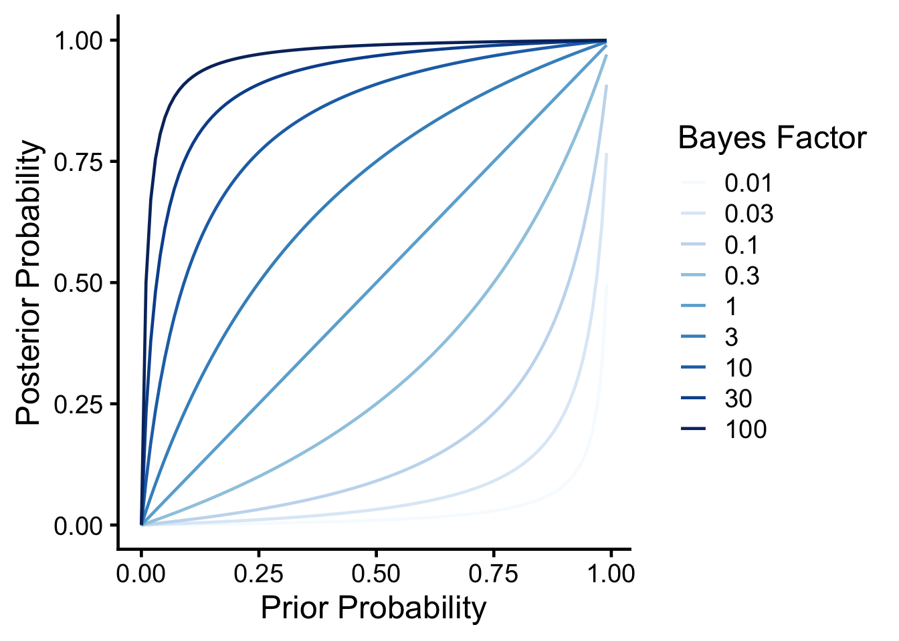
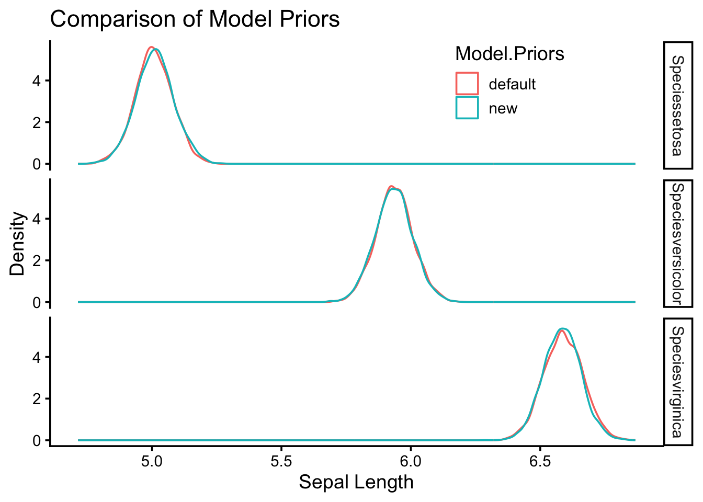

While we most often use classical frequentist statistical approaches, the norm in the molecular physiology field, I have been thinking a lot about Bayesian approaches, especially from a public health and nutrition perspective. In these fields the data tend to be less clear and I find myself updating my opinions often based on new data.

### How Much Protein is Optimal Post-Exercise

One example is the question of how much protein is optimal post-resistance training workout. I had been teaching for years that the max was 20-30g and beyond that there was no advantage. This was based on several feeding experiments with whey protein looking at muscle protein synthesis as the endpoint. However in December a provocative paper [@trommelenAnabolicResponseProtein2023] came out showing that up to 100g could be absorbed and stored and that the true maximum may be higher. There are several important differences in this study including a more natural protein source (milk proteins mostly a combination of whey and casein, compared with casein alone) and much more rigorous endpoints by the use of stable isotopes. I am a cynical person by nature, but this paper made me change my opinion greatly. In other words my prior hypothesis (max protein uptake is 20-30g) was updated by new data (this new paper) and my new posterior opinion suggests the levels might be higher. Fundamentally this happens to me a lot when newer (or better) data updates our understanding of the world and we update the likelihood of something being true. This is an example of inferential Bayesian reasoning. The math behind this is found on this [Wikipedia Article on Bayesian Inference](https://en.wikipedia.org/wiki/Bayesian_inference):

-   $P(H|E)$ is the probability of the hypothesis given that the evidence (E) was obtained. Also known as the *posterior probability*.
-   $P(E|H)$ is the probability of observing the evidence given this hypothesis. This is also known as the *likelihood*.
-   $P(H)$ is the probability of the hypothesis before the data are observed (the *prior probability*). Think of this as how likely you think the result is before you see the data.
-   $P(E)$ is the probability of the evidence, or the *marginal likelihood*. This is the same regardless of which hypothesis is being tested — it is the probability of the observed data averaged across all hypotheses.

Together these are connected by Bayes' rule:

$$P(H|E) = \frac{P(E|H)P(H)}{P(E)}$$

In other words my prior hypothesis (max protein post workout is 20-30g; $P(H)$) was updated by this new data (represented by the **Bayesian update factor** $\frac{P(E|H)}{P(E)}$) to give me an updated posterior probability of that hypothesis being true given this evidence ($P(H|E)$). Roughly I would say I had about 70% certainty that 20-30g was the maximum before the study but now only about \~10% certainty after reading that study, so re-arranging we would get:

$$
0.1 = \frac{P(E|H)}{P(E)} \times 0.7
$$
$$
\frac{P(E|H)}{P(E)} = 0.1 / 0.7 \approx 0.14
$$

The update factor of 0.14 (i.e. ~1/7) tells us by how much the data divided my belief in the original hypothesis. **This is not a Bayes factor**, although it is sometimes loosely called one — a Bayes factor compares two competing hypotheses, not a hypothesis against the marginal evidence. To get a proper Bayes factor for this example we need to compare H ("max is 20-30g") against ¬H ("max is higher").

The Bayes factor is defined as the ratio of marginal likelihoods under two hypotheses,

$$BF_{12} = \frac{P(E|H_1)}{P(E|H_2)}$$

and it is the multiplier that converts prior odds into posterior odds:

$$\text{posterior odds} = BF \times \text{prior odds}$$

For the protein example:

- Prior odds for H: $P(H)/P(\neg H) = 0.7/0.3 \approx 2.33$
- Posterior odds for H: $P(H|E)/P(\neg H|E) = 0.1/0.9 \approx 0.11$
- Bayes factor for H over ¬H: $BF_{H,\neg H} = 0.11 / 2.33 \approx 0.048$

Equivalently, $BF_{\neg H, H} \approx 21$ — the data are about 21 times more consistent with the alternative (max is higher) than with the original hypothesis. This counts as "strong to very strong" evidence on the conventions described below.

### Interpreting a Bayesian Analysis

After this kind of analysis, there are two things we could report: a *posterior probability* ($P(H|E)$, or its distribution) or a Bayes factor. In the first case we are saying that based on our prior probability and the data, the posterior probability of the hypothesis is some value — this requires us to commit to a specific prior, which could vary among investigators. If we report a Bayes factor we are reporting how much the data should modify *any* prior odds. This is an important distinction because a Bayes factor does not make any claims about what the scientist initially thought about how likely a hypothesis was, so is more generalizable. Two scientists with different priors will get different posterior probabilities from the same data, but the same Bayes factor.

There are no p-values in either case. Here we are reporting either a Bayes factor or a posterior probability (or both). For standardization, Bayes factors are classified in several ways — the table below follows the conventions of [@leeBayesianCognitiveModeling2014]. Because BF is symmetric (BF₁₂ = 1/BF₂₁), the same scale applies in both directions:

| Bayes factor (BF₁₂) | Interpretation |
|---|---|
| > 100         | Extreme evidence for $H_1$ |
| 30 – 100      | Very strong evidence for $H_1$ |
| 10 – 30       | Strong evidence for $H_1$ |
| 3 – 10        | Moderate evidence for $H_1$ |
| 1 – 3         | Anecdotal evidence for $H_1$ |
| 1             | No evidence either way |
| 1/3 – 1       | Anecdotal evidence for $H_2$ |
| 1/10 – 1/3    | Moderate evidence for $H_2$ |
| 1/30 – 1/10   | Strong evidence for $H_2$ |
| 1/100 – 1/30  | Very strong evidence for $H_2$ |
| < 1/100       | Extreme evidence for $H_2$ |

### How Does a Bayes Factor Affect Posterior Probability

Lets take a look at how these two results relate to each other.  We can calculate a posterior probability from a prior probability and a bayes factor using the formula rearranged from above.

$P(H|E) = \frac{BF \times P(H)}{BF \times P(H) + (1-P(H))}$


::: {.cell}
::: {.cell-output-display}
{width=672}
:::
:::


As you can see, in all cases as your prior probability ($P(H)$) increases so does the posterior probability ($P(H|E)$).  As your data (the Bayes factor) come in, if its positive it will incresae the posterior probability.  In other words, the more plausible a hypothesis is before and the higher the evidence (as measured by the Bayes Factor) the more likely it is true.

## How to perform Bayesian Analyses

There are several useful R packages to help with this, but I will focus on the [brms package](https://paul-buerkner.github.io/brms/) by Paul-Christian Bürkner. For comparison let's first look at a conventional analysis using the Iris dataset.


::: {.cell}

```{.r .cell-code}
library(knitr)
library(broom)
standard.fit <- lm(Sepal.Length~0+Species, data=iris)
standard.fit %>% 
  anova %>% 
  kable(caption="linear model for sepal length vs species",
        digits=c(2,2,2,2,99))
```

::: {.cell-output-display}


Table: linear model for sepal length vs species

|          |  Df|  Sum Sq| Mean Sq| F value| Pr(>F)|
|:---------|---:|-------:|-------:|-------:|------:|
|Species   |   3| 5184.89| 1728.30| 6521.68|      0|
|Residuals | 147|   38.96|    0.27|      NA|     NA|


:::

```{.r .cell-code}
standard.fit %>% 
  tidy %>% 
  kable(caption="linear model for sepal length vs species",
        digits=c(2,2,2,2,99))
```

::: {.cell-output-display}


Table: linear model for sepal length vs species

|term              | estimate| std.error| statistic| p.value|
|:-----------------|--------:|---------:|---------:|-------:|
|Speciessetosa     |     5.01|      0.07|     68.76|       0|
|Speciesversicolor |     5.94|      0.07|     81.54|       0|
|Speciesvirginica  |     6.59|      0.07|     90.49|       0|


:::
:::


According to this model there is a significant association between species and sepal length, with veriscolor being slightly smaller and virginica being larger than the reference (setosa). Both of these are significiant differences.

Using brms the model specification is the same, though it takes a few seconds longer to compute.


::: {.cell}

```{.r .cell-code}
library(brms)

# directory for cached model fits — brms reuses these on re-render
dir.create("fits", showWarnings = FALSE)

brms.fit <- brm(Sepal.Length~0+Species, data=iris,
                family = gaussian(),
                sample_prior = TRUE,             # required for hypothesis testing
                file = "fits/iris-default-priors",
                file_refit = "on_change")
```
:::


Lets walk through this.  First the model call looks similar to before.  We expect the residual errors to be normally distributed so used a gaussian distribution (which is the same thing for this package).  The main difference is that we should set our priors probabilities.

### Setting Prior Probabilities for use in BRM

We may not have noticed this but in the call above we just used the default priors.


::: {.cell}

```{.r .cell-code}
prior_summary(brms.fit) %>% kable(caption="Default priors for a brms model of Sepal Length")
```

::: {.cell-output-display}


Table: Default priors for a brms model of Sepal Length

|prior                |class |coef              |group |resp |dpar |nlpar |lb |ub |tag |source  |
|:--------------------|:-----|:-----------------|:-----|:----|:----|:-----|:--|:--|:---|:-------|
|                     |b     |                  |      |     |     |      |   |   |    |default |
|                     |b     |Speciessetosa     |      |     |     |      |   |   |    |default |
|                     |b     |Speciesversicolor |      |     |     |      |   |   |    |default |
|                     |b     |Speciesvirginica  |      |     |     |      |   |   |    |default |
|student_t(3, 0, 2.5) |sigma |                  |      |     |     |      |0  |   |    |default |


:::
:::


This means that for the beta coefficients (b) the priors were set as flat priors. The intercept was set as a Student's *t* distribution (three degrees of freedom, location at the median of the response, and scale set to the larger of 2.5 or a robust estimate of the response SD). The sigma (residual error) was set to a similar distribution but centered at zero. Where did these defaults come from? The mean sepal length is 5.8433333, which is close to the median brms uses for the intercept location. But what about the distributions chosen?

* **Flat prior** means the b coefficient is equally likely to be any value, which is technically improper but conceptually a non-informative prior.
* **Student's *t*** distributions have heavier tails than normal/Gaussian distributions, so allow for outliers more easily to be modelled. For the intercept it is centered around the median of the data.

This is the default, and presumes you know little about your data. Since this is a Bayesian approach, you could provide more or less information about the model parameters based on your prior knowledge.

There is a continuum of how informative your priors can be. You could have *weakly informative priors* as in the defaults above, or *strongly informative priors* if you know a lot about the system from prior literature.

Let's say we have some information about Iris because we have been working on this for a while, but haven't investigated the effect of species. We could therefore set our priors as follows:

* Intercept is a value of 5.8433333 with an SD of 0.8280661, fit to a normal distribution.
* Beta coefficients are set to a value of zero with an SD of 0.5, also fit to a normal distribution.
* Set the residual standard deviation (sigma) as mean zero, three degrees of freedom with a scale of 2.5, fit to a Student's *t* distribution.

These are *weakly informative* priors — they encode some general knowledge (the intercept should be near the response mean, effect sizes shouldn't be enormous) without strongly committing to specific values. We could also set lower or upper bounds for these distributions if needed (`lb` and `ub`) but we will skip that for now.


::: {.cell}

```{.r .cell-code}
sepal_length_mean <- mean(iris$Sepal.Length)
sepal_length_sd <- sd(iris$Sepal.Length)
new.priors <- c(
    # Prior for the Intercept
    set_prior(paste0("normal(", sepal_length_mean, ", ", sepal_length_sd, ")"), class = "b",coef=paste0("Species",levels(iris$Species)[1])),
    set_prior(paste0("normal(", sepal_length_mean, ", ", sepal_length_sd, ")"), class = "b",coef=paste0("Species",levels(iris$Species)[2])),
    set_prior(paste0("normal(", sepal_length_mean, ", ", sepal_length_sd, ")"), class = "b",coef=paste0("Species",levels(iris$Species)[3])),
    # Prior for the residual standard deviation (sigma)
    set_prior("student_t(3, 0, 2.5)", class = "sigma",lb=0)) #lower bound of zero (cant have a negative error)
```
:::


Now lets re-run the analysis


::: {.cell}

```{.r .cell-code}
brms.fit.new.priors <- brm(Sepal.Length~0+Species, data=iris,
                family = gaussian(),
                prior = new.priors,
                sample_prior = TRUE,
                file = "fits/iris-new-priors",
                file_refit = "on_change")
```
:::


#### Comparing the Results


::: {.cell}

```{.r .cell-code}
fixef(brms.fit)  %>% kable(caption="Fixed effects from default priors")
```

::: {.cell-output-display}


Table: Fixed effects from default priors

|                  | Estimate| Est.Error|     Q2.5|    Q97.5|
|:-----------------|--------:|---------:|--------:|--------:|
|Speciessetosa     | 5.007033| 0.0728355| 4.860497| 5.149472|
|Speciesversicolor | 5.936856| 0.0725811| 5.795712| 6.084188|
|Speciesvirginica  | 6.589458| 0.0763936| 6.438599| 6.742062|


:::

```{.r .cell-code}
fixef(brms.fit.new.priors) %>% kable(caption="Fixed effects from new priors")
```

::: {.cell-output-display}


Table: Fixed effects from new priors

|                  | Estimate| Est.Error|     Q2.5|    Q97.5|
|:-----------------|--------:|---------:|--------:|--------:|
|Speciessetosa     | 5.011522| 0.0747130| 4.863597| 5.161935|
|Speciesversicolor | 5.934145| 0.0732823| 5.792182| 6.080216|
|Speciesvirginica  | 6.584415| 0.0725136| 6.443355| 6.728418|


:::
:::


You will notice that they give us similar (but not identical) regression coefficients, demonstrating that while the choice of priors does affect the results, the analysis is still relatively robust.  This is represented graphically:


::: {.cell}

```{.r .cell-code}
#first extract the priors for each model
library(tibble)
combined.posteriors <-
  full_join(as_draws_df(brms.fit) %>% rownames_to_column("rowid"),
            as_draws_df(brms.fit.new.priors) %>% rownames_to_column("rowid"),
            by='rowid',
            suffix=c("_default","_new")) %>%
  select(starts_with('b_Species')) %>%
  rename('Speciesversicolor_default'='b_Speciesversicolor_default',
         'Speciesversicolor_new'='b_Speciesversicolor_new',
         'Speciesvirginica_default'='b_Speciesvirginica_default',
         'Speciesvirginica_new'='b_Speciesvirginica_new',
          'Speciessetosa_default'='b_Speciessetosa_default',
         'Speciessetosa_new'='b_Speciessetosa_new') %>%
  pivot_longer(cols=everything(),
               names_sep="_",
               names_to = c("Factor","Model.Priors")) 

combined.posteriors %>%  
  ggplot(aes(x=value,
             col=Model.Priors)) +
  geom_density(alpha=0.5) +
  facet_grid(Factor~.) +
  labs(y="Density",
       x="Sepal Length",
       title="Comparison of Model Priors") +
  theme_classic(base_size=14) +
  theme(legend.position=c(0.75,0.9))
```

::: {.cell-output-display}
{width=672}
:::
:::


Nowhere in these results are no p-values, so how do we get a sense of confidence around a parameter?

### Hypothesis Testing with BRMS

How do we get Bayes Factors and posterior probabilities. Lets say we want to test the hypothesis that `Speciesvirginica` was greater than the reference (setosa), that would mean the estimate would have to be greater than zero for this term


::: {.cell}

```{.r .cell-code}
hypothesis(brms.fit.new.priors, "Speciesvirginica > Speciessetosa") 
```

::: {.cell-output .cell-output-stdout}

```
Hypothesis Tests for class b:
                Hypothesis Estimate Est.Error CI.Lower CI.Upper Evid.Ratio
1 (Speciesvirginica... > 0     1.57       0.1      1.4     1.75        Inf
  Post.Prob Star
1         1    *
---
'CI': 90%-CI for one-sided and 95%-CI for two-sided hypotheses.
'*': For one-sided hypotheses, the posterior probability exceeds 95%;
for two-sided hypotheses, the value tested against lies outside the 95%-CI.
Posterior probabilities of point hypotheses assume equal prior probabilities.
```


:::
:::


This table shows the estimate, error and confidence intervals. The Evid.Ratio (infinity) is the Bayes Factor and the Post.Prob is the posterior probability. This suggests very high (extreme) confidence in that hypothesis being true. But now lets say we only care if virginica is 1.5 units greater than setosa. Those results look like this:


::: {.cell}

```{.r .cell-code}
hypothesis(brms.fit.new.priors, "Speciesvirginica > 1.5+Speciessetosa") -> new.priors.ht

new.priors.ht
```

::: {.cell-output .cell-output-stdout}

```
Hypothesis Tests for class b:
                Hypothesis Estimate Est.Error CI.Lower CI.Upper Evid.Ratio
1 (Speciesvirginica... > 0     0.07       0.1     -0.1     0.25       3.09
  Post.Prob Star
1      0.76     
---
'CI': 90%-CI for one-sided and 95%-CI for two-sided hypotheses.
'*': For one-sided hypotheses, the posterior probability exceeds 95%;
for two-sided hypotheses, the value tested against lies outside the 95%-CI.
Posterior probabilities of point hypotheses assume equal prior probabilities.
```


:::
:::


As you can see while the estimate is still positive ($1.57-1.5=0.07$), the Bayes Factor is less confident (3.09), and the posterior probability is now 76%.

Hopefully this gives you a sense on how a Bayesian approach can be applied in general.  Next we will look at how to do some standard analyses commonly done with null hypothesis significance testing using brms.

Note this script used some examples generated by [perplexity.ai](https://www.perplexity.ai/) and then modified further

### References

::: {#refs}
:::

# Session Info


::: {.cell}

```{.r .cell-code}
sessionInfo()
```

::: {.cell-output .cell-output-stdout}

```
R version 4.6.0 (2026-04-24)
Platform: aarch64-apple-darwin23
Running under: macOS Tahoe 26.4.1

Matrix products: default
BLAS:   /Library/Frameworks/R.framework/Versions/4.6/Resources/lib/libRblas.0.dylib 
LAPACK: /Library/Frameworks/R.framework/Versions/4.6/Resources/lib/libRlapack.dylib;  LAPACK version 3.12.1

locale:
[1] en_US.UTF-8/en_US.UTF-8/en_US.UTF-8/C/en_US.UTF-8/en_US.UTF-8

time zone: America/Detroit
tzcode source: internal

attached base packages:
[1] stats     graphics  grDevices utils     datasets  methods   base     

other attached packages:
[1] tibble_3.3.1   brms_2.23.0    Rcpp_1.1.1-1.1 broom_1.0.12   knitr_1.51    
[6] tidyr_1.3.2    dplyr_1.2.1    ggplot2_4.0.3 

loaded via a namespace (and not attached):
 [1] tensorA_0.36.2.1      bridgesampling_1.2-1  generics_0.1.4       
 [4] stringi_1.8.7         lattice_0.22-9        digest_0.6.39        
 [7] magrittr_2.0.5        estimability_1.5.1    evaluate_1.0.5       
[10] grid_4.6.0            RColorBrewer_1.1-3    mvtnorm_1.3-7        
[13] fastmap_1.2.0         jsonlite_2.0.0        Matrix_1.7-5         
[16] processx_3.9.0        pkgbuild_1.4.8        backports_1.5.1      
[19] gridExtra_2.3         Brobdingnag_1.2-9     purrr_1.2.2          
[22] QuickJSR_1.9.2        scales_1.4.0          codetools_0.2-20     
[25] abind_1.4-8           cli_3.6.6             rlang_1.2.0          
[28] withr_3.0.2           yaml_2.3.12           StanHeaders_2.32.10  
[31] inline_0.3.21         rstan_2.32.7          tools_4.6.0          
[34] parallel_4.6.0        rstantools_2.6.0      checkmate_2.3.4      
[37] coda_0.19-4.1         vctrs_0.7.3           posterior_1.7.0      
[40] R6_2.6.1              stats4_4.6.0          emmeans_2.0.3        
[43] matrixStats_1.5.0     lifecycle_1.0.5       stringr_1.6.0        
[46] callr_3.7.6           pkgconfig_2.0.3       RcppParallel_5.1.11-2
[49] pillar_1.11.1         gtable_0.3.6          loo_2.9.0            
[52] glue_1.8.1            xfun_0.57             tidyselect_1.2.1     
[55] rstudioapi_0.18.0     farver_2.1.2          bayesplot_1.15.0     
[58] htmltools_0.5.9       nlme_3.1-169          rmarkdown_2.31       
[61] labeling_0.4.3        compiler_4.6.0        S7_0.2.2             
[64] distributional_0.7.0 
```


:::
:::


