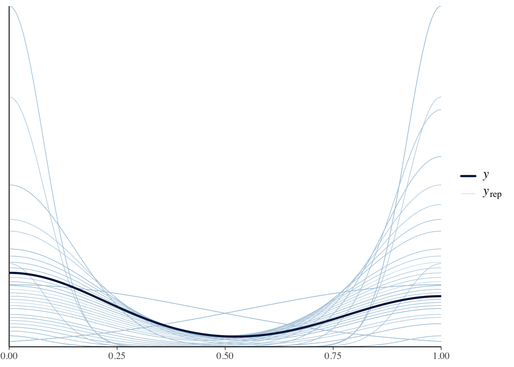

So how do we report the results of a bayesian analysis.  As mentioned previously, at a minimum you need to report either the Bayes Factor or the Posterior Probabilities.  However that is not typically sufficient or reproducible.

Fortunately there are reporting guidelines set out in [@kruschkeBayesianAnalysisReporting2021], which includes the rationale and importance for each of these.  These are known as the Bayesian Analysis Reporting Guidelines or BARG.  Lets go over them, and some ideas of how we could do this with our example analysis of mtcars evaluating the relationship between transmission type and vehicle weight


::: {.cell}

```{.r .cell-code}
library(tinytex)
library(knitr)
library(dplyr)
mtcars.data <- 
  as.data.frame(mtcars) %>%
  mutate(transmission = factor(case_when(am==0~"automatic",
                           am==1~"manual")),
         engine=factor(case_when(vs==0~"V-Shaped",
                       vs==1~"Straight")),
         cylindars=factor(cyl))
```
:::


## Preamble

### Justify why you are using a Bayesian approach

This is important as it is likely most readers will be unfamiliar with this approach and will be hoping to see conventional p-values.

For each of these I will show some sample language

>We used a Bayesian approach here because it provides a continuous probability interpretation of the hypotheses being tested

### Explain the goals of the analysis

>To determine whether transmission has a relationship with the weight in the mtcars dataset.

## Model Specification

### Describe dependent and independent variables

This should be done in the results section so it is clear what the comparason is.

>We evaluated whether the vehicle had an automatic or manual transmission and how that related to the weight.

### Likelihood function and model parameters

Lets look at our analysis from before.  We used a bernoulli family fit (this is a binomial regression).  This is the default analysis:


::: {.cell}

```{.r .cell-code}
# Fit the model
library(brms)
binomial.fit.default <- brm(transmission ~ wt, 
           data = mtcars.data, 
           family = bernoulli())
```
:::


As we will shortly see its helpful for us to be more thoughtful about the choice of priors which by default are flat with no upper or lower bounds.  The intercept is set roughly to a Student's *t* distribution centered around 3 tons.


::: {.cell}

```{.r .cell-code}
prior_summary(binomial.fit.default) %>% kable(caption="Prior summary for effects of transmission on engine type")
```

::: {.cell-output-display}
Table: Prior summary for effects of transmission on engine type

|prior                |class     |coef |group |resp |dpar |nlpar |lb |ub |source  |
|:--------------------|:---------|:----|:-----|:----|:----|:-----|:--|:--|:-------|
|                     |b         |     |      |     |     |      |   |   |default |
|                     |b         |wt   |      |     |     |      |   |   |default |
|student_t(3, 0, 2.5) |Intercept |     |      |     |     |      |   |   |default |
:::
:::


We have *some* information already, for example we know that there are more automatic than manual transmission vehicles.  Globally 56% of vehicles are automatic.  That means the log odds of a transmission being automatic is $LogOdds=\ln{p/(1-p)}$ since $\ln \frac{0.56}{1-0.56} \approx 0.241$ we will set this as the intercept with a wide standard deviation of 5.

I dont have a good sense of what I estimated for the effects of weight (class b, coef wt), so I set that to normal distribution around zero with a standard deviation of 5, zero degrees of freedom and and with no boundaries.  I would consider these are somewhat informative priors.


::: {.cell}

```{.r .cell-code}
new.priors <- c(prior(normal(0.241,5), class=Intercept),
                prior(normal(0,5),class=b, coef=wt))

binomial.fit <- brm(transmission ~ wt, 
           data = mtcars.data, 
           family = bernoulli(),
           sample_prior = T,
           prior = new.priors)
```
:::

::: {.cell}

```{.r .cell-code}
prior_summary(binomial.fit) %>% kable(caption="Prior summary for effects of weight on transmission type")
```

::: {.cell-output-display}
Table: Prior summary for effects of weight on transmission type

|prior            |class     |coef |group |resp |dpar |nlpar |lb |ub |source  |
|:----------------|:---------|:----|:-----|:----|:----|:-----|:--|:--|:-------|
|                 |b         |     |      |     |     |      |   |   |default |
|normal(0, 5)     |b         |wt   |      |     |     |      |   |   |user    |
|normal(0.241, 5) |Intercept |     |      |     |     |      |   |   |user    |
:::
:::


Using the bernouli family, the default is the logit link function.

>The data were fit to a bernoulli distribution with a logit link function.

### Prior Distributions

What was the prior probabilities set at.  As noted above we set our priors to be this, including some justification:

>The prior distributions were set so that the intercept was a normal distribution with a beta coefficient corresponding to the log odds corresponding to a 56% probability of an automatic transmission ($\beta = 0.241$; based on worldwide automobile statistics), with a relatively wide standard deviation of 5.  For the prior effects of weight on transmission type we used normally distributed priors with a mean of zero and a standard deviation of 5.

### Formal Specification of the Likelihood Function

The Bernouli family probability function including a logit link is automatically implemented in brms but is $P(TYPE|\eta) = (1 / (1 + exp(-\eta)))^{TYPE} * (1 - 1 / (1 + exp(-\eta)))^(1-TYPE)$ where TYPE is the type of transmission (0 for manual, 1 for automatic).

This is implemented within `brms` so I think this is covered by our statement about the likelihood function.

### Prior Predictive Check

This is to make sure that our priors are reasonable and fit the shape and values of our data.  To do this we simulate some data from our priors, and compare that with the observed data.  To do this within `brms` we will need to re-run our model but just sampling the priors:


::: {.cell}

```{.r .cell-code}
binomial.fit.pp.check <- brm(transmission ~ wt, 
           data = mtcars.data, 
           family = bernoulli(),
           sample_prior = "only",
           prior = new.priors)
```
:::


Lets visualize these the solid line is the observed data with the lighter lines being those simulated from our priors.  These look ok to me.


::: {.cell}

```{.r .cell-code}
# Show density plot
pp_check(binomial.fit.pp.check, type = "dens_overlay", ndraws = 100)
```

::: {.cell-output-display}
{width=672}
:::
:::


>We did a prior predictive check and values from simulated from our prior distributions were similar to the observed data.

## Reporting Details of the Computation

### Software

It is good practice to cite the package and the version numbers for reproducibility.

>We used the brms package version 2.21.0 [@brms;@brms-mlm] implemented in R version 4.4.1 [@r-core].

### MCMC Chain Convergence

This is given by $\hat{R}$ or Rhat in brms, which is the same as as the PSRF (Position scale response factor) or the Gelman-Rubin convergence diagnostic [@Gelman1992].  We want this to be as close to 1 as possible (ideally between $0.99-1.01$).  You could report this for each model, or just give a range of values.

>We verified that the Gelman-Rubin statistic for chain convergence was between 1 and 1.01 for all model parameters


::: {.cell}

```{.r .cell-code}
kable(data.frame(
  Parameter = names(rhat(binomial.fit)),
  Rhat = format(rhat(binomial.fit), nsmall = 5)),
caption="Rhat values for model testing the association between weight and transmission (should b between 0.99 and 1.01 for convergence).",
row.names = F)
```

::: {.cell-output-display}
Table: Rhat values for model testing the association between weight and transmission (should b between 0.99 and 1.01 for convergence).

|Parameter       |Rhat     |
|:---------------|:--------|
|b_Intercept     |1.002042 |
|b_wt            |1.001543 |
|Intercept       |1.002517 |
|prior_Intercept |1.000273 |
|prior_b_wt      |1.000092 |
|lprior          |1.001200 |
|lp__            |1.001149 |
:::
:::


### MCMC Chain Resolution

This is the ESS or effective sample size.  We use the default 4000 samples, and the ESS is how many are unique.  This should be >400, you can report its greater than some value if you are reporting several models.


::: {.cell}

```{.r .cell-code}
library(broom.mixed)
tidy(binomial.fit, ess = TRUE) %>% kable(caption="Model random effects for weight vs transmission")
```

::: {.cell-output-display}
Table: Model random effects for weight vs transmission

|effect |component |group |term        |   estimate| std.error|  conf.low| conf.high|      ess|
|:------|:---------|:-----|:-----------|----------:|---------:|---------:|---------:|--------:|
|fixed  |cond      |NA    |(Intercept) | 13.0749075|  4.381090|  5.893250| 23.104665| 1877.921|
|fixed  |cond      |NA    |wt          | -4.3543135|  1.389451| -7.430027| -2.050400| 1793.746|
|fixed  |cond      |NA    |priorwt     |  0.0745448|  4.962379| -9.666938|  9.774055| 4029.507|
:::
:::


>The effective sample size for the Markov Chain Monte Carlo (MCMC) analyses were >1500 samples for each parameter.

## Posterior Distribution

### Posterior Predictive Check

Similar to the prior predictive check we should check if our posterior results match the actual results.


::: {.cell}

```{.r .cell-code}
pp_check(binomial.fit, type = "dens_overlay",ndraws=100)
```

::: {.cell-output-display}
{width=672}
:::
:::


This looks great, with the modeled curve being in the middle of the posterior drawn lines.

>A posterior predictive check indicated a good model fit.

### Summarize Posterior of Variables

Describe the posterior variables, including their shape, estimates and range.


::: {.cell}

```{.r .cell-code}
plot(binomial.fit)
```

::: {.cell-output-display}
{width=672}
:::

```{.r .cell-code}
library(ggplot2)
library(cowplot)
b_wt_plot <- 
  as_draws_df(binomial.fit) %>%
  ggplot(aes(x=b_wt)) +
  geom_density(fill="#FFCB05") +
  geom_vline(xintercept=0,color="#00274C",lty=2) +
  labs(y="",
       x="",
       title="Beta (Weight)") +
  theme_classic(base_size=16)

b_int_plot <- 
  as_draws_df(binomial.fit) %>%
  ggplot(aes(x=b_Intercept)) +
  geom_density(fill="#FFCB05") +
  geom_vline(xintercept=0,color="#00274C",lty=2) +
  labs(y="",
       x="",
       title="Intercept") +
  theme_classic(base_size=16)

plot_grid(b_int_plot,b_wt_plot)
```

::: {.cell-output-display}
{width=672}
:::
:::

These are both roughly unimodal distributions centered at:


::: {.cell}

```{.r .cell-code}
fixef(binomial.fit) %>% kable(caption="Posterior estimates", digits=3)
```

::: {.cell-output-display}
Table: Posterior estimates

|          | Estimate| Est.Error|   Q2.5|  Q97.5|
|:---------|--------:|---------:|------:|------:|
|Intercept |   13.075|     4.381|  5.893| 23.105|
|wt        |   -4.354|     1.389| -7.430| -2.050|
:::
:::


>The beta coefficient for the effect of weight on transmission type is -4.354  with a 95% confidence interval of -7.43 to -2.05 (OR=0.013).

### Bayes Factor and Posterior Probabilities

The Bayes Factor and posterior probabilities are extracted by testing a particular hypothesis


::: {.cell}

```{.r .cell-code}
hypothesis(binomial.fit, "wt<0")$hypothesis %>%
  kable(caption="Hypothesis test for effects of weight on automatic transmission", digits=3)
```

::: {.cell-output-display}
Table: Hypothesis test for effects of weight on automatic transmission

|Hypothesis | Estimate| Est.Error| CI.Lower| CI.Upper| Evid.Ratio| Post.Prob|Star |
|:----------|--------:|---------:|--------:|--------:|----------:|---------:|:----|
|(wt) < 0   |   -4.354|     1.389|     -6.9|   -2.331|        Inf|         1|*    |
:::
:::


In this case the values are off the scale high so its best to report as greater than a large number rather than infinity and zero.

>The Bayes Factor for the hypothesis that weight results in a lower likelihood of an automatic transmission is >1,000,000 with a posterior probability of >0.999.


## Summary

Here are some recommendations to where to put this information

| Reporting Point | Location |
| -- | -- |
| Justification | Introduction |
| Goals | Introduction |
| Description of Variables | Results |
| Likelihood Function | Methods |
| Prior Distribution | Methods |
| Formal Specification | Methods or Default |
| Prior Predictive Check | Methods/Repository |
| Sotware | Methods |
| $\hat{R}$ | Methods |
| ESS | Methods |
| Posterior Probability Check | Methods/Repository |
| Posterior Distributions | Results/Repository |
| BF and Postrior Probability | Results |

### References

::: {#refs}
:::


# Session Info


::: {.cell}

```{.r .cell-code}
sessionInfo()
```

::: {.cell-output .cell-output-stdout}
```
R version 4.4.1 (2024-06-14)
Platform: x86_64-apple-darwin20
Running under: macOS Monterey 12.7.6

Matrix products: default
BLAS:   /Library/Frameworks/R.framework/Versions/4.4-x86_64/Resources/lib/libRblas.0.dylib 
LAPACK: /Library/Frameworks/R.framework/Versions/4.4-x86_64/Resources/lib/libRlapack.dylib;  LAPACK version 3.12.0

locale:
[1] en_US.UTF-8/en_US.UTF-8/en_US.UTF-8/C/en_US.UTF-8/en_US.UTF-8

time zone: America/Detroit
tzcode source: internal

attached base packages:
[1] stats     graphics  grDevices utils     datasets  methods   base     

other attached packages:
[1] cowplot_1.1.3       ggplot2_3.5.1       broom.mixed_0.2.9.5
[4] brms_2.21.0         Rcpp_1.0.13         dplyr_1.1.4        
[7] knitr_1.48          tinytex_0.52       

loaded via a namespace (and not attached):
 [1] gtable_0.3.5         tensorA_0.36.2.1     xfun_0.46           
 [4] QuickJSR_1.3.1       processx_3.8.4       inline_0.3.19       
 [7] lattice_0.22-6       callr_3.7.6          vctrs_0.6.5         
[10] tools_4.4.1          ps_1.7.7             generics_0.1.3      
[13] stats4_4.4.1         parallel_4.4.1       tibble_3.2.1        
[16] fansi_1.0.6          pkgconfig_2.0.3      Matrix_1.7-0        
[19] checkmate_2.3.2      distributional_0.4.0 RcppParallel_5.1.8  
[22] lifecycle_1.0.4      compiler_4.4.1       farver_2.1.2        
[25] stringr_1.5.1        Brobdingnag_1.2-9    munsell_0.5.1       
[28] codetools_0.2-20     htmltools_0.5.8.1    bayesplot_1.11.1    
[31] yaml_2.3.10          furrr_0.3.1          tidyr_1.3.1         
[34] pillar_1.9.0         StanHeaders_2.32.10  bridgesampling_1.1-2
[37] abind_1.4-5          parallelly_1.38.0    nlme_3.1-164        
[40] posterior_1.6.0      rstan_2.32.6         tidyselect_1.2.1    
[43] digest_0.6.36        future_1.34.0        mvtnorm_1.2-5       
[46] stringi_1.8.4        listenv_0.9.1        purrr_1.0.2         
[49] reshape2_1.4.4       splines_4.4.1        forcats_1.0.0       
[52] labeling_0.4.3       fastmap_1.2.0        grid_4.4.1          
[55] colorspace_2.1-1     cli_3.6.3            magrittr_2.0.3      
[58] loo_2.8.0            pkgbuild_1.4.4       utf8_1.2.4          
[61] broom_1.0.6          withr_3.0.0          scales_1.3.0        
[64] backports_1.5.0      rmarkdown_2.27       globals_0.16.3      
[67] matrixStats_1.3.0    gridExtra_2.3        coda_0.19-4.1       
[70] evaluate_0.24.0      rstantools_2.4.0     rlang_1.1.4         
[73] glue_1.7.0           rstudioapi_0.16.0    jsonlite_1.8.8      
[76] R6_2.5.1             plyr_1.8.9          
```
:::
:::
