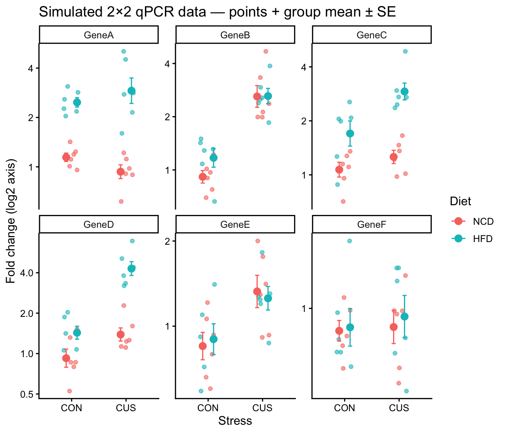
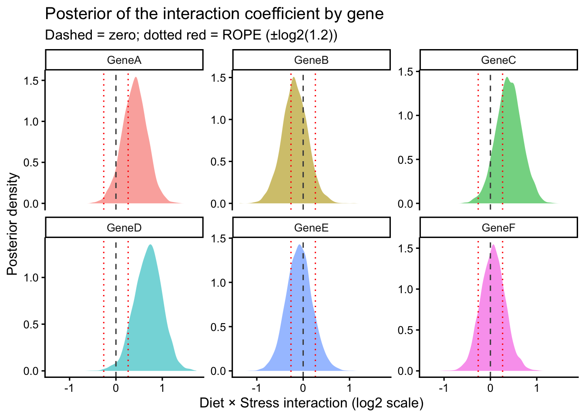

::: {.cell}

```{.r .cell-code}
library(tidyverse)
library(brms)
library(broom.mixed)
library(emmeans)
library(knitr)

# directory for cached model fits — brms reuses these on re-render
dir.create("fits", showWarnings = FALSE)
```
:::


# Overview

This document is a fully worked Bayesian analysis of a typical 2×2 qPCR experiment in our lab. The design crosses two diets (normal chow, NCD; high-fat, HFD) with two stress conditions (control, CON; chronic unpredictable stress, CUS), giving four groups of `n = 6` mice per group. We measure six target genes and ask:

- Does diet, stress, or their interaction affect each transcript?
- For each target, what is the posterior probability of an interaction (effect modification)?
- For genes where we find no meaningful effect, can we say something stronger than "we failed to reject the null"?

Related materials:

- For the simpler two-group case (e.g. WT vs KO), see [bayesian-qpcr-example.html](https://bridgeslab.github.io/Lab-Documents/Experimental%20Policies/bayesian-qpcr-example.html).
- The frequentist counterpart workflow is in [anova-example.html](https://bridgeslab.github.io/Lab-Documents/Experimental%20Policies/anova-example.html).
- For Bayesian background and intuition, see [bayesian-analyses.html](https://bridgeslab.github.io/Lab-Documents/Experimental%20Policies/bayesian-analyses.html).
- For reporting standards, see [bayesian-barg.html](https://bridgeslab.github.io/Lab-Documents/Experimental%20Policies/bayesian-barg.html) [@kruschkeBayesianAnalysisReporting2021].

# Simulating a Realistic Dataset

We simulate fold-change values on the log2 scale (where 0 = no change, 1 = 2-fold up, −1 = 2-fold down). Six genes are chosen with stylised labels (`GeneA`–`GeneF`) to span typical biological scenarios that arise in a HFD × stress experiment:

| Gene  | Scenario                          | True effect simulated                  |
|-------|-----------------------------------|----------------------------------------|
| GeneA | Diet-responsive only              | HFD main effect only                   |
| GeneB | Stress-responsive only            | CUS main effect only                   |
| GeneC | Diet-responsive with interaction  | HFD main effect + mild interaction     |
| GeneD | Both factors with strong interaction | Both main effects + strong interaction |
| GeneE | Mildly stress-responsive          | Mild CUS effect only                   |
| GeneF | Negative control (no effects)     | No effects                             |

The within-group SD on the log2 scale is 0.4, which corresponds to typical biological + technical variation in qPCR.


::: {.cell}

```{.r .cell-code}
set.seed(2025)

n_per_cell <- 6

# True effects for each gene on the log2 scale
gene_effects <- tribble(
  ~Target,   ~b_diet, ~b_stress, ~b_inter,
  "GeneA",   1.2,     0.0,       0.0,
  "GeneB",   0.0,     1.5,       0.0,
  "GeneC",   0.8,     0.3,       0.5,
  "GeneD",   0.5,     0.6,       1.0,
  "GeneE",   0.0,     0.4,       0.0,
  "GeneF",   0.0,     0.0,       0.0
)

qpcr_sim <- gene_effects |>
  expand_grid(Diet   = c("NCD", "HFD"),
              Stress = c("CON", "CUS"),
              rep    = 1:n_per_cell) |>
  mutate(
    diet_x   = ifelse(Diet   == "HFD", 1, 0),
    stress_x = ifelse(Stress == "CUS", 1, 0),
    log2FC   = b_diet * diet_x +
               b_stress * stress_x +
               b_inter * diet_x * stress_x +
               rnorm(n(), 0, 0.4),
    Fold_Change = 2 ^ log2FC
  ) |>
  mutate(
    Diet   = factor(Diet,   levels = c("NCD", "HFD")),
    Stress = factor(Stress, levels = c("CON", "CUS")),
    Target = factor(Target,
                    levels = c("GeneA", "GeneB", "GeneC",
                               "GeneD", "GeneE", "GeneF"))
  ) |>
  select(Target, Diet, Stress, rep, log2FC, Fold_Change)

qpcr_sim |>
  slice_head(n = 8) |>
  kable(digits = 2, caption = "First 8 rows of the simulated dataset")
```

::: {.cell-output-display}


Table: First 8 rows of the simulated dataset

|Target |Diet |Stress | rep| log2FC| Fold_Change|
|:------|:----|:------|---:|------:|-----------:|
|GeneA  |NCD  |CON    |   1|   0.25|        1.19|
|GeneA  |NCD  |CON    |   2|   0.01|        1.01|
|GeneA  |NCD  |CON    |   3|   0.31|        1.24|
|GeneA  |NCD  |CON    |   4|   0.51|        1.42|
|GeneA  |NCD  |CON    |   5|   0.15|        1.11|
|GeneA  |NCD  |CON    |   6|  -0.07|        0.96|
|GeneA  |NCD  |CUS    |   1|   0.16|        1.12|
|GeneA  |NCD  |CUS    |   2|  -0.03|        0.98|


:::
:::


::: {.cell}

```{.r .cell-code}
ggplot(qpcr_sim, aes(x = Stress, y = Fold_Change, color = Diet)) +
  geom_jitter(width = 0.15, alpha = 0.6, size = 1.5) +
  stat_summary(fun = mean, geom = "point",
               size = 3, position = position_dodge(0.4)) +
  stat_summary(fun.data = mean_se, geom = "errorbar", width = 0.15,
               position = position_dodge(0.4)) +
  facet_wrap(~ Target, scales = "free_y") +
  scale_y_continuous(trans = "log2") +
  labs(y = "Fold change (log2 axis)",
       title = "Simulated 2×2 qPCR data — points + group mean ± SE") +
  theme_classic(base_size = 12)
```

::: {.cell-output-display}
{width=672}
:::
:::


# Analysis Decisions

## Why fit on the log2 scale?

Fold-change data is inherently multiplicative — going from FC = 1 to FC = 2 is the same biological "size" of effect as FC = 2 to FC = 4. On a linear scale these are different distances; on the log2 scale they are both 1 unit. Working on the log2 scale therefore:

- Makes effect sizes (regression coefficients) directly interpretable as fold changes (`2^β`).
- Approximately stabilises the within-group variance, making the Gaussian likelihood assumption defensible.
- Symmetrises the prior — `normal(0, 1)` puts equal probability on 2-fold up vs 2-fold down, whereas a normal prior on raw fold change would not.

We fit `log2(Fold_Change) ~ Diet * Stress` with a Gaussian likelihood throughout.

## Pre-specified hypothesis on the interaction

Per the [ANOVA tutorial](https://bridgeslab.github.io/Lab-Documents/Experimental%20Policies/anova-example.html), we always retain the interaction term and use the prior to encode how surprised we would be by an interaction.

For most published HFD × stress qPCR experiments, the two factors act roughly additively — a meaningful interaction would be surprising for most genes but plausible for a few (e.g. inflammatory genes). We therefore put a weakly informative prior on the main effects (`normal(0, 1)`, allowing effects up to 2-fold with high probability) and a tighter prior on the interaction term (`normal(0, 0.5)`, allowing interactions up to ~1.4-fold).

| Term            | Prior                | Practical meaning (back-transformed)            |
|-----------------|----------------------|--------------------------------------------------|
| Intercept       | `normal(0, 1.5)`     | baseline log2FC near 0 (no change)               |
| Main effects    | `normal(0, 1)`       | ~95% prior on \|effect\| < 2 (i.e., 4-fold range)|
| Interaction     | `normal(0, 0.5)`     | ~95% prior on \|effect\| < 1 (i.e., 2-fold range)|
| Residual SD (σ) | `student_t(3, 0, 1)` | weakly informative on within-group variability |


::: {.cell}

```{.r .cell-code}
qpcr_priors <- c(
  prior(normal(0, 1.5),     class = Intercept),
  prior(normal(0, 1),       class = b),
  prior(normal(0, 0.5),     class = b, coef = "DietHFD:StressCUS"),
  prior(student_t(3, 0, 1), class = sigma)
)
```
:::


These priors are **pre-specified before fitting** the data, in line with [BARG](https://bridgeslab.github.io/Lab-Documents/Experimental%20Policies/bayesian-barg.html). Document them in your methods exactly as written above.

## Region of practical equivalence (ROPE)

We define the smallest interaction that would be biologically meaningful as **1.2-fold change**, corresponding to ±log2(1.2) ≈ ±0.263 on the log2 scale. Effects within this range are treated as practically zero.


::: {.cell}

```{.r .cell-code}
rope_log2 <- log2(1.2)   # ≈ 0.263 on the log2 scale
rope_log2
```

::: {.cell-output .cell-output-stdout}

```
[1] 0.2630344
```


:::
:::


# Per-Gene Bayesian Models

We fit one `brm()` per gene using `dplyr::group_by() |> nest() |> mutate(map(...))`. Each fit caches to disk via `file = "fits/qpcr-em-..."` so first-render compilation only happens once.


::: {.cell}

```{.r .cell-code}
qpcr_fits <- qpcr_sim |>
  group_by(Target) |>
  nest() |>
  mutate(
    fit = map2(data, Target, ~ brm(
      log2(Fold_Change) ~ Diet * Stress,
      data         = .x,
      prior        = qpcr_priors,
      sample_prior = TRUE,
      chains = 4, cores = 4,
      seed   = 42,
      refresh = 0,
      file       = paste0("fits/qpcr-em-", as.character(.y)),
      file_refit = "on_change"
    ))
  )
```
:::


# Convergence Diagnostics

Before interpreting any model, verify that all chains converged ($\hat{R}$ ≈ 1) and that the effective sample size is adequate ([@vehtariRankNormalizationFolding2021] recommends bulk-ESS ≥ 1000 and tail-ESS ≥ 400). We extract diagnostics across all six gene-level fits at once:


::: {.cell}

```{.r .cell-code}
qpcr_fits |>
  mutate(diag = map(fit, ~ {
    rh <- rhat(.x)
    s  <- summary(.x)$fixed
    tibble(
      max_rhat = max(rh, na.rm = TRUE),
      min_bulk = min(s[, "Bulk_ESS"]),
      min_tail = min(s[, "Tail_ESS"])
    )
  })) |>
  select(Target, diag) |>
  unnest(diag) |>
  kable(digits = 3,
        caption = "Convergence diagnostics across all gene fits",
        col.names = c("Target", "Max R̂", "Min bulk-ESS", "Min tail-ESS"))
```

::: {.cell-output-display}


Table: Convergence diagnostics across all gene fits

|Target | Max R̂| Min bulk-ESS| Min tail-ESS|
|:------|-----:|------------:|------------:|
|GeneA  | 1.001|     2354.546|     2754.824|
|GeneB  | 1.002|     1760.967|     2041.378|
|GeneC  | 1.002|     2366.898|     2735.724|
|GeneD  | 1.002|     1956.428|     2275.537|
|GeneE  | 1.004|     2117.962|     2359.962|
|GeneF  | 1.004|     1812.172|     2349.430|


:::
:::


If any model has $\hat{R}$ > 1.01 or ESS below threshold, increase iterations (`iter = 4000`) or reconsider priors before proceeding.

# Interaction Analysis

The pre-specified scientific question is whether the Diet × Stress interaction is non-zero for each gene. We extract the posterior summary plus a Savage-Dickey Bayes factor for the null and the posterior probability of direction.


::: {.cell}

```{.r .cell-code}
interaction_results <- qpcr_fits |>
  mutate(summary = map(fit, ~ {
    draws <- as_draws_df(.x) |> pull(`b_DietHFD:StressCUS`)
    h     <- hypothesis(.x, "DietHFD:StressCUS = 0")
    tibble(
      median        = median(draws),
      ci_lower      = quantile(draws, 0.025),
      ci_upper      = quantile(draws, 0.975),
      P_positive    = mean(draws > 0),
      P_in_ROPE     = mean(abs(draws) < rope_log2),
      BF_null       = h$hypothesis$Evid.Ratio,
      P_null        = h$hypothesis$Post.Prob
    )
  })) |>
  select(Target, summary) |>
  unnest(summary)

interaction_results |>
  arrange(BF_null) |>
  kable(digits = 3,
        caption = "Posterior summary of the Diet × Stress interaction per gene",
        col.names = c("Target", "Median (log2)", "2.5%", "97.5%",
                      "P(β > 0)", "P(in ROPE)", "BF₀", "P(null)"))
```

::: {.cell-output-display}


Table: Posterior summary of the Diet × Stress interaction per gene

|Target | Median (log2)|   2.5%| 97.5%| P(β > 0)| P(in ROPE)|   BF₀| P(null)|
|:------|-------------:|------:|-----:|--------:|----------:|-----:|-------:|
|GeneD  |         0.706|  0.103| 1.251|    0.985|      0.073| 0.106|   0.096|
|GeneA  |         0.409| -0.138| 0.926|    0.935|      0.287| 0.537|   0.349|
|GeneC  |         0.395| -0.157| 0.952|    0.926|      0.297| 0.617|   0.382|
|GeneB  |        -0.183| -0.728| 0.376|    0.257|      0.573| 1.490|   0.598|
|GeneE  |        -0.085| -0.640| 0.484|    0.377|      0.631| 1.709|   0.631|
|GeneF  |         0.056| -0.451| 0.598|    0.589|      0.676| 1.806|   0.644|


:::
:::


How to read this table:

- **Median (log2) and 95% CI**: the interaction effect size on the log2 scale. Exponentiate (`2^median`) for a multiplicative fold-change interpretation.
- **P(β > 0)**: probability of direction. Values near 0.5 → no preferred direction; values near 0 or 1 → strong directional support.
- **P(in ROPE)**: probability the interaction is within ±log2(1.2) — biologically negligible.
- **BF₀**: Savage-Dickey Bayes factor for the null hypothesis vs. the prior alternative. Values > 3 favour the null; < 1/3 favour the alternative; near 1 are inconclusive.
- **P(null)**: posterior probability of no interaction at the default 0.5 prior model probability.

## Visualising the interaction posteriors


::: {.cell}

```{.r .cell-code}
all_draws <- qpcr_fits |>
  mutate(draws = map(fit, ~ as_draws_df(.x) |>
                            select(`b_DietHFD:StressCUS`))) |>
  select(Target, draws) |>
  unnest(draws) |>
  rename(interaction = `b_DietHFD:StressCUS`)

ggplot(all_draws, aes(x = interaction, fill = Target)) +
  geom_density(alpha = 0.6, color = NA) +
  geom_vline(xintercept = 0, linetype = "dashed", color = "grey30") +
  geom_vline(xintercept =  rope_log2, linetype = "dotted", color = "red") +
  geom_vline(xintercept = -rope_log2, linetype = "dotted", color = "red") +
  facet_wrap(~ Target, scales = "free_y") +
  labs(x = "Diet × Stress interaction (log2 scale)",
       y = "Posterior density",
       title = "Posterior of the interaction coefficient by gene",
       subtitle = "Dashed = zero; dotted red = ROPE (±log2(1.2))") +
  theme_classic(base_size = 12) +
  guides(fill = "none")
```

::: {.cell-output-display}
{width=672}
:::
:::


In our simulated truth, only GeneC (mild) and GeneD (strong) have non-zero interactions. The posteriors should reflect that — the other four genes' posteriors should be concentrated around zero.

# Cell Means and Main Effects via emmeans

For genes whose interaction posterior is concentrated near zero, the **marginal main effects** (averaging over levels of the other factor) are the most informative summary. For genes where the interaction is meaningful, **simple effects** (effect of one factor *within* each level of the other) are more informative. `emmeans` works directly on `brmsfit` objects with the same syntax as for `lm()` and returns posterior summaries with HPD credible intervals [@lenth2016; @emmeans].

## Cell means per gene (back-transformed to fold change)


::: {.cell}

```{.r .cell-code}
cell_means <- qpcr_fits |>
  mutate(emm = map(fit, ~ emmeans(.x, ~ Diet * Stress) |>
                          as_tibble())) |>
  select(Target, emm) |>
  unnest(emm) |>
  mutate(across(c(emmean, lower.HPD, upper.HPD), ~ 2 ^ .x))

cell_means |>
  kable(digits = 2,
        caption = "Posterior cell means with 95% HPD intervals (back-transformed to fold change)",
        col.names = c("Target", "Diet", "Stress",
                      "Mean FC", "Lower HPD", "Upper HPD"))
```

::: {.cell-output-display}


Table: Posterior cell means with 95% HPD intervals (back-transformed to fold change)

|Target |Diet |Stress | Mean FC| Lower HPD| Upper HPD|
|:------|:----|:------|-------:|---------:|---------:|
|GeneA  |NCD  |CON    |    1.13|      0.92|      1.40|
|GeneA  |HFD  |CON    |    2.48|      1.99|      3.05|
|GeneA  |NCD  |CUS    |    0.96|      0.78|      1.18|
|GeneA  |HFD  |CUS    |    2.81|      2.25|      3.49|
|GeneB  |NCD  |CON    |    0.95|      0.77|      1.20|
|GeneB  |HFD  |CON    |    1.15|      0.93|      1.45|
|GeneB  |NCD  |CUS    |    2.48|      1.98|      3.09|
|GeneB  |HFD  |CUS    |    2.65|      2.11|      3.29|
|GeneC  |NCD  |CON    |    1.05|      0.84|      1.31|
|GeneC  |HFD  |CON    |    1.73|      1.38|      2.14|
|GeneC  |NCD  |CUS    |    1.29|      1.05|      1.62|
|GeneC  |HFD  |CUS    |    2.81|      2.20|      3.49|
|GeneD  |NCD  |CON    |    0.89|      0.70|      1.14|
|GeneD  |HFD  |CON    |    1.50|      1.18|      1.93|
|GeneD  |NCD  |CUS    |    1.46|      1.14|      1.87|
|GeneD  |HFD  |CUS    |    4.01|      3.03|      5.06|
|GeneE  |NCD  |CON    |    0.87|      0.69|      1.09|
|GeneE  |HFD  |CON    |    0.89|      0.72|      1.12|
|GeneE  |NCD  |CUS    |    1.30|      1.04|      1.63|
|GeneE  |HFD  |CUS    |    1.26|      0.99|      1.57|
|GeneF  |NCD  |CON    |    0.86|      0.70|      1.07|
|GeneF  |HFD  |CON    |    0.89|      0.72|      1.11|
|GeneF  |NCD  |CUS    |    0.89|      0.72|      1.11|
|GeneF  |HFD  |CUS    |    0.95|      0.76|      1.18|


:::
:::


## Marginal main effects


::: {.cell}

```{.r .cell-code}
diet_effects <- qpcr_fits |>
  mutate(emm = map(fit, ~ emmeans(.x, ~ Diet) |>
                          pairs() |>
                          as_tibble())) |>
  select(Target, emm) |>
  unnest(emm) |>
  mutate(factor = "Diet")

stress_effects <- qpcr_fits |>
  mutate(emm = map(fit, ~ emmeans(.x, ~ Stress) |>
                          pairs() |>
                          as_tibble())) |>
  select(Target, emm) |>
  unnest(emm) |>
  mutate(factor = "Stress")

bind_rows(diet_effects, stress_effects) |>
  select(Target, factor, contrast, estimate, lower.HPD, upper.HPD) |>
  kable(digits = 3,
        caption = "Marginal main-effect contrasts (log2 scale; HPD intervals)")
```

::: {.cell-output-display}


Table: Marginal main-effect contrasts (log2 scale; HPD intervals)

|Target |factor |contrast  | estimate| lower.HPD| upper.HPD|
|:------|:------|:---------|--------:|---------:|---------:|
|GeneA  |Diet   |NCD - HFD |   -1.342|    -1.666|    -1.038|
|GeneB  |Diet   |NCD - HFD |   -0.173|    -0.508|     0.157|
|GeneC  |Diet   |NCD - HFD |   -0.920|    -1.257|    -0.580|
|GeneD  |Diet   |NCD - HFD |   -1.110|    -1.470|    -0.722|
|GeneE  |Diet   |NCD - HFD |    0.001|    -0.322|     0.346|
|GeneF  |Diet   |NCD - HFD |   -0.064|    -0.406|     0.245|
|GeneA  |Stress |CON - CUS |    0.027|    -0.300|     0.345|
|GeneB  |Stress |CON - CUS |   -1.292|    -1.615|    -0.959|
|GeneC  |Stress |CON - CUS |   -0.499|    -0.847|    -0.186|
|GeneD  |Stress |CON - CUS |   -1.058|    -1.429|    -0.687|
|GeneE  |Stress |CON - CUS |   -0.540|    -0.875|    -0.197|
|GeneF  |Stress |CON - CUS |   -0.070|    -0.389|     0.265|


:::
:::


The estimate column is on the log2 scale — `estimate = 1` means a 2-fold change for the marginal contrast. GeneA should show a large Diet contrast and zero Stress contrast; GeneB the reverse; GeneF should show neither.

## Simple effects (for genes with a meaningful interaction)

When the interaction posterior is concentrated away from zero, the marginal main effect is misleading — the effect of one factor genuinely depends on the level of the other. Report simple effects in that case:


::: {.cell}

```{.r .cell-code}
# Restrict to genes where the interaction is meaningful — using
# the threshold P(null | data) < 0.2 as illustration
genes_with_interaction <- interaction_results |>
  filter(P_null < 0.2) |>
  pull(Target)

simple_effects <- qpcr_fits |>
  filter(Target %in% genes_with_interaction) |>
  mutate(emm = map(fit, ~ emmeans(.x, ~ Diet | Stress) |>
                          pairs() |>
                          as_tibble())) |>
  select(Target, emm) |>
  unnest(emm)

simple_effects |>
  kable(digits = 3,
        caption = "Simple effects: HFD vs NCD within each stress condition (log2 scale)")
```

::: {.cell-output-display}


Table: Simple effects: HFD vs NCD within each stress condition (log2 scale)

|Target |contrast  |Stress | estimate| lower.HPD| upper.HPD|
|:------|:---------|:------|--------:|---------:|---------:|
|GeneD  |NCD - HFD |CON    |   -0.759|    -1.221|    -0.305|
|GeneD  |NCD - HFD |CUS    |   -1.466|    -1.938|    -0.969|


:::
:::


# Multiple Targets and Bayesian Inference

The frequentist workflow applies Benjamini-Hochberg adjustment across multiple targets to control the false discovery rate [@Benjamini1995]. In the Bayesian framework the situation is more nuanced:

- Each gene's posterior is a complete probabilistic statement about that gene and does not "inflate Type I error" in the way that p-values do when multiple tests are performed.
- The prior already provides regularisation: the tighter `normal(0, 0.5)` prior on the interaction shrinks small apparent interactions toward zero across all genes.
- However, when reporting "discoveries" — genes where the interaction posterior excludes zero with high probability — the *expected number of false claims* still grows with the number of genes tested.

Two pragmatic options:

1. **Use a stricter posterior threshold.** For a single planned comparison you might call an interaction "supported" if `P(null) < 0.1`. Across many genes, tighten this — for instance `P(null) < 0.05` or require `BF₀ < 0.1`. Document this threshold before fitting.

2. **Use a hierarchical model with partial pooling.** Fit `log2(Fold_Change) ~ Diet * Stress + (Diet * Stress | Target)` with a multilevel structure across genes. This shrinks gene-level estimates toward the lab-wide average and provides automatic FDR-like behaviour without an explicit correction step. This is the more principled solution but adds model complexity and is beyond the scope of this example.

# Interpreting Near-Null Results

A genuine strength of the Bayesian framework — and the reason this approach is worth the extra effort for small-n biological studies — is that it can make *constructive* statements about the absence of an effect. Frequentist NHST cannot directly do this; "we failed to reject the null" only says the data did not provide enough evidence against it.

For a gene like GeneF (negative control; no true effect) we expect the interaction posterior to be tightly concentrated near zero. The `P(in ROPE)` column above quantifies that directly: the posterior probability that the interaction lies within ±log2(1.2) on the log2 scale (less than ~1.2-fold change). For GeneF and the other simulated null-interaction genes, this probability should be high (often > 0.9) — a much more useful scientific statement than "we did not reject the null."

The choice of the ROPE width should be substantive: pick the smallest interaction magnitude that would be biologically meaningful for your system, and document it in your methods.

# BARG Reporting Checklist for This Analysis

A paper reporting this analysis would include the following, organised per [@kruschkeBayesianAnalysisReporting2021]:

| Element | What to report |
|---|---|
| **Justification for Bayesian approach** | "We used Bayesian regression to obtain posterior distributions of effect sizes, to quantify evidence both for and against the interaction term, and to make positive statements about practical equivalence to zero in null-effect cases." |
| **Likelihood family** | "Gaussian likelihood on log2-transformed fold change." |
| **Pre-specified priors** | List each prior with rationale (see Priors table above). State explicitly that priors were finalised before fitting. |
| **ROPE definition** | "We defined a region of practical equivalence as ±log2(1.2) on the log2 scale (i.e., interactions producing less than 1.2-fold change are considered biologically negligible)." |
| **Software and versions** | brms 2.23.0 [@brms; @brms-r-journal], R 4.6.0 [@r-core], emmeans 2.0.3 [@lenth2016]. |
| **Convergence ($\hat{R}$, ESS)** | Report the maximum $\hat{R}$ and minimum bulk/tail-ESS across all gene fits. |
| **Posterior predictive checks** | Run `pp_check(fit)` per gene and include as a supplementary figure. |
| **Posterior summaries** | Median + 95% HPD per gene for each parameter of interest (interaction, main effects, cell means). |
| **Hypothesis-specific BFs and posterior probabilities** | For the interaction term per gene; report BF and P(null). |
| **Multiple-target threshold** | If a stricter threshold is used across many genes, document it with rationale. |
| **Sensitivity analysis** | If a different reasonable prior changes the conclusion for a gene, report both fits in the supplement. |

A sample results paragraph:

>**Results.** We fit a Bayesian linear regression of `log2(Fold_Change) ~ Diet * Stress` per target gene with weakly informative pre-specified priors (intercept `normal(0, 1.5)`; main effects `normal(0, 1)`; interaction `normal(0, 0.5)`; residual SD `student_t(3, 0, 1)`) and a Gaussian likelihood, using brms. All chains converged (max $\hat{R}$ = X.XX, min bulk-ESS = X, min tail-ESS = X). For each target we report the posterior median and 95% credible interval of the Diet × Stress interaction along with a Savage-Dickey Bayes factor and the posterior probability that the interaction lies within a region of practical equivalence (ROPE) of ±log2(1.2). Genes with `P(null | data) > 0.9` and `P(in ROPE | data) > 0.9` were classified as showing positive evidence for the absence of a biologically meaningful interaction. Cell means and marginal main effects were extracted from the same fits via emmeans.

# Adapting This Workflow to Your Data

To use this template on a real qPCR dataset:

1. Replace the simulated `qpcr_sim` with your own data. The required columns are `Target` (factor; gene name), `Diet` (factor with reference level NCD), `Stress` (factor with reference level CON), and `Fold_Change` (numeric; ΔΔCt-derived fold change relative to a reference group).
2. Confirm the priors are appropriate. The prior scales (`normal(0, 1)` on main effects, `normal(0, 0.5)` on the interaction) assume biologically meaningful effects of order 1× to 4× fold change. Adjust if your system typically shows much larger or smaller effects.
3. Decide on the ROPE width. The default of ±log2(1.2) corresponds to "anything within ±1.2-fold change is biologically uninteresting." Adjust based on what change is meaningful in your system.
4. Decide your reporting threshold. The default `P(null) < 0.2` for "interaction supported" is loose for a single comparison; tighten to `P(null) < 0.05` or `BF₀ < 0.1` when reporting many targets.

# References

::: {#refs}
:::

# Session Information


::: {.cell}
::: {.cell-output .cell-output-stdout}

```
R version 4.6.0 (2026-04-24)
Platform: aarch64-apple-darwin23
Running under: macOS Tahoe 26.4.1

Matrix products: default
BLAS:   /Library/Frameworks/R.framework/Versions/4.6/Resources/lib/libRblas.0.dylib 
LAPACK: /Library/Frameworks/R.framework/Versions/4.6/Resources/lib/libRlapack.dylib;  LAPACK version 3.12.1

locale:
[1] en_US.UTF-8/en_US.UTF-8/en_US.UTF-8/C/en_US.UTF-8/en_US.UTF-8

time zone: America/Detroit
tzcode source: internal

attached base packages:
[1] stats     graphics  grDevices utils     datasets  methods   base     

other attached packages:
 [1] knitr_1.51          emmeans_2.0.3       broom.mixed_0.2.9.7
 [4] brms_2.23.0         Rcpp_1.1.1-1.1      lubridate_1.9.5    
 [7] forcats_1.0.1       stringr_1.6.0       dplyr_1.2.1        
[10] purrr_1.2.2         readr_2.2.0         tidyr_1.3.2        
[13] tibble_3.3.1        ggplot2_4.0.3       tidyverse_2.0.0    

loaded via a namespace (and not attached):
 [1] gtable_0.3.6          tensorA_0.36.2.1      QuickJSR_1.9.2       
 [4] xfun_0.57             processx_3.9.0        inline_0.3.21        
 [7] lattice_0.22-9        callr_3.7.6           tzdb_0.5.0           
[10] vctrs_0.7.3           tools_4.6.0           generics_0.1.4       
[13] stats4_4.6.0          parallel_4.6.0        pkgconfig_2.0.3      
[16] Matrix_1.7-5          checkmate_2.3.4       RColorBrewer_1.1-3   
[19] S7_0.2.2              distributional_0.7.0  RcppParallel_5.1.11-2
[22] lifecycle_1.0.5       compiler_4.6.0        farver_2.1.2         
[25] Brobdingnag_1.2-9     codetools_0.2-20      htmltools_0.5.9      
[28] bayesplot_1.15.0      yaml_2.3.12           pillar_1.11.1        
[31] furrr_0.4.0           StanHeaders_2.32.10   bridgesampling_1.2-1 
[34] abind_1.4-8           parallelly_1.47.0     nlme_3.1-169         
[37] rstan_2.32.7          posterior_1.7.0       tidyselect_1.2.1     
[40] digest_0.6.39         mvtnorm_1.3-7         stringi_1.8.7        
[43] future_1.70.0         reshape2_1.4.5        listenv_0.10.1       
[46] labeling_0.4.3        splines_4.6.0         fastmap_1.2.0        
[49] grid_4.6.0            cli_3.6.6             magrittr_2.0.5       
[52] loo_2.9.0             pkgbuild_1.4.8        broom_1.0.12         
[55] withr_3.0.2           scales_1.4.0          backports_1.5.1      
[58] timechange_0.4.0      estimability_1.5.1    rmarkdown_2.31       
[61] matrixStats_1.5.0     globals_0.19.1        gridExtra_2.3        
[64] hms_1.1.4             coda_0.19-4.1         evaluate_1.0.5       
[67] rstantools_2.6.0      rlang_1.2.0           glue_1.8.1           
[70] rstudioapi_0.18.0     jsonlite_2.0.0        plyr_1.8.9           
[73] R6_2.6.1             
```


:::
:::

