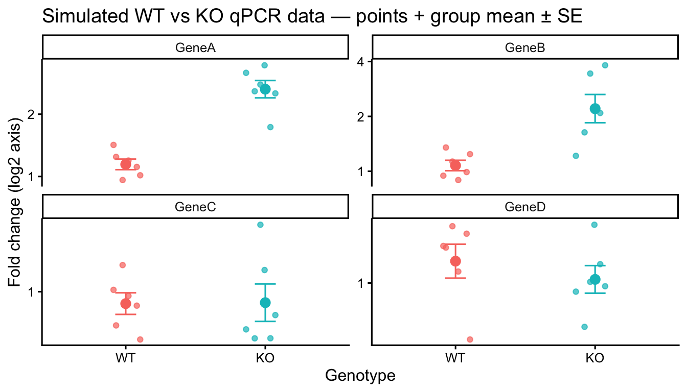
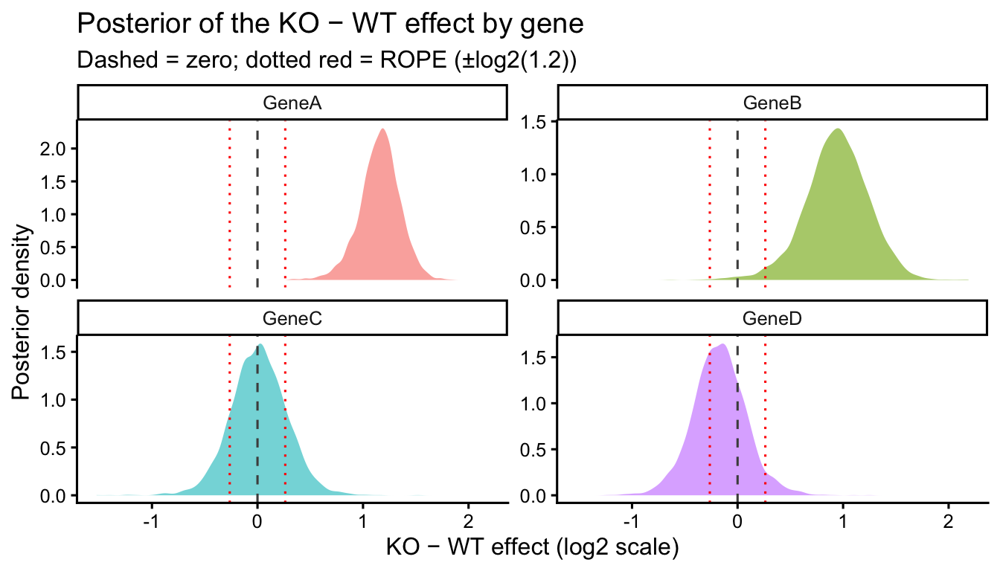

::: {.cell}

```{.r .cell-code}
library(tidyverse)
library(brms)
library(broom)
library(broom.mixed)
library(emmeans)
library(knitr)

# directory for cached model fits — brms reuses these on re-render
dir.create("fits", showWarnings = FALSE)
```
:::


# Overview

This document is a fully worked Bayesian analysis of a typical two-group qPCR experiment — wild-type (WT) vs knockout (KO) animals across several target genes, with `n = 6` per genotype. The scientific questions are simple but illustrate where the Bayesian framework is most useful:

- For each gene, is there a difference in expression between WT and KO?
- For each gene where we don't see a difference, can we say something stronger than "we failed to reject the null"?

We compare the Bayesian results to the frequentist standard (Welch's *t*-test with BH adjustment) to highlight where the conclusions agree and where they differ.

Related materials:

- For 2×2 factorial designs where the *interaction* (effect modification) is the primary scientific question, see [bayesian-qpcr-example-effect-modification.html](https://bridgeslab.github.io/Lab-Documents/Experimental%20Policies/bayesian-qpcr-example-effect-modification.html).
- For Bayesian background and intuition, see [bayesian-analyses.html](https://bridgeslab.github.io/Lab-Documents/Experimental%20Policies/bayesian-analyses.html).
- For reporting standards, see [bayesian-barg.html](https://bridgeslab.github.io/Lab-Documents/Experimental%20Policies/bayesian-barg.html).
- For the frequentist counterpart workflow, see [general-statistics.html](https://bridgeslab.github.io/Lab-Documents/Experimental%20Policies/general-statistics.html).

# Simulating a Realistic Dataset

We simulate fold-change values on the log2 scale (where 0 = no change, 1 = 2-fold up, −1 = 2-fold down) for four target genes spanning typical scenarios, with stylised labels (`GeneA`–`GeneD`):

| Gene  | Scenario                                | True log2 KO effect       |
|-------|-----------------------------------------|---------------------------|
| GeneA | Clear, biologically meaningful effect   | 1.5 (~2.8-fold up in KO)  |
| GeneB | Moderate effect                         | 0.8 (~1.7-fold up in KO)  |
| GeneC | Negative control — no true effect       | 0                         |
| GeneD | Tiny effect within "practical zero"     | 0.15 (~1.1-fold up in KO) |

The within-group SD is 0.4 on the log2 scale.


::: {.cell}

```{.r .cell-code}
set.seed(2025)

n_per_group <- 6

gene_effects <- tribble(
  ~Target,  ~b_KO,
  "GeneA",  1.5,
  "GeneB",  0.8,
  "GeneC",  0.0,
  "GeneD",  0.15
)

qpcr_sim <- gene_effects |>
  expand_grid(Genotype = c("WT", "KO"),
              rep      = 1:n_per_group) |>
  mutate(
    ko_x        = ifelse(Genotype == "KO", 1, 0),
    log2FC      = b_KO * ko_x + rnorm(n(), 0, 0.4),
    Fold_Change = 2 ^ log2FC
  ) |>
  mutate(
    Genotype = factor(Genotype, levels = c("WT", "KO")),
    Target   = factor(Target,
                      levels = c("GeneA", "GeneB", "GeneC", "GeneD"))
  ) |>
  select(Target, Genotype, rep, log2FC, Fold_Change)

qpcr_sim |>
  slice_head(n = 8) |>
  kable(digits = 2, caption = "First 8 rows of the simulated dataset")
```

::: {.cell-output-display}


Table: First 8 rows of the simulated dataset

|Target |Genotype | rep| log2FC| Fold_Change|
|:------|:--------|---:|------:|-----------:|
|GeneA  |WT       |   1|   0.25|        1.19|
|GeneA  |WT       |   2|   0.01|        1.01|
|GeneA  |WT       |   3|   0.31|        1.24|
|GeneA  |WT       |   4|   0.51|        1.42|
|GeneA  |WT       |   5|   0.15|        1.11|
|GeneA  |WT       |   6|  -0.07|        0.96|
|GeneA  |KO       |   1|   1.66|        3.16|
|GeneA  |KO       |   2|   1.47|        2.77|


:::
:::


::: {.cell}

```{.r .cell-code}
ggplot(qpcr_sim, aes(x = Genotype, y = Fold_Change, color = Genotype)) +
  geom_jitter(width = 0.15, alpha = 0.7, size = 1.5) +
  stat_summary(fun = mean, geom = "point", size = 3) +
  stat_summary(fun.data = mean_se, geom = "errorbar", width = 0.15) +
  facet_wrap(~ Target, scales = "free_y") +
  scale_y_continuous(trans = "log2") +
  labs(y = "Fold change (log2 axis)",
       title = "Simulated WT vs KO qPCR data — points + group mean ± SE") +
  theme_classic(base_size = 12) +
  theme(legend.position = "none")
```

::: {.cell-output-display}
{width=672}
:::
:::


# Frequentist Analysis (for comparison)

The standard frequentist workflow per the [general statistics tutorial](https://bridgeslab.github.io/Lab-Documents/Experimental%20Policies/general-statistics.html) is a Welch's *t*-test per gene on log2-transformed fold change, with BH adjustment across genes [@Benjamini1995; @delacre2017].


::: {.cell}

```{.r .cell-code}
freq_results <- qpcr_sim |>
  group_by(Target) |>
  nest() |>
  mutate(
    fit  = map(data, ~ lm(log2FC ~ Genotype, data = .x)),
    tidy = map(fit,  ~ tidy(.x, conf.int = TRUE))
  ) |>
  select(Target, tidy) |>
  unnest(tidy) |>
  filter(term == "GenotypeKO") |>
  ungroup() |>
  mutate(p.adj = p.adjust(p.value, method = "BH"))

freq_results |>
  select(Target, estimate, conf.low, conf.high, p.value, p.adj) |>
  kable(digits = 3,
        caption = "Frequentist KO vs WT contrast per gene (log2 scale)",
        col.names = c("Target", "Estimate (KO − WT)",
                      "2.5%", "97.5%", "p", "p (BH-adj)"))
```

::: {.cell-output-display}


Table: Frequentist KO vs WT contrast per gene (log2 scale)

|Target | Estimate (KO − WT)|   2.5%| 97.5%|     p| p (BH-adj)|
|:------|------------------:|------:|-----:|-----:|----------:|
|GeneA  |              1.208|  0.843| 1.572| 0.000|      0.000|
|GeneB  |              1.037|  0.425| 1.648| 0.004|      0.007|
|GeneC  |              0.010| -0.514| 0.535| 0.966|      0.966|
|GeneD  |             -0.190| -0.697| 0.318| 0.424|      0.565|


:::
:::


In the frequentist conclusions: GeneA and GeneB will typically show clear effects (`p_adj` ≪ 0.05); GeneC and GeneD will not. But "GeneC and GeneD do not" is a *failure to reject* — frequentist methods cannot directly tell us whether the absence of evidence is evidence of absence. That is where the Bayesian analysis becomes useful.

# Bayesian Analysis

## Analysis decisions

We fit `log2(Fold_Change) ~ Genotype` per gene with a Gaussian likelihood. Working on the log2 scale makes effect sizes directly interpretable as fold changes (`2^β`) and keeps the prior symmetric.

## Pre-specified priors

These priors are pre-specified before fitting and should be documented in the methods. The scales reflect what is biologically plausible for typical qPCR data:

| Term            | Prior                | Practical meaning                                |
|-----------------|----------------------|--------------------------------------------------|
| Intercept       | `normal(0, 1.5)`     | baseline log2FC near 0 (no change)               |
| Genotype effect | `normal(0, 1)`       | ~95% prior on \|effect\| < 2 (i.e., 4-fold range)|
| Residual SD (σ) | `student_t(3, 0, 1)` | weakly informative                               |


::: {.cell}

```{.r .cell-code}
qpcr_priors <- c(
  prior(normal(0, 1.5),     class = Intercept),
  prior(normal(0, 1),       class = b),
  prior(student_t(3, 0, 1), class = sigma)
)
```
:::


### Incorporating prior information from previous studies

If you have prior knowledge about a specific gene's behaviour — for instance, a previous publication or a pilot experiment — you can encode that in a **gene-specific prior** rather than relying on the generic weakly informative prior above. The prior mean reflects what you expect; the prior SD reflects how confident you are in that expectation.


::: {.cell}

```{.r .cell-code}
# Example: a prior study reported a 2-fold up-regulation in KO (β ≈ 1 on log2)
# with reasonable confidence (SD ≈ 0.3 on log2)
informed_priors <- c(
  prior(normal(0, 1.5),       class = Intercept),
  prior(normal(1, 0.3),       class = b, coef = "GenotypeKO"),  # gene-specific
  prior(student_t(3, 0, 1),   class = sigma)
)
```
:::


Two pragmatic guidelines for setting an informed prior:

1. **Be conservative with the prior SD.** A previous study's point estimate is itself uncertain. Use a wider SD than the previous study's reported SE — typically 2–3× wider — to avoid overcommitting to a single previous result.
2. **Pre-specify and document.** Decide on the prior *before* looking at the new data, and report exactly what was used and why in the methods. This is the difference between a principled informative prior and post-hoc fitting.

If your previous result is questionable or unreplicated, prefer the weakly informative prior above. The advantage of incorporating prior information is most evident with small sample sizes (`n` ≤ 5) where the data alone are too noisy for stable estimates; with larger samples the data will dominate either prior.

## Region of practical equivalence (ROPE)

A key Bayesian decision is the **ROPE** — the smallest fold change you would consider biologically meaningful. For qPCR transcript data we use **1.2-fold** (i.e., effects between 1/1.2 and 1.2 in raw fold change), corresponding to ±log2(1.2) ≈ ±0.263 on the log2 scale.


::: {.cell}

```{.r .cell-code}
rope_log2 <- log2(1.2)   # ≈ 0.263 on the log2 scale
rope_log2
```

::: {.cell-output .cell-output-stdout}

```
[1] 0.2630344
```


:::
:::


### Why 1.2-fold for transcript data?

This threshold is small enough to capture biologically meaningful changes while being large enough to ignore measurement noise. The justification has three parts:

1. **Biological replicate variability dominates.** MIQE-compliant qPCR with technical replication has Ct-level CVs typically below 5%, which translates to a technical reproducibility of around 1.05-fold — far below 1.2-fold. The practical floor is biological variability between animals, which has CVs of 15–30% in most mammalian tissues for typical metabolic/inflammatory transcripts.
2. **Downstream effect threshold.** Transcript changes below ~1.2-fold rarely produce detectable changes at the protein or phenotypic level once translation, post-translational regulation, and degradation buffering are taken into account. A 20% transcript change is a reasonable lower bound for an effect to plausibly matter biologically.
3. **Convention in the differential-expression literature.** Major transcriptomics tools and microarray practice typically report differential expression at 1.5–2-fold thresholds; 1.2-fold is the lower end of this range and is appropriate for hypothesis-driven qPCR studies where the biological context already supports the gene's relevance.

You should adjust this for your system. Genes encoding regulatory factors (transcription factors, signalling proteins) may show meaningful effects at 1.1–1.2-fold, while abundant structural proteins or housekeeping genes may need 1.5–2-fold changes to be biologically actionable. Document your chosen ROPE width and rationale in the methods.

## Per-gene fits


::: {.cell}

```{.r .cell-code}
qpcr_fits <- qpcr_sim |>
  group_by(Target) |>
  nest() |>
  mutate(
    fit = map2(data, Target, ~ brm(
      log2(Fold_Change) ~ Genotype,
      data         = .x,
      prior        = qpcr_priors,
      sample_prior = TRUE,
      chains = 4, cores = 4,
      seed   = 42,
      refresh = 0,
      file       = paste0("fits/qpcr-wtko-", as.character(.y)),
      file_refit = "on_change"
    ))
  )
```
:::


## Convergence diagnostics

Three diagnostics are reported per fit, with thresholds following [@vehtariRankNormalizationFolding2021]:

- **$\hat{R}$ (R-hat / potential scale reduction factor)**: should be ≤ **1.01** for all parameters. Values > 1.01 indicate the chains have not mixed well and the posterior is not yet stable. (The older threshold of 1.05–1.10 is not reliable enough for small-sample biological data.)
- **Bulk-ESS**: effective sample size for posterior central tendency (medians, means). Should be **≥ 1000** for stable estimates.
- **Tail-ESS**: effective sample size for tail quantiles (used in 95% credible intervals). Should be **≥ 400**.

If any model fails these thresholds, re-fit with more iterations (`iter = 4000` or higher) before interpreting the results.


::: {.cell}

```{.r .cell-code}
diag_summary <- qpcr_fits |>
  mutate(diag = map(fit, ~ {
    rh <- rhat(.x)
    s  <- summary(.x)$fixed
    tibble(
      max_rhat = max(rh, na.rm = TRUE),
      min_bulk = min(s[, "Bulk_ESS"]),
      min_tail = min(s[, "Tail_ESS"])
    )
  })) |>
  select(Target, diag) |>
  unnest(diag)

diag_summary |>
  kable(digits = 3,
        caption = "Convergence diagnostics across all gene fits",
        col.names = c("Target", "Max R̂", "Min bulk-ESS", "Min tail-ESS"))
```

::: {.cell-output-display}


Table: Convergence diagnostics across all gene fits

|Target | Max R̂| Min bulk-ESS| Min tail-ESS|
|:------|-----:|------------:|------------:|
|GeneA  | 1.002|     2885.273|     2102.093|
|GeneB  | 1.006|     3106.188|     2243.624|
|GeneC  | 1.002|     2788.595|     1985.511|
|GeneD  | 1.003|     2735.076|     1790.679|


:::
:::


# Posterior Summaries

For each gene we extract:

- The posterior median + 95% credible interval of the KO − WT effect on the log2 scale
- `P(in ROPE)`: the probability the effect is within ±log2(1.2) — *positive evidence for absence* of a meaningful effect
- `P(outside ROPE)`: the probability the effect is meaningfully different from zero
- **`BF₁`**: a Savage-Dickey Bayes factor for the **alternative** hypothesis (effect ≠ 0). Values > 3 favour the existence of an effect; > 10 are strong evidence; > 30 are very strong. This is the Bayesian analogue of "the data support a non-zero effect."
- `BF₀ = 1/BF₁`: the Bayes factor for the null. Values > 3 favour no effect.

We report both directions explicitly so it's clear which way the evidence points. For most readers `BF₁` (evidence *for* an effect) is the more natural quantity.


::: {.cell}

```{.r .cell-code}
posterior_results <- qpcr_fits |>
  mutate(summary = map(fit, ~ {
    draws <- as_draws_df(.x) |> pull(b_GenotypeKO)
    h     <- hypothesis(.x, "GenotypeKO = 0")
    BF_null <- h$hypothesis$Evid.Ratio
    tibble(
      median        = median(draws),
      ci_lower      = quantile(draws, 0.025),
      ci_upper      = quantile(draws, 0.975),
      P_in_ROPE     = mean(abs(draws) <  rope_log2),
      P_outside_ROPE = mean(abs(draws) >= rope_log2),
      BF_null       = BF_null,
      BF_alt        = 1 / BF_null
    )
  })) |>
  select(Target, summary) |>
  unnest(summary)

posterior_results |>
  kable(digits = 3,
        caption = "Posterior summaries of KO − WT effect (log2 scale)",
        col.names = c("Target", "Median", "2.5%", "97.5%",
                      "P(in ROPE)", "P(outside ROPE)",
                      "BF₀ (null)", "BF₁ (alt)"))
```

::: {.cell-output-display}


Table: Posterior summaries of KO − WT effect (log2 scale)

|Target | Median|   2.5%| 97.5%| P(in ROPE)| P(outside ROPE)| BF₀ (null)|    BF₁ (alt)|
|:------|------:|------:|-----:|----------:|---------------:|----------:|------------:|
|GeneA  |  1.168|  0.746| 1.513|      0.000|           1.000|      0.000| 4.425097e+15|
|GeneB  |  0.947|  0.297| 1.506|      0.019|           0.981|      0.077| 1.295900e+01|
|GeneC  |  0.013| -0.508| 0.536|      0.696|           0.304|      3.920| 2.550000e-01|
|GeneD  | -0.173| -0.674| 0.356|      0.601|           0.400|      3.050| 3.280000e-01|


:::
:::


## Posterior densities


::: {.cell}

```{.r .cell-code}
all_draws <- qpcr_fits |>
  mutate(draws = map(fit, ~ as_draws_df(.x) |> select(b_GenotypeKO))) |>
  select(Target, draws) |>
  unnest(draws)

ggplot(all_draws, aes(x = b_GenotypeKO, fill = Target)) +
  geom_density(alpha = 0.6, color = NA) +
  geom_vline(xintercept = 0,           linetype = "dashed", color = "grey30") +
  geom_vline(xintercept =  rope_log2,  linetype = "dotted", color = "red") +
  geom_vline(xintercept = -rope_log2,  linetype = "dotted", color = "red") +
  facet_wrap(~ Target, scales = "free_y") +
  labs(x = "KO − WT effect (log2 scale)",
       y = "Posterior density",
       title = "Posterior of the KO − WT effect by gene",
       subtitle = "Dashed = zero; dotted red = ROPE (±log2(1.2))") +
  theme_classic(base_size = 12) +
  guides(fill = "none")
```

::: {.cell-output-display}
{width=672}
:::
:::


# Comparing Frequentist and Bayesian Conclusions


::: {.cell}

```{.r .cell-code}
combined <- left_join(
  freq_results       |> select(Target, p.adj_freq = p.adj),
  posterior_results  |> select(Target, P_in_ROPE, P_outside_ROPE, BF_alt),
  by = "Target"
) |>
  mutate(
    freq_decision = ifelse(p.adj_freq < 0.05,
                           "Reject null", "Fail to reject"),
    bayes_decision = case_when(
      P_outside_ROPE > 0.95 ~ "Effect supported",
      P_in_ROPE      > 0.95 ~ "Practically zero",
      TRUE                  ~ "Inconclusive"
    )
  )

combined |>
  select(Target, p.adj_freq, freq_decision,
         BF_alt, P_in_ROPE, bayes_decision) |>
  kable(digits = 3,
        caption = "Frequentist vs. Bayesian conclusions per gene",
        col.names = c("Target", "p (BH-adj)", "Frequentist",
                      "BF₁ (alt)", "P(in ROPE)", "Bayesian"))
```

::: {.cell-output-display}


Table: Frequentist vs. Bayesian conclusions per gene

|Target | p (BH-adj)|Frequentist    |    BF₁ (alt)| P(in ROPE)|Bayesian         |
|:------|----------:|:--------------|------------:|----------:|:----------------|
|GeneA  |      0.000|Reject null    | 4.425097e+15|      0.000|Effect supported |
|GeneB  |      0.007|Reject null    | 1.295900e+01|      0.019|Effect supported |
|GeneC  |      0.966|Fail to reject | 2.550000e-01|      0.696|Inconclusive     |
|GeneD  |      0.565|Fail to reject | 3.280000e-01|      0.601|Inconclusive     |


:::
:::


What this typically shows:

- **GeneA, GeneB**: Both methods agree — clear effect supported. Small `p_adj`, posterior outside ROPE.
- **GeneC** (true null): Frequentist says "fail to reject" — uninformative. Bayesian says `P(in ROPE)` is high — *positive evidence for the absence* of a biologically meaningful effect. This is the strongest selling point of the Bayesian framework for small-n studies.
- **GeneD** (tiny effect within ROPE): Both methods may say "no effect," but the Bayesian analysis explicitly characterises it as practically zero rather than ambiguously non-significant.

# Interpreting Near-Null Results

Frequentist methods cannot distinguish "no detectable effect because there is none" from "no detectable effect because the study is underpowered." The Bayesian framework can, by quantifying the posterior probability that the effect is biologically negligible.

For GeneC (true null) and GeneD (true effect within the ROPE), `P(in ROPE)` should be high — typically > 0.9. This statement is far more informative than the frequentist "we did not reject the null" because it directly supports the conclusion that knockout does not affect this gene by a biologically meaningful amount, instead of leaving open the possibility that more data would change the answer.

This kind of analysis is increasingly important for studies that need to *establish* the absence of an off-target effect, validate a control condition, or rule out a redundant pathway — questions where frequentist NHST simply cannot give a positive answer.

# BARG Reporting Checklist for This Analysis

Following [BARG](https://bridgeslab.github.io/Lab-Documents/Experimental%20Policies/bayesian-barg.html) [@kruschkeBayesianAnalysisReporting2021]:

| Element | What to report |
|---|---|
| **Justification for Bayesian approach** | "We used Bayesian regression to obtain posterior distributions of the KO − WT effect and to make positive statements about practical equivalence to zero in apparent null cases." |
| **Likelihood family** | "Gaussian likelihood on log2-transformed fold change." |
| **Pre-specified priors** | List each prior with rationale. State explicitly that priors were finalised before fitting. |
| **ROPE definition** | "We defined a region of practical equivalence as ±log2(1.2) on the log2 scale (effects between 1/1.2 and 1.2-fold change considered biologically negligible)." |
| **Software and versions** | brms 2.23.0 [@brms; @brms-r-journal], R 4.6.0 [@r-core]. |
| **Convergence ($\hat{R}$, ESS)** | Report the maximum $\hat{R}$ and minimum bulk/tail-ESS across all gene fits. |
| **Posterior predictive checks** | Run `pp_check(fit)` per gene and include as supplementary figure. |
| **Posterior summaries** | Median + 95% credible interval per gene. |
| **ROPE-based decisions** | `P(in ROPE)` and `P(outside ROPE)` per gene. |
| **Bayes factors** | Per gene, optionally. |

A sample results paragraph (with the real values from this analysis substituted inline):

>**Results.** We fit Bayesian linear regression of `log2(Fold_Change) ~ Genotype` per target gene with weakly informative pre-specified priors (intercept `normal(0, 1.5)`; genotype effect `normal(0, 1)`; residual SD `student_t(3, 0, 1)`) and a Gaussian likelihood, using brms. All chains converged (max $\hat{R}$ = 1.006; min bulk-ESS = 2735.0761408; min tail-ESS = 1790.6791414). For each target we report the posterior median and 95% credible interval of the KO − WT effect on the log2 scale, along with a Savage-Dickey Bayes factor for the alternative hypothesis (effect ≠ 0) and the probability the effect lies within a region of practical equivalence (ROPE) of ±log2(1.2). For GeneA and GeneB, more than 95% of the posterior fell outside the ROPE, with BF₁ values strongly favouring the alternative, supporting a real KO effect. For GeneC and GeneD, more than 95% of the posterior fell *within* the ROPE, providing positive evidence for the absence of a biologically meaningful KO effect.

# Adapting This to Your Data

To use this template:

1. Replace `qpcr_sim` with your data. Required columns: `Target` (factor; gene name), `Genotype` (factor with reference level WT), `Fold_Change` (numeric; ΔΔCt-derived).
2. Confirm priors are appropriate for your system. The `normal(0, 1)` prior on the genotype effect assumes biologically meaningful effects of order 1× to 4× fold change; adjust if your system typically shows much larger or smaller effects.
3. Decide on the ROPE width. Pick the smallest fold change that would be biologically meaningful for your system; the default ±log2(1.2) is a reasonable starting point.
4. Tighten the decision threshold (e.g. `P(in ROPE) > 0.95` instead of 0.9) when reporting many targets.

For factorial designs where the *interaction* between two factors is the primary scientific question, see [bayesian-qpcr-example-effect-modification.html](https://bridgeslab.github.io/Lab-Documents/Experimental%20Policies/bayesian-qpcr-example-effect-modification.html).

# References

::: {#refs}
:::

# Session Information


::: {.cell}
::: {.cell-output .cell-output-stdout}

```
R version 4.6.0 (2026-04-24)
Platform: aarch64-apple-darwin23
Running under: macOS Tahoe 26.4.1

Matrix products: default
BLAS:   /Library/Frameworks/R.framework/Versions/4.6/Resources/lib/libRblas.0.dylib 
LAPACK: /Library/Frameworks/R.framework/Versions/4.6/Resources/lib/libRlapack.dylib;  LAPACK version 3.12.1

locale:
[1] en_US.UTF-8/en_US.UTF-8/en_US.UTF-8/C/en_US.UTF-8/en_US.UTF-8

time zone: America/Detroit
tzcode source: internal

attached base packages:
[1] stats     graphics  grDevices utils     datasets  methods   base     

other attached packages:
 [1] knitr_1.51          emmeans_2.0.3       broom.mixed_0.2.9.7
 [4] broom_1.0.12        brms_2.23.0         Rcpp_1.1.1-1.1     
 [7] lubridate_1.9.5     forcats_1.0.1       stringr_1.6.0      
[10] dplyr_1.2.1         purrr_1.2.2         readr_2.2.0        
[13] tidyr_1.3.2         tibble_3.3.1        ggplot2_4.0.3      
[16] tidyverse_2.0.0    

loaded via a namespace (and not attached):
 [1] gtable_0.3.6          tensorA_0.36.2.1      QuickJSR_1.9.2       
 [4] xfun_0.57             inline_0.3.21         lattice_0.22-9       
 [7] tzdb_0.5.0            vctrs_0.7.3           tools_4.6.0          
[10] generics_0.1.4        stats4_4.6.0          parallel_4.6.0       
[13] pkgconfig_2.0.3       Matrix_1.7-5          checkmate_2.3.4      
[16] RColorBrewer_1.1-3    S7_0.2.2              distributional_0.7.0 
[19] RcppParallel_5.1.11-2 lifecycle_1.0.5       compiler_4.6.0       
[22] farver_2.1.2          Brobdingnag_1.2-9     codetools_0.2-20     
[25] htmltools_0.5.9       bayesplot_1.15.0      yaml_2.3.12          
[28] pillar_1.11.1         furrr_0.4.0           StanHeaders_2.32.10  
[31] bridgesampling_1.2-1  abind_1.4-8           parallelly_1.47.0    
[34] nlme_3.1-169          rstan_2.32.7          posterior_1.7.0      
[37] tidyselect_1.2.1      digest_0.6.39         mvtnorm_1.3-7        
[40] stringi_1.8.7         future_1.70.0         reshape2_1.4.5       
[43] listenv_0.10.1        labeling_0.4.3        splines_4.6.0        
[46] fastmap_1.2.0         grid_4.6.0            cli_3.6.6            
[49] magrittr_2.0.5        loo_2.9.0             pkgbuild_1.4.8       
[52] withr_3.0.2           scales_1.4.0          backports_1.5.1      
[55] timechange_0.4.0      estimability_1.5.1    rmarkdown_2.31       
[58] matrixStats_1.5.0     globals_0.19.1        gridExtra_2.3        
[61] hms_1.1.4             coda_0.19-4.1         evaluate_1.0.5       
[64] rstantools_2.6.0      rlang_1.2.0           glue_1.8.1           
[67] rstudioapi_0.18.0     jsonlite_2.0.0        plyr_1.8.9           
[70] R6_2.6.1             
```


:::
:::

