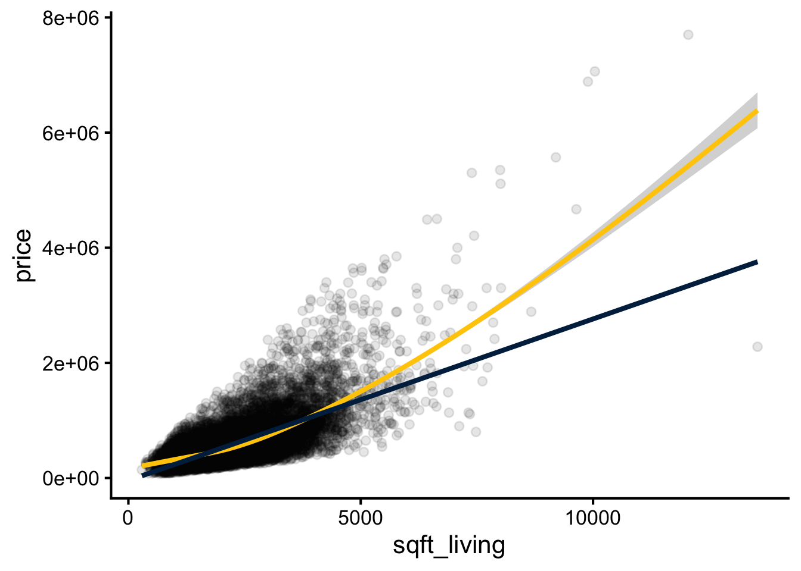
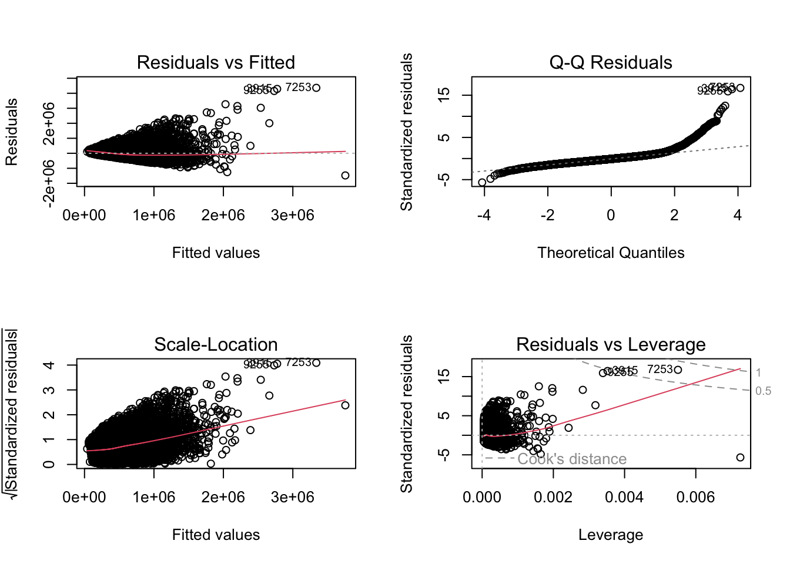
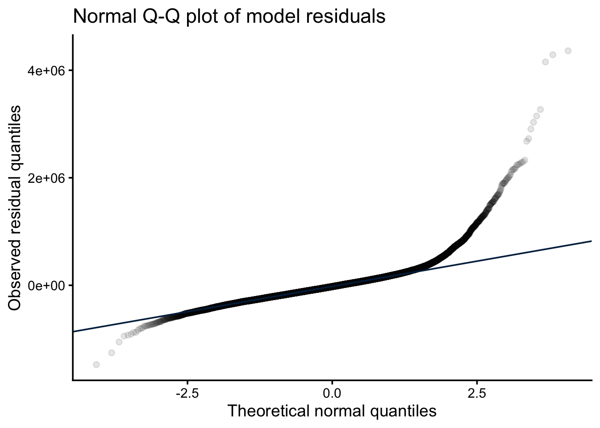
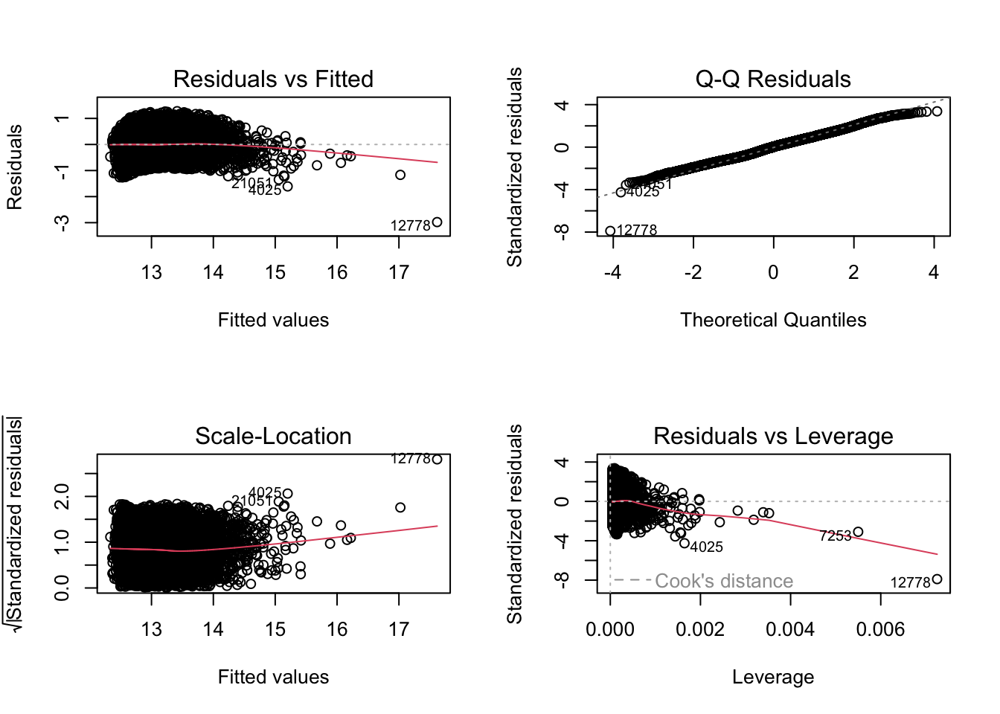
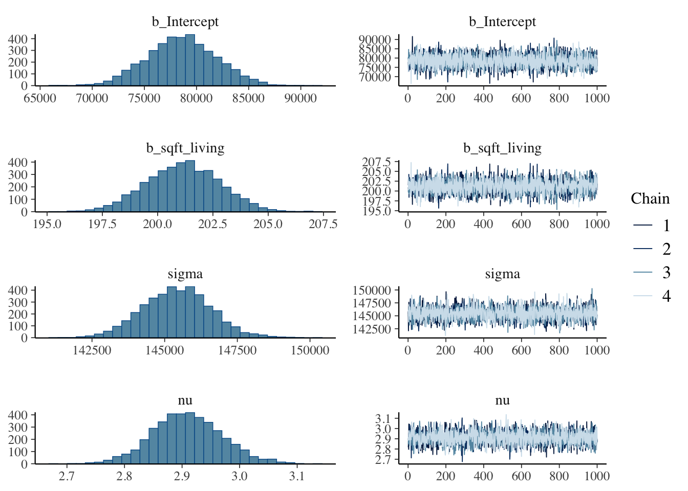
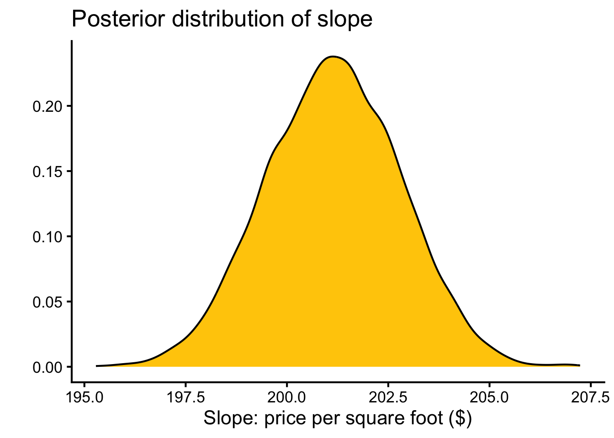
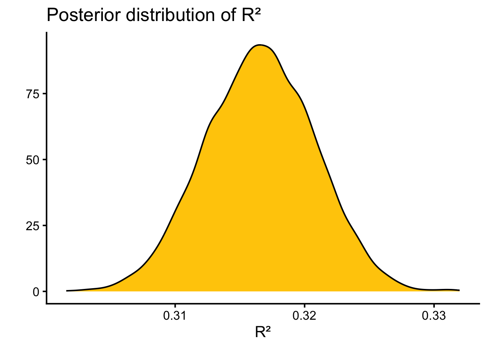
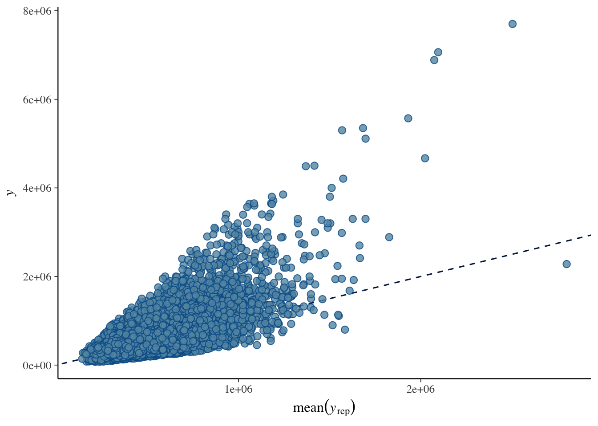
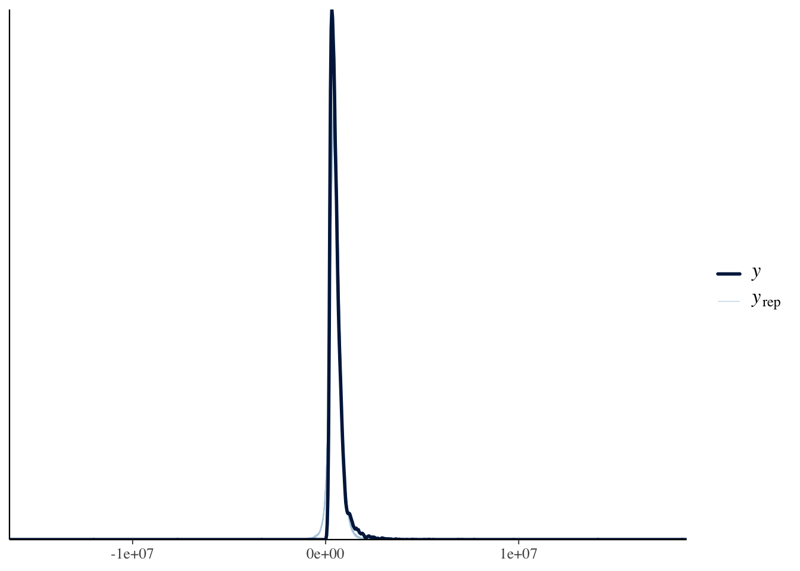

::: {.cell}

```{.r .cell-code}
library(tidyverse)
library(moderndive)
library(broom)
library(knitr)
```
:::


We will use the `house_prices` dataset from the `moderndive` package, which contains sale prices and characteristics of houses in King County, Washington. Here we explore how the square feet of living space (`sqft_living`) relates to sale `price`.


::: {.cell}

```{.r .cell-code}
color_scheme <- c("#00274c", "#ffcb05")
```
:::


## Visualizing a Relationship

The first step is always to plot the two variables against each other. Here we overlay both a smoothed (loess) curve and a linear fit to see whether a straight line is a reasonable description of the relationship.


::: {.cell}

```{.r .cell-code}
ggplot(house_prices, aes(y = price, x = sqft_living)) +
  geom_point(alpha = 0.1) +
  geom_smooth(method = "loess", color = color_scheme[2]) +
  geom_smooth(method = "lm",    color = color_scheme[1]) +
  theme_classic(base_size = 16)
```

::: {.cell-output-display}
{width=672}
:::
:::


The relationship appears approximately linear (blue line), though the loess curve (maize) suggests a slight upward bend at larger values, indicating some non-linearity. We will address this in the [Non-Linear Relationships](#non_linear) section.

## Quantifying the Relationship: Correlation

Before fitting a regression model it is useful to quantify the strength of the association with a correlation coefficient. There are two main choices.

### Pearson Correlation

Pearson's *r* measures the strength of the **linear** association. Inference (the t-test for H₀: ρ = 0) relies on bivariate normality — both variables should be approximately normally distributed. With large samples the Central Limit Theorem makes the test robust to moderate departures, but Pearson *r* is sensitive to outliers and is attenuated by non-linearity.


::: {.cell}

```{.r .cell-code}
cor.test(house_prices$price, house_prices$sqft_living, method = "pearson") |>
  tidy() |>
  kable(digits = 3, caption = "Pearson correlation between price and living area")
```

::: {.cell-output-display}


Table: Pearson correlation between price and living area

| estimate| statistic| p.value| parameter| conf.low| conf.high|method                               |alternative |
|--------:|---------:|-------:|---------:|--------:|---------:|:------------------------------------|:-----------|
|    0.702|    144.92|       0|     21611|    0.695|     0.709|Pearson's product-moment correlation |two.sided   |


:::
:::


### Spearman Correlation

Spearman's ρ is a rank-based measure of **monotonic** association. It does not assume normality and is robust to outliers and non-linearity. It is the better default when the data are skewed or when the relationship may be monotonic but not strictly linear — both of which apply here.


::: {.cell}

```{.r .cell-code}
cor.test(house_prices$price, house_prices$sqft_living, method = "spearman") |>
  tidy() |>
  kable(digits = 3, caption = "Spearman correlation between price and living area")
```

::: {.cell-output-display}


Table: Spearman correlation between price and living area

| estimate|    statistic| p.value|method                          |alternative |
|--------:|------------:|-------:|:-------------------------------|:-----------|
|    0.644| 598702208243|       0|Spearman's rank correlation rho |two.sided   |


:::
:::


Spearman ρ will generally differ from Pearson *r* when the data are skewed or the relationship is non-linear. A noticeably higher Spearman ρ suggests the relationship is monotonic but not strictly linear — which matches what the loess curve shows.

## Describing the Linear Relationship with Regression

A linear model provides both the **slope** (how much price changes per additional square foot) and **R²** (the proportion of variance in price explained by living area). We extract these with `tidy()` (coefficients) and `glance()` (overall fit), adding confidence intervals throughout.


::: {.cell}

```{.r .cell-code}
lm.1 <- lm(price ~ sqft_living, data = house_prices)

tidy(lm.1, conf.int = TRUE) |>
  kable(digits = 2, caption = "Coefficient estimates with 95% confidence intervals")
```

::: {.cell-output-display}


Table: Coefficient estimates with 95% confidence intervals

|term        |  estimate| std.error| statistic| p.value|  conf.low| conf.high|
|:-----------|---------:|---------:|---------:|-------:|---------:|---------:|
|(Intercept) | -43580.74|   4402.69|     -9.90|       0| -52210.34| -34951.15|
|sqft_living |    280.62|      1.94|    144.92|       0|    276.83|    284.42|


:::

```{.r .cell-code}
glance(lm.1) |>
  kable(digits = 3, caption = "Overall model fit")
```

::: {.cell-output-display}


Table: Overall model fit

| r.squared| adj.r.squared|    sigma| statistic| p.value| df|    logLik|      AIC|      BIC|     deviance| df.residual|  nobs|
|---------:|-------------:|--------:|---------:|-------:|--:|---------:|--------:|--------:|------------:|-----------:|-----:|
|     0.493|         0.493| 261452.9|  21001.91|       0|  1| -300267.3| 600540.6| 600564.5| 1.477276e+15|       21611| 21613|


:::
:::


We estimate that price increases by \$281 (95% CI: \$277 – \$284) per square foot of living space. The model explains 49.3% of the variance in price (R² = 0.493). For simple regression with one predictor, R² equals the squared Pearson correlation. When comparing models with different numbers of predictors, use adjusted R² from `glance()` instead, which penalises additional parameters.

### Confidence Intervals vs. Prediction Intervals

It is important to distinguish two types of interval around the fitted line:

- A **confidence interval** describes uncertainty in the *mean* response at a given x — how well we know where the regression line is.
- A **prediction interval** describes uncertainty for a *new individual observation* at a given x — it is always wider because it must also account for the residual variance around the line.

For applied questions (e.g. "what will this specific house sell for?"), prediction intervals are what matter.


::: {.cell}

```{.r .cell-code}
new_sizes <- data.frame(sqft_living = c(1000, 2000, 3000))

bind_cols(
  new_sizes,
  predict(lm.1, newdata = new_sizes, interval = "confidence") |>
    as_tibble() |> rename(ci_lwr = lwr, ci_upr = upr),
  predict(lm.1, newdata = new_sizes, interval = "prediction") |>
    as_tibble() |> select(pi_lwr = lwr, pi_upr = upr)
) |>
  kable(digits = 0,
        caption = "Fitted values with 95% confidence intervals (CI) and prediction intervals (PI)")
```

::: {.cell-output-display}


Table: Fitted values with 95% confidence intervals (CI) and prediction intervals (PI)

| sqft_living|    fit| ci_lwr| ci_upr|  pi_lwr|  pi_upr|
|-----------:|------:|------:|------:|-------:|-------:|
|        1000| 237043| 231662| 242423| -275452|  749538|
|        2000| 517666| 514167| 521165|    5188| 1030145|
|        3000| 798290| 793356| 803224|  285799| 1310781|


:::
:::


The prediction intervals are substantially wider than the confidence intervals, illustrating that even a well-fitting model has considerable uncertainty for individual predictions.

### Testing the Assumptions of the Model

For a linear model there are four assumptions:

- **Linearity**: The relationship between predictor and outcome is linear — one unit change in x produces a constant change in y.
- **Independence**: Residuals are independent of each other and of the predictor.
- **Homoscedasticity**: Residuals have constant variance across all fitted values.
- **Normality**: Residuals are approximately normally distributed.


::: {.cell}

```{.r .cell-code}
par(mfrow = c(2, 2))
plot(lm.1)
```

::: {.cell-output-display}
{width=672}
:::
:::


#### Interpreting These Diagnostic Plots

- **Residuals vs. Fitted**: Residuals should scatter randomly around zero with no pattern. A cone shape (widening spread) indicates heteroscedasticity; a curve indicates non-linearity.
- **Normal Q-Q**: Residuals should fall on the diagonal reference line. Deviations at the upper tail (points curve above the line) indicate a heavy right tail or right skewness. An S-shape indicates the tails are lighter than normal (platykurtic); a reverse S-shape indicates heavier tails (leptokurtic).
- **Scale-Location**: The square root of standardised residuals should be approximately flat. An upward slope indicates heteroscedasticity.
- **Residuals vs. Leverage**: Points outside Cook's distance dashed lines are influential — their removal would substantially change the fitted coefficients.

#### Assessing Residual Normality

A Q-Q plot of model residuals is the primary visual diagnostic for normality. Points should fall approximately on the diagonal; systematic departures indicate the residuals are not normally distributed.


::: {.cell}

```{.r .cell-code}
tibble(residuals = residuals(lm.1)) |>
  ggplot(aes(sample = residuals)) +
  stat_qq(alpha = 0.1) +
  stat_qq_line(color = color_scheme[1]) +
  labs(
    title = "Normal Q-Q plot of model residuals",
    x     = "Theoretical normal quantiles",
    y     = "Observed residual quantiles"
  ) +
  theme_classic(base_size = 14)
```

::: {.cell-output-display}
{width=672}
:::
:::


A Shapiro-Wilk test can supplement the visual check, but note that with large datasets it has very high power — it will reject normality for trivial departures that have no practical effect on inference. Treat the Q-Q plot as the primary diagnostic and the p-value as a supplementary signal.


::: {.cell}

```{.r .cell-code}
# Shapiro-Wilk requires n ≤ 5000; sample from the full dataset
set.seed(42)
bind_rows(
  sample(house_prices$price,       5000) |> shapiro.test() |> tidy() |> mutate(variable = "price"),
  sample(house_prices$sqft_living, 5000) |> shapiro.test() |> tidy() |> mutate(variable = "sqft_living"),
  sample(residuals(lm.1),          5000) |> shapiro.test() |> tidy() |> mutate(variable = "residuals")
) |>
  relocate(variable) |>
  kable(digits = 3, caption = "Shapiro-Wilk tests (n = 5000 sample; see text on large-n interpretation)")
```

::: {.cell-output-display}


Table: Shapiro-Wilk tests (n = 5000 sample; see text on large-n interpretation)

|variable    | statistic| p.value|method                      |
|:-----------|---------:|-------:|:---------------------------|
|price       |     0.699|       0|Shapiro-Wilk normality test |
|sqft_living |     0.927|       0|Shapiro-Wilk normality test |
|residuals   |     0.876|       0|Shapiro-Wilk normality test |


:::
:::


Here both variables and the residuals are significantly non-normal, and the diagnostic plots confirm heteroscedasticity (cone-shaped residuals vs. fitted, upward-sloping scale-location plot) and a heavy upper tail (Q-Q points lift above the line at high quantiles). This combination — right-skewed outcome, heteroscedasticity, slight non-linearity — is typical of price data and suggests a log transformation of the response is worth trying (see below).

#### What to Do if Assumptions Are Not Met

- **Non-linearity**: Apply a transformation (log, square root) to the predictor or response, add polynomial or spline terms, or use a generalised additive model (GAM). See [Non-Linear Relationships](#non_linear).
- **Heteroscedasticity**: Log-transform the response (often fixes both heteroscedasticity and non-linearity for skewed outcomes); use weighted least squares; or use heteroscedasticity-consistent (sandwich) standard errors via `lmtest::coeftest()` with `sandwich::vcovHC()`.
- **Non-normality of residuals**: Transformation is usually the first step. With large n, the CLT means non-normal residuals have little effect on coefficient inference, but they do affect prediction intervals. Robust regression (`MASS::rlm()`) or quantile regression are alternatives.
- **Non-independence**: For clustered or repeated-measures data, use mixed-effects models (`lme4::lmer()`). For time series, use ARIMA or include lagged terms.

## Evaluating and Modifying Models for Non-Linear Relationships {#non_linear}

Given the diagnostic evidence of non-linearity and heteroscedasticity, we can try a log transformation of the response and compare it against the original model and a polynomial extension.


::: {.cell}

```{.r .cell-code}
lm.log <- lm(log(price) ~ sqft_living, data = house_prices)

tidy(lm.log, conf.int = TRUE) |>
  kable(digits = 4, caption = "Log-price model coefficients")
```

::: {.cell-output-display}


Table: Log-price model coefficients

|term        | estimate| std.error| statistic| p.value| conf.low| conf.high|
|:-----------|--------:|---------:|---------:|-------:|--------:|---------:|
|(Intercept) |  12.2185|    0.0064| 1916.8830|       0|  12.2060|   12.2310|
|sqft_living |   0.0004|    0.0000|  142.2326|       0|   0.0004|    0.0004|


:::

```{.r .cell-code}
par(mfrow = c(2, 2))
plot(lm.log)
```

::: {.cell-output-display}
{width=672}
:::
:::


The slope on the log scale is a proportional effect. The exact percentage change in price per unit increase in `sqft_living` is $(\exp(\beta) - 1) \times 100$. The approximation $\beta \times 100$ is adequate only when $|\beta| \lesssim 0.05$; for larger coefficients the approximation understates the true effect.


::: {.cell}

```{.r .cell-code}
beta_log <- coef(lm.log)["sqft_living"]
tibble(
  slope_log_scale      = beta_log,
  pct_change_exact     = (exp(beta_log) - 1) * 100,
  pct_change_approx    = beta_log * 100
) |>
  kable(digits = 4,
        caption = "Exact vs approximate percentage-change interpretation of log-scale slope")
```

::: {.cell-output-display}


Table: Exact vs approximate percentage-change interpretation of log-scale slope

| slope_log_scale| pct_change_exact| pct_change_approx|
|---------------:|----------------:|-----------------:|
|           4e-04|           0.0399|            0.0399|


:::
:::


The diagnostic plots should now show more uniform spread and a straighter Q-Q line if the transformation was appropriate.

We can also fit a polynomial model on the original scale (valid AIC comparison since the response is the same). We use `poly(sqft_living, 2)` rather than `sqft_living + I(sqft_living^2)` because `poly()` generates orthogonal polynomial terms, eliminating the collinearity between x and x² that inflates standard errors with raw polynomial coding.


::: {.cell}

```{.r .cell-code}
lm.poly <- lm(price ~ poly(sqft_living, 2), data = house_prices)

tidy(lm.poly, conf.int = TRUE) |>
  kable(digits = 2, caption = "Orthogonal polynomial model coefficients")
```

::: {.cell-output-display}


Table: Orthogonal polynomial model coefficients

|term                  |   estimate| std.error| statistic| p.value|   conf.low|  conf.high|
|:---------------------|----------:|---------:|---------:|-------:|----------:|----------:|
|(Intercept)           |   540088.1|   1707.09|    316.38|       0|   536742.1|   543434.2|
|poly(sqft_living, 2)1 | 37889845.6| 250965.79|    150.98|       0| 37397934.1| 38381757.0|
|poly(sqft_living, 2)2 | 10779419.7| 250965.79|     42.95|       0| 10287508.2| 11271331.1|


:::
:::


### Comparing Models with AIC and BIC

AIC and BIC penalise model complexity and can identify which model fits the data best relative to its degrees of freedom. **Models must have the same response variable to be compared** — so we compare the log-response models with each other, and the original-scale models with each other, but not across the two response scales.


::: {.cell}

```{.r .cell-code}
# Original-scale models: linear vs. quadratic
AIC(lm.1, lm.poly) |>
  rownames_to_column("model") |>
  kable(digits = 1, caption = "AIC comparison: linear vs. quadratic (original scale)")
```

::: {.cell-output-display}


Table: AIC comparison: linear vs. quadratic (original scale)

|model   | df|      AIC|
|:-------|--:|--------:|
|lm.1    |  3| 600540.6|
|lm.poly |  4| 598772.0|


:::

```{.r .cell-code}
BIC(lm.1, lm.poly) |>
  rownames_to_column("model") |>
  kable(digits = 1, caption = "BIC comparison: linear vs. quadratic (original scale)")
```

::: {.cell-output-display}


Table: BIC comparison: linear vs. quadratic (original scale)

|model   | df|      BIC|
|:-------|--:|--------:|
|lm.1    |  3| 600564.5|
|lm.poly |  4| 598803.9|


:::
:::


Lower AIC/BIC indicates better fit adjusted for model complexity. A difference of >2 is considered meaningful; >10 is strong evidence in favour of the lower-scoring model.

For **nested models** — where one model is a special case of another — a likelihood ratio test via `anova()` is more powerful than AIC and directly tests whether the extra terms improve fit significantly. AIC and BIC are more appropriate for comparing non-nested models.


::: {.cell}

```{.r .cell-code}
anova(lm.1, lm.poly) |>
  tidy() |>
  kable(digits = 3, caption = "Likelihood ratio test: linear vs. quadratic (nested comparison)")
```

::: {.cell-output-display}


Table: Likelihood ratio test: linear vs. quadratic (nested comparison)

|term                         | df.residual|          rss| df|        sumsq| statistic| p.value|
|:----------------------------|-----------:|------------:|--:|------------:|---------:|-------:|
|price ~ sqft_living          |       21611| 1.477276e+15| NA|           NA|        NA|      NA|
|price ~ poly(sqft_living, 2) |       21610| 1.361080e+15|  1| 1.161959e+14|  1844.853|       0|


:::
:::


Alternatively, spline terms offer a flexible non-linear fit without specifying the polynomial degree:


::: {.cell}

```{.r .cell-code}
library(splines)
lm.spline <- lm(price ~ ns(sqft_living, df = 4), data = house_prices)

AIC(lm.1, lm.poly, lm.spline) |>
  rownames_to_column("model") |>
  kable(digits = 1, caption = "AIC comparison across three model structures")
```

::: {.cell-output-display}


Table: AIC comparison across three model structures

|model     | df|      AIC|
|:---------|--:|--------:|
|lm.1      |  3| 600540.6|
|lm.poly   |  4| 598772.0|
|lm.spline |  6| 598546.1|


:::
:::


The natural spline with 4 degrees of freedom allows up to 3 bends in the curve. Re-examine the residual plots after fitting to confirm improvement in linearity.

## Bayesian Approach

For an alternative to null hypothesis significance testing, a Bayesian approach estimates the posterior distribution of the slope and R² directly. See [the Bayesian tutorial](https://bridgeslab.github.io/Lab-Documents/Experimental%20Policies/bayesian-analyses.html) for background.

We set an illustrative informative prior based on published estimates (here ~\$1,663/sq ft with SD \$602) and use a Student-*t* likelihood, which is more robust to the outliers and heteroscedasticity diagnosed above.


::: {.cell}

```{.r .cell-code}
library(brms)

# directory for cached model fits — brms reuses these on re-render
dir.create("fits", showWarnings = FALSE)

housing.priors <- prior(normal(1663, 602), class = b, coef = sqft_living)
brm.1 <- brm(
  price ~ sqft_living,
  data         = house_prices,
  prior        = housing.priors,
  family       = student(),
  sample_prior = TRUE,
  file         = "fits/housing-prices",
  file_refit   = "on_change"
)
```
:::


::: {.cell}

```{.r .cell-code}
prior_summary(brm.1) |>
  kable(caption = "Prior summary")
```

::: {.cell-output-display}


Table: Prior summary

|prior                        |class     |coef        |group |resp |dpar |nlpar |lb |ub |tag |source  |
|:----------------------------|:---------|:-----------|:-----|:----|:----|:-----|:--|:--|:---|:-------|
|                             |b         |            |      |     |     |      |   |   |    |default |
|normal(1663, 602)            |b         |sqft_living |      |     |     |      |   |   |    |user    |
|student_t(3, 450000, 222390) |Intercept |            |      |     |     |      |   |   |    |default |
|gamma(2, 0.1)                |nu        |            |      |     |     |      |1  |   |    |default |
|student_t(3, 0, 222390)      |sigma     |            |      |     |     |      |0  |   |    |default |


:::

```{.r .cell-code}
library(broom.mixed)
tidy(brm.1) |>
  kable(digits = 2, caption = "Posterior estimates for price vs. square feet of living space")
```

::: {.cell-output-display}


Table: Posterior estimates for price vs. square feet of living space

|effect   |component |group    |term                           |  estimate| std.error|  conf.low| conf.high|
|:--------|:---------|:--------|:------------------------------|---------:|---------:|---------:|---------:|
|fixed    |cond      |NA       |(Intercept)                    |  78578.84|   3307.55|  72290.11|  85058.91|
|fixed    |cond      |NA       |sqft_living                    |    201.15|      1.66|    197.93|    204.34|
|fixed    |cond      |NA       |sigma                          | 145421.19|   1176.01| 143150.13| 147736.10|
|ran_pars |cond      |Residual |sd__Observation                |   1672.75|    594.01|    510.88|   2818.90|
|ran_pars |cond      |Residual |prior_sigma__NA.NA.prior_sigma | 245731.04| 291231.18|   6211.26| 933181.81|


:::

```{.r .cell-code}
plot(brm.1)
```

::: {.cell-output-display}
{width=672}
:::

```{.r .cell-code}
hypothesis(brm.1, "sqft_living > 0")   # is the slope positive?
```

::: {.cell-output .cell-output-stdout}

```
Hypothesis Tests for class b:
         Hypothesis Estimate Est.Error CI.Lower CI.Upper Evid.Ratio Post.Prob
1 (sqft_living) > 0   201.15      1.66   198.42   203.87        Inf         1
  Star
1    *
---
'CI': 90%-CI for one-sided and 95%-CI for two-sided hypotheses.
'*': For one-sided hypotheses, the posterior probability exceeds 95%;
for two-sided hypotheses, the value tested against lies outside the 95%-CI.
Posterior probabilities of point hypotheses assume equal prior probabilities.
```


:::

```{.r .cell-code}
hypothesis(brm.1, "sqft_living = 1663") # does the slope match the prior mean?
```

::: {.cell-output .cell-output-stdout}

```
Hypothesis Tests for class b:
                Hypothesis Estimate Est.Error CI.Lower CI.Upper Evid.Ratio
1 (sqft_living)-(1663) = 0 -1461.85      1.66 -1465.07 -1458.66          0
  Post.Prob Star
1         0    *
---
'CI': 90%-CI for one-sided and 95%-CI for two-sided hypotheses.
'*': For one-sided hypotheses, the posterior probability exceeds 95%;
for two-sided hypotheses, the value tested against lies outside the 95%-CI.
Posterior probabilities of point hypotheses assume equal prior probabilities.
```


:::
:::


::: {.cell}

```{.r .cell-code}
as_draws_df(brm.1) |>
  ggplot(aes(x = b_sqft_living)) +
  geom_density(fill = color_scheme[2]) +
  labs(
    x     = "Slope: price per square foot ($)",
    y     = "",
    title = "Posterior distribution of slope"
  ) +
  theme_classic(base_size = 16)
```

::: {.cell-output-display}
{width=672}
:::
:::


The Bayesian estimate (\$201 ± 2) is similar to the OLS estimate (\$281 ± 2), though the Student-*t* likelihood downweights influential high-value outliers slightly.


::: {.cell}

```{.r .cell-code}
bayes_R2(brm.1) |>
  kable(digits = 3, caption = "Bayesian R²")
```

::: {.cell-output-display}


Table: Bayesian R²

|   | Estimate| Est.Error|  Q2.5| Q97.5|
|:--|--------:|---------:|-----:|-----:|
|R2 |    0.317|     0.004| 0.308| 0.325|


:::

```{.r .cell-code}
bayes_R2(brm.1, summary = FALSE) |>
  as_tibble() |>
  ggplot(aes(x = R2)) +
  geom_density(fill = color_scheme[2]) +
  labs(x = "R²", y = "", title = "Posterior distribution of R²") +
  theme_classic(base_size = 16)
```

::: {.cell-output-display}
{width=672}
:::
:::


A posterior predictive check confirms whether the model captures the data-generating process. The lingering non-linearity means that even the Bayesian model with a robust likelihood will show some systematic mis-fit at high fitted values.


::: {.cell}

```{.r .cell-code}
pp_check(brm.1, type = "scatter_avg")
```

::: {.cell-output-display}
{width=672}
:::

```{.r .cell-code}
pp_check(brm.1, type = "dens_overlay")
```

::: {.cell-output-display}
{width=672}
:::
:::


## References

::: {#refs}
:::

## Session Information


::: {.cell}
::: {.cell-output .cell-output-stdout}

```
R version 4.6.0 (2026-04-24)
Platform: aarch64-apple-darwin23
Running under: macOS Tahoe 26.4.1

Matrix products: default
BLAS:   /Library/Frameworks/R.framework/Versions/4.6/Resources/lib/libRblas.0.dylib 
LAPACK: /Library/Frameworks/R.framework/Versions/4.6/Resources/lib/libRlapack.dylib;  LAPACK version 3.12.1

locale:
[1] en_US.UTF-8/en_US.UTF-8/en_US.UTF-8/C/en_US.UTF-8/en_US.UTF-8

time zone: America/Detroit
tzcode source: internal

attached base packages:
[1] splines   stats     graphics  grDevices utils     datasets  methods  
[8] base     

other attached packages:
 [1] broom.mixed_0.2.9.7 brms_2.23.0         Rcpp_1.1.1-1.1     
 [4] knitr_1.51          broom_1.0.12        moderndive_0.7.0   
 [7] lubridate_1.9.5     forcats_1.0.1       stringr_1.6.0      
[10] dplyr_1.2.1         purrr_1.2.2         readr_2.2.0        
[13] tidyr_1.3.2         tibble_3.3.1        ggplot2_4.0.3      
[16] tidyverse_2.0.0    

loaded via a namespace (and not attached):
 [1] tidyselect_1.2.1       farver_2.1.2           loo_2.9.0             
 [4] S7_0.2.2               fastmap_1.2.0          tensorA_0.36.2.1      
 [7] janitor_2.2.1          digest_0.6.39          timechange_0.4.0      
[10] estimability_1.5.1     lifecycle_1.0.5        StanHeaders_2.32.10   
[13] processx_3.9.0         magrittr_2.0.5         posterior_1.7.0       
[16] compiler_4.6.0         rlang_1.2.0            tools_4.6.0           
[19] yaml_2.3.12            labeling_0.4.3         bridgesampling_1.2-1  
[22] pkgbuild_1.4.8         plyr_1.8.9             RColorBrewer_1.1-3    
[25] abind_1.4-8            withr_3.0.2            grid_4.6.0            
[28] stats4_4.6.0           future_1.70.0          inline_0.3.21         
[31] globals_0.19.1         emmeans_2.0.3          scales_1.4.0          
[34] cli_3.6.6              mvtnorm_1.3-7          rmarkdown_2.31        
[37] generics_0.1.4         RcppParallel_5.1.11-2  rstudioapi_0.18.0     
[40] reshape2_1.4.5         tzdb_0.5.0             rstan_2.32.7          
[43] operator.tools_1.6.3.1 bayesplot_1.15.0       parallel_4.6.0        
[46] infer_1.1.0            matrixStats_1.5.0      vctrs_0.7.3           
[49] Matrix_1.7-5           jsonlite_2.0.0         callr_3.7.6           
[52] hms_1.1.4              listenv_0.10.1         parallelly_1.47.0     
[55] glue_1.8.1             codetools_0.2-20       distributional_0.7.0  
[58] stringi_1.8.7          gtable_0.3.6           QuickJSR_1.9.2        
[61] furrr_0.4.0            pillar_1.11.1          htmltools_0.5.9       
[64] Brobdingnag_1.2-9      R6_2.6.1               formula.tools_1.7.1   
[67] evaluate_1.0.5         lattice_0.22-9         backports_1.5.1       
[70] snakecase_0.11.1       rstantools_2.6.0       coda_0.19-4.1         
[73] gridExtra_2.3          nlme_3.1-169           checkmate_2.3.4       
[76] mgcv_1.9-4             xfun_0.57              pkgconfig_2.0.3       
```


:::
:::

