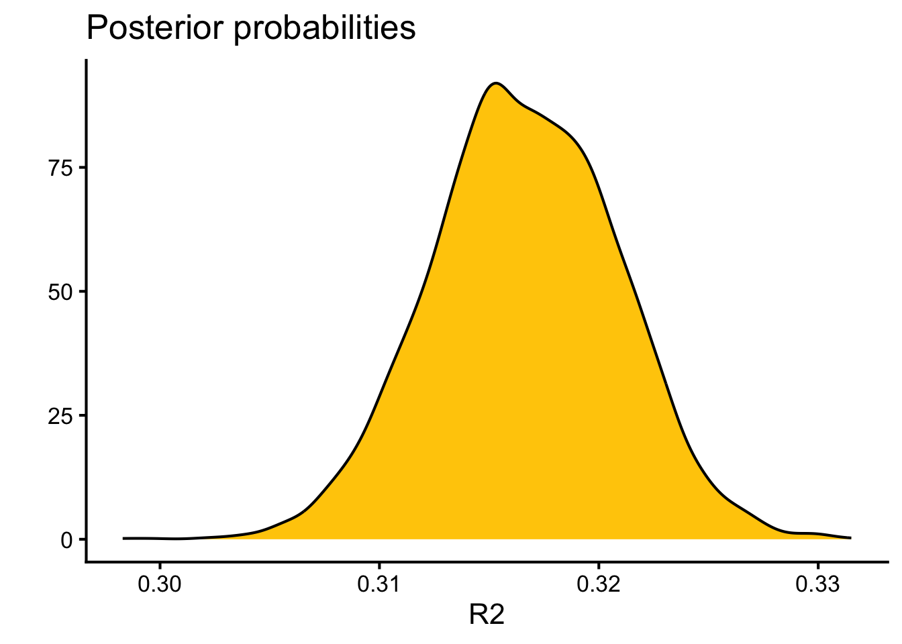
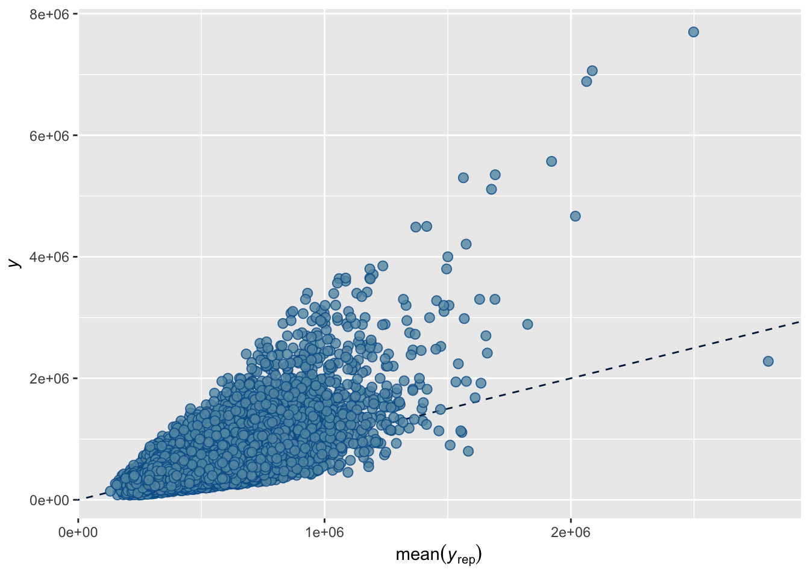

Lets say you want to explore the relationship between two continuous variables.  Here we will cover how to explore, graph, and quantify these relationships.


::: {.cell}

```{.r .cell-code}
# sets maize and blue color scheme
color_scheme <- c("#00274c", "#ffcb05")

library(tidyverse)
library(moderndive)
```
:::


We will use the `houseprices` dataset in the moderndive package.  It has data about a variety of factors about housing.  Here we will explore how the square feet of living space (`sqft_living`) relates to the `price`.

## Visualizing a Relationship

The best first thing to do is to make a plot looking at the two variables.  Here we will use ggplot, defining the x and y axis aesthetics, and adding both a linear and smoothed line (geom)


::: {.cell}

```{.r .cell-code}
library(ggplot2)
ggplot(house_prices,
       aes(y=price,x=sqft_living)) +
  geom_point(alpha=0.1) + #transparency of the points
  geom_smooth(method="loess",color=color_scheme[2]) + #smoothed line
  geom_smooth(method="lm",color=color_scheme[1]) + #linear relationship
  theme_classic(base_size=16) #classic theme, and increasing the font size
```

::: {.cell-output-display}
{width=672}
:::
:::


This appears to be an approximately linear relationship (blue line), though the smooth best fit curve (maize line) suggests it might be nonlinear and slightly upward sloping.  For now lets focus on describing the linear relationship, we will come back to a non-linear relationship in [Non-Linear Relationships](#non_linear).

## Describing the Linear Relationship

In general there are two components to a relationship

1. The slope estimate and its error, in this example how much does price increase per square foot of living space
2. The linearity ($R^2$), or how much of the price is explained by square feet of living space.

In both cases this can be solved with a linear model, and the results visualized with the `tidy` and `glance` functions from the `broom` package


::: {.cell}

```{.r .cell-code}
lm.1 <- lm(price~sqft_living,data=house_prices)
library(broom) #for glance/tidy
library(knitr) #for kable
tidy(lm.1) %>% kable(caption="Estimates for the price/square foot relationship")
```

::: {.cell-output-display}


Table: Estimates for the price/square foot relationship

|term        |    estimate|   std.error|  statistic| p.value|
|:-----------|-----------:|-----------:|----------:|-------:|
|(Intercept) | -43580.7431| 4402.689690|  -9.898663|       0|
|sqft_living |    280.6236|    1.936399| 144.920356|       0|


:::

```{.r .cell-code}
glance(lm.1) %>% kable(caption="Model fit for the price/square food relationship")
```

::: {.cell-output-display}


Table: Model fit for the price/square food relationship

| r.squared| adj.r.squared|    sigma| statistic| p.value| df|    logLik|      AIC|      BIC|     deviance| df.residual|  nobs|
|---------:|-------------:|--------:|---------:|-------:|--:|---------:|--------:|--------:|------------:|-----------:|-----:|
| 0.4928532|     0.4928298| 261452.9|  21001.91|       0|  1| -300267.3| 600540.6| 600564.5| 1.477276e+15|       21611| 21613|


:::
:::


As you can see from these tables, we estimate that the price increases by \$280.6235679 $\pm$ 1.9363986 per square foot of living space.  This is a highly significant relationship (p=0).  The $R^2$ for this model is estimated at 0.4928532.

### Testing the Assumptions of the Model

For a linear model there are four assumptions

* **Linearity**: The relationship between the predictor (x) and the outcome (y) is assumed to be linear. This means that for one unit change in the predictor, there is a constant change in the response.
* **Independence**: The residuals (error terms) are assumed to be independent of each other. This means we cannot predict the size of a residual from another residual or from the value of a predictor variable.
* **Homoscedasticity**: The residuals are assumed to have constant variance across all levels of the predictor variable. This is also known as homogeneity of variance.
* **Normality**: The residuals are assumed to be normally distributed. While perfect normality is not required, it suggests that the model is doing a good job of predicting the response.

These can be generated in base r or using the `lindia` package.  I'll show code for both, but we will focus on the four main diagnostic plots in base R.


::: {.cell}

```{.r .cell-code}
par(mfrow = c(2, 2))
plot(lm.1)
```

::: {.cell-output-display}
{width=672}
:::

```{.r .cell-code}
#alternatively can use diagnostics in the lindia package
#library(lindia)
#gg_diagnose(lm.1)
```
:::


#### Interpreting these Model Plots

* **Residuals vs. Fitted Plot** This plot helps detect non-linearity, unequal error variances, and outliers.  *Linearity*: The residuals should "bounce randomly" around the horizontal line at y=0. If you see a pattern, it suggests non-linearity.  *Equal Variance*: The vertical spread of residuals should be similar across the plot. A "horizontal band" indicates equal error variances. *Outliers*: Look for any points that stand out from the overall pattern.
* **Normal Q-Q Plot** This plot checks if residuals are normally distributed. *Normal Distribution*: Points should fall approximately along the diagonal line. Significant deviations suggest non-normality. *Tails*: Pay attention to deviations at the ends of the line, which indicate issues with the tails of the distribution.
* **Scale-Location Plot** This plot checks the assumption of equal variance (homoscedasticity). *Equal Variance*: Look for a horizontal line with randomly spread points. Any patterns or funneling suggest heteroscedasticity.
* **Residuals vs. Leverage Plot** This plot helps identify influential observations. *Influential Points*: Look for any points falling outside Cook's distance (usually marked by dashed lines). These are considered influential observations. *Leverage*: Points far to the right have high leverage, meaning they have a strong influence on the model coefficients.

My interpretation is that there are several issues with our model fit.  First from the residuals vs fitted plot, I see a cone-shape of points rather than a slug shape.  This means that as the price increases the error is worse.  Similarly the scale-location plot has an upward slope indicating the same thing. This suggests unequal variance across the estimates or *heteroscedasticity*.  In terms of normality, the Q-Q plot shows points lifting off the line, so this suggests these data are not *normally distributed*.  This can be confirmed by a Shapiro-Wilk test of either covariate or the model fit residuals:


::: {.cell}

```{.r .cell-code}
#note shapiro tests require 5000 or less values, so i randomly sampled
bind_rows(
sample(house_prices$price,5000,replace=F) %>% shapiro.test %>% tidy() %>% mutate(input="prices"), 
sample(house_prices$sqft_living,5000,replace=F) %>% shapiro.test %>% tidy() %>% mutate(input="sqft_living"), 
sample(residuals(lm.1),5000,replace=F) %>% shapiro.test %>% tidy() %>% mutate(input="redisuals")) %>% relocate(input) %>%
  kable(caption="Shapiro-Wilk Tests for Variables and Residuals",digits=c(0,3,99))
```

::: {.cell-output-display}


Table: Shapiro-Wilk Tests for Variables and Residuals

|input       | statistic|      p.value|method                      |
|:-----------|---------:|------------:|:---------------------------|
|prices      |     0.668| 1.591593e-71|Shapiro-Wilk normality test |
|sqft_living |     0.923| 7.073408e-45|Shapiro-Wilk normality test |
|redisuals   |     0.837| 9.880667e-58|Shapiro-Wilk normality test |


:::
:::


#### What to Do if Assumptions are Not Met

* **Linearity**.  Apply a non-linear transformation to the predictor or response variable (*e.g.*, log, square root, or polynomial terms).  Add interaction terms or higher-order terms (*e.g.*, quadratic) to the model to account for non-linear relationships.  Alternatively use a generalized additive model (GAM) or other non-linear modeling techniques.  See [non-linear relationships](#non_linear) for more details on these approaches.
* **Independence**  Check for omitted variables that might explain the correlation and include them in the model.  For time-series data, use models like ARIMA or include lagged variables to account for autocorrelation.  If independence is violated due to clustering or grouping, consider using mixed-effects models or hierarchical models.
* **Homoscedasticity (Constant Variance)**  Apply a log transformation or other variance-stabilizing transformations to the response variable.  Use weighted least squares (WLS) regression, which assigns weights inversely proportional to the variance of residuals.  Consider robust regression methods, such as those implemented in the robustbase package (lmrob).
* **Normality of Residuals**  Apply transformations (*e.g.*, log, square root) to the response variable if it is skewed.  Use non-parametric regression methods that do not assume normality, such as quantile regression.  If normality is violated due to outliers, investigate and either remove or down-weight their influence using robust regression techniques like least trimmed squares or MM-estimators.

## Bayesian Approach

Lets say you want to take a Bayesian approach to this question, and dispense with null hypothesis significance testing (see [here for an introduction](https://bridgeslab.github.io/Lab-Documents/Experimental%20Policies/bayesian-analyses.html)).  In this approach you would set a prior probablity, indexing what you would expect from this relationship then use a MCMC sampling method to estimate the $\beta$ coefficient and $R^2$ along with confidence intervals.  You can then derive a Bayes Factor and Posterior Probability of some hypothesis.  We will use the `brms` package for this.

For our prior probability, I have a general sense of this relationship.  I could assign an uninformative flat prior (meaning the $\beta$ coefficient can be any value) but I did a quick AI query and came up with a plausible global estimate of \$1663/sq ft with a standard deviation of \$602.  Im also setting the family to Student's *t* distribution which is more robust to outliers due to its heavier tails (normal or gaussian distribution of residualsis the default).


::: {.cell}

```{.r .cell-code}
library(brms)
housing.priors <- prior(normal(1663,602), class=b, coef=sqft_living)
brm.1 <- brm(price~sqft_living,
                  data=house_prices,
                  prior = housing.priors,
                  family = student(),
                  sample_prior = TRUE)
```
:::


In summary, this is what we did:


::: {.cell}

```{.r .cell-code}
prior_summary(brm.1) %>% kable(caption="Prior summary for effects of square feet of living space on price")
```

::: {.cell-output-display}


Table: Prior summary for effects of square feet of living space on price

|prior                        |class     |coef        |group |resp |dpar |nlpar |lb |ub |tag |source  |
|:----------------------------|:---------|:-----------|:-----|:----|:----|:-----|:--|:--|:---|:-------|
|                             |b         |            |      |     |     |      |   |   |    |default |
|normal(1663, 602)            |b         |sqft_living |      |     |     |      |   |   |    |user    |
|student_t(3, 450000, 222390) |Intercept |            |      |     |     |      |   |   |    |default |
|gamma(2, 0.1)                |nu        |            |      |     |     |      |1  |   |    |default |
|student_t(3, 0, 222390)      |sigma     |            |      |     |     |      |0  |   |    |default |


:::

```{.r .cell-code}
library(broom.mixed)
tidy(brm.1) %>% kable(caption="Summary of model fit for price vs square feet of living space")
```

::: {.cell-output-display}


Table: Summary of model fit for price vs square feet of living space

|effect   |component |group    |term                           |    estimate|    std.error|    conf.low|   conf.high|
|:--------|:---------|:--------|:------------------------------|-----------:|------------:|-----------:|-----------:|
|fixed    |cond      |NA       |(Intercept)                    |  78528.3965| 3.333290e+03|  72067.2054|  85107.0555|
|fixed    |cond      |NA       |sqft_living                    |    201.1642| 1.661884e+00|    197.9176|    204.3408|
|fixed    |cond      |NA       |sigma                          | 145391.3712| 1.199778e+03| 143037.7072| 147670.2147|
|ran_pars |cond      |Residual |sd__Observation                |   1666.5511| 5.991218e+02|    504.0056|   2846.3785|
|ran_pars |cond      |Residual |prior_sigma__NA.NA.prior_sigma | 242774.5665| 3.279991e+05|   7270.0050| 919500.8346|


:::

```{.r .cell-code}
plot(brm.1)
```

::: {.cell-output-display}
{width=672}
:::

```{.r .cell-code}
hypothesis(brm.1, "sqft_living>0") # hypothesis testing for a positive relationship
```

::: {.cell-output .cell-output-stdout}

```
Hypothesis Tests for class b:
         Hypothesis Estimate Est.Error CI.Lower CI.Upper Evid.Ratio Post.Prob
1 (sqft_living) > 0   201.16      1.66   198.45    203.8        Inf         1
  Star
1    *
---
'CI': 90%-CI for one-sided and 95%-CI for two-sided hypotheses.
'*': For one-sided hypotheses, the posterior probability exceeds 95%;
for two-sided hypotheses, the value tested against lies outside the 95%-CI.
Posterior probabilities of point hypotheses assume equal prior probabilities.
```


:::

```{.r .cell-code}
hypothesis(brm.1, "sqft_living=1663") # hypothesis testing that my prior is correct
```

::: {.cell-output .cell-output-stdout}

```
Hypothesis Tests for class b:
                Hypothesis Estimate Est.Error CI.Lower CI.Upper Evid.Ratio
1 (sqft_living)-(1663) = 0 -1461.84      1.66 -1465.08 -1458.66          0
  Post.Prob Star
1         0    *
---
'CI': 90%-CI for one-sided and 95%-CI for two-sided hypotheses.
'*': For one-sided hypotheses, the posterior probability exceeds 95%;
for two-sided hypotheses, the value tested against lies outside the 95%-CI.
Posterior probabilities of point hypotheses assume equal prior probabilities.
```


:::

```{.r .cell-code}
as_draws_df(brm.1) %>%
  ggplot(aes(x=b_sqft_living)) +
  geom_density(fill=color_scheme[2]) +
  #geom_vline(xintercept=0,color=color_scheme[2],lty=2) +
  labs(y="",
       x="Living Space (square feet)",
       title="Posterior probabilities") +
  theme_classic(base_size=16)
```

::: {.cell-output-display}
{width=672}
:::
:::


This gives me an estimate of \$201.16415 $\pm$ 1.6618838, compared to the linear model approach which estimated 280.6235679 $\pm$ 1.9363986 per square foot of living space, so very similar results. We also get a very similar value for $R^2$


::: {.cell}

```{.r .cell-code}
kable(bayes_R2(brm.1),caption="Estimates for R2 between price and square feet of living space")
```

::: {.cell-output-display}


Table: Estimates for R2 between price and square feet of living space

|   |  Estimate| Est.Error|      Q2.5|     Q97.5|
|:--|---------:|---------:|---------:|---------:|
|R2 | 0.3166025| 0.0042288| 0.3083265| 0.3246707|


:::

```{.r .cell-code}
r2.probs <- bayes_R2(brm.1, summary=F) #summary false is to get the posterior probabilities
ggplot(data=r2.probs, aes(x=R2)) +
  geom_density(fill=color_scheme[2]) +
  #geom_vline(xintercept=0,color=color_scheme[1],lty=2) +
  labs(y="",
       x="R2",
       title="Posterior probabilities") +
  #lims(x=c(0,1)) +
  theme_classic(base_size=16)
```

::: {.cell-output-display}
{width=672}
:::
:::


This approach has several advantages, including allowing for more robust handling of outliers and heteroscedasticity (due to using the Student's *t* distribution).  This allows for more robust posterior predictions.  This is probably why the estimates of the relationship are somewhat attenuated (because there are several influential high price/high square foot data points).

The linearity concerns may still remain in this approach.  We can evaluate this with a posterior probability check.  It shows again that when plotting the observed ($y$) and the predicted ($y_{rep}$) values, they tend to lift off the line as $y$ increases, so the relationship is nonlinear and slightly exponential in nature.


::: {.cell}

```{.r .cell-code}
pp_check(brm.1, type = "scatter_avg")
```

::: {.cell-output-display}
{width=672}
:::

```{.r .cell-code}
pp_check(brm.1, type = "dens_overlay")
```

::: {.cell-output-display}
{width=672}
:::
:::


## Evaluating and Modifying Models for Non-Linear Relationships {#non_linear}

If your model diagnostics suggest a non-linear relationship (for example the residuals vs fitted plot shows a curve rather than random scatter), you can consider several approaches to address this:

- Perform a transformation on one of the predictors or the response variable (*e.g.*, log, square root, polynomial terms).  You should do this if you have some prior knowledge of the relationship.  This has the advantage of easier interpretability if the model is simple.  An example if this kind of approach is `model_poly <- lm(y ~ x + I(x^2), data = df)` where you model a quadratic relationship between `x` and `y`.
- Use a spline fitting or GAM to model a nonlinear predictor.  This can be useful if the relationship is smooth but more complex than you can capture with polynomial terms.  This has the advantage of flexibility, but can be harder to interpret.  An example if this kind of model is `model_spline <- lm(y ~ ns(x, df = 4), data = df)` where `ns` is a natural spline with 4 degrees of freedom.  This means you can have up to 3 bends in the curve.

If you see evidence of non-linearity test these approaches and re-run the residuals vs fitted plots to see if linearity has improved.  You can also compare models using AIC or BIC to see if the more complex model is justified.

## Session Information

This script used [perplexity.ai](https://perplexity.ai) to help with its design and interpretation.


::: {.cell}

```{.r .cell-code}
sessionInfo()
```

::: {.cell-output .cell-output-stdout}

```
R version 4.5.1 (2025-06-13)
Platform: aarch64-apple-darwin20
Running under: macOS Sequoia 15.6.1

Matrix products: default
BLAS:   /Library/Frameworks/R.framework/Versions/4.5-arm64/Resources/lib/libRblas.0.dylib 
LAPACK: /Library/Frameworks/R.framework/Versions/4.5-arm64/Resources/lib/libRlapack.dylib;  LAPACK version 3.12.1

locale:
[1] en_US.UTF-8/en_US.UTF-8/en_US.UTF-8/C/en_US.UTF-8/en_US.UTF-8

time zone: America/Detroit
tzcode source: internal

attached base packages:
[1] stats     graphics  grDevices utils     datasets  methods   base     

other attached packages:
 [1] broom.mixed_0.2.9.6 brms_2.23.0         Rcpp_1.1.0         
 [4] knitr_1.50          broom_1.0.10        moderndive_0.7.0   
 [7] lubridate_1.9.4     forcats_1.0.0       stringr_1.5.2      
[10] dplyr_1.1.4         purrr_1.1.0         readr_2.1.5        
[13] tidyr_1.3.1         tibble_3.3.0        ggplot2_4.0.0      
[16] tidyverse_2.0.0    

loaded via a namespace (and not attached):
 [1] tidyselect_1.2.1      farver_2.1.2          loo_2.8.0            
 [4] S7_0.2.0              fastmap_1.2.0         TH.data_1.1-4        
 [7] tensorA_0.36.2.1      janitor_2.2.1         digest_0.6.37        
[10] timechange_0.3.0      estimability_1.5.1    lifecycle_1.0.4      
[13] StanHeaders_2.32.10   processx_3.8.6        survival_3.8-3       
[16] magrittr_2.0.4        posterior_1.6.1       compiler_4.5.1       
[19] rlang_1.1.6           tools_4.5.1           yaml_2.3.10          
[22] labeling_0.4.3        bridgesampling_1.1-2  pkgbuild_1.4.8       
[25] plyr_1.8.9            RColorBrewer_1.1-3    abind_1.4-8          
[28] multcomp_1.4-28       withr_3.0.2           grid_4.5.1           
[31] stats4_4.5.1          future_1.67.0         inline_0.3.21        
[34] globals_0.18.0        emmeans_1.11.2-8      scales_1.4.0         
[37] MASS_7.3-65           cli_3.6.5             mvtnorm_1.3-3        
[40] rmarkdown_2.29        generics_0.1.4        RcppParallel_5.1.11-1
[43] rstudioapi_0.17.1     reshape2_1.4.4        tzdb_0.5.0           
[46] rstan_2.32.7          operator.tools_1.6.3  splines_4.5.1        
[49] bayesplot_1.14.0      parallel_4.5.1        infer_1.0.9          
[52] matrixStats_1.5.0     vctrs_0.6.5           Matrix_1.7-4         
[55] sandwich_3.1-1        jsonlite_2.0.0        callr_3.7.6          
[58] hms_1.1.3             listenv_0.9.1         parallelly_1.45.1    
[61] glue_1.8.0            ps_1.9.1              codetools_0.2-20     
[64] distributional_0.5.0  stringi_1.8.7         gtable_0.3.6         
[67] QuickJSR_1.8.0        furrr_0.3.1           pillar_1.11.0        
[70] htmltools_0.5.8.1     Brobdingnag_1.2-9     R6_2.6.1             
[73] formula.tools_1.7.1   evaluate_1.0.5        lattice_0.22-7       
[76] backports_1.5.0       snakecase_0.11.1      rstantools_2.5.0     
[79] gridExtra_2.3         coda_0.19-4.1         nlme_3.1-168         
[82] checkmate_2.3.3       mgcv_1.9-3            xfun_0.53            
[85] zoo_1.8-14            pkgconfig_2.0.3      
```


:::
:::
