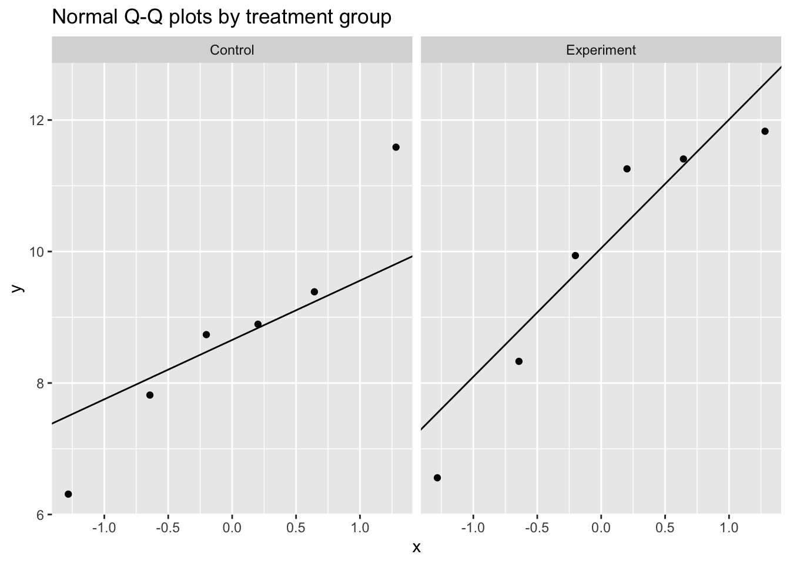
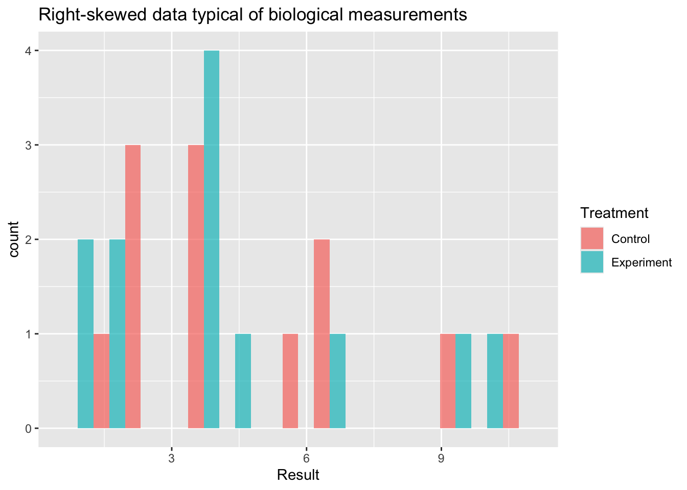

::: {.cell}

```{.r .cell-code}
library(tidyverse)
library(broom)
library(knitr)
library(pwr)
library(car)
library(MASS)
```
:::


# General Statistical Methods

There are several important concepts that we adhere to in our group. These involve design considerations, execution considerations and analysis concerns. The standard for our field is null hypothesis significance testing, which means that we are generally comparing our data to a null hypothesis, generating an **effect size** and a **p-value**. As a general rule, we report both of these both within our scripts and in our publications.

We generally use an $\alpha$ of $p<0.05$ to determine significance. This threshold is a convention, not a bright line — p-values should be interpreted on a continuum alongside effect sizes and confidence intervals, not as a binary pass/fail.

An alternative to null hypothesis significance testing is the Bayesian approach, described in more detail in [this document](https://bridgeslab.github.io/Lab-Documents/Experimental%20Policies/bayesian-analyses.html). For comparing more than two groups, or for factorial designs with multiple predictors, see the [ANOVA tutorial](https://bridgeslab.github.io/Lab-Documents/Experimental%20Policies/anova-example.html).

# Experimental Design

Where possible, perform a power analysis before an experiment to determine the appropriate sample size. To do this you need:

- The **effect size** you hope to detect, expressed as Cohen's *d* = (expected difference) / (standard deviation). Keep a log of standard deviations from past measurements so you can estimate this.
- The desired **false positive rate** ($\alpha$, normally 0.05 — the Type I error rate).
- The desired **power** (normally 0.8 — the probability of detecting the effect when it is real; equivalently, 1 minus the Type II error rate).

We use the R package **pwr** [@pwr] for power calculations.

## Pairwise Comparisons


::: {.cell}

```{.r .cell-code}
false.negative.rate <- 0.05
statistical.power   <- 0.8
sd                  <- 3.5   # estimated from prior measurements
difference          <- 3     # minimum difference you want to detect
cohens.d            <- difference / sd  # standardised effect size

power.result <- pwr.t.test(
  d         = cohens.d,
  sig.level = false.negative.rate,
  power     = statistical.power
)

tibble(
  `Cohen's d`       = round(cohens.d, 2),
  `n per group`     = ceiling(power.result$n),
  `Alpha`           = false.negative.rate,
  `Power`           = statistical.power
) |>
  kable(caption = "Power analysis for a two-sample t-test")
```

::: {.cell-output-display}


Table: Power analysis for a two-sample t-test

| Cohen's d| n per group| Alpha| Power|
|---------:|-----------:|-----:|-----:|
|      0.86|          23|  0.05|   0.8|


:::
:::


To detect a difference of at least 3 units with a standard deviation of 3.5 (Cohen's *d* = 0.86) you need at least **23** observations per group.

## Correlations


::: {.cell}

```{.r .cell-code}
correlation.coefficient <- 0.6

cor.power.result <- pwr.r.test(
  r         = correlation.coefficient,
  sig.level = false.negative.rate,
  power     = statistical.power
)

tibble(
  `r`           = correlation.coefficient,
  `R-squared`   = round(correlation.coefficient^2, 2),
  `n`           = ceiling(cor.power.result$n),
  `Alpha`       = false.negative.rate,
  `Power`       = statistical.power
) |>
  kable(caption = "Power analysis for a correlation")
```

::: {.cell-output-display}


Table: Power analysis for a correlation

|   r| R-squared|  n| Alpha| Power|
|---:|---------:|--:|-----:|-----:|
| 0.6|      0.36| 19|  0.05|   0.8|


:::
:::


To detect a correlation of at least *r* = 0.6 (R² = 0.36) you need at least **19** observations.

# Pairwise Testing

If you have exactly two groups to compare, use a pairwise test. The most common choice is a *t*-test.

## Always Use Welch's *t*-Test

There are two common variants of the *t*-test: Student's (assumes equal variances between groups) and Welch's (does not). A common workflow is to pre-test for equal variances with Levene's test and then choose between them based on the result. **This pre-test approach should be avoided** because it conditions the final inference on the outcome of a prior test, which inflates Type I error rates [@delacre2017].

The practical solution is to **generally always use Welch's *t*-test by default**. When variances happen to be equal, Welch's performs nearly identically to Student's. When they are not, Welch's is correct and Student's is not. There is no meaningful downside to using Welch's by default [@delacre2017].


::: {.cell}

```{.r .cell-code}
set.seed(1265)
test.data <- tibble(
  Treatment = c(rep("Experiment", 6), rep("Control", 6)),
  Result    = rnorm(n = 12, mean = 10, sd = 3)
) |>
  mutate(Treatment = factor(Treatment, levels = c("Control", "Experiment")))

kable(test.data, digits = 2, caption = "Example data for pairwise tests")
```

::: {.cell-output-display}


Table: Example data for pairwise tests

|Treatment  | Result|
|:----------|------:|
|Experiment |  11.26|
|Experiment |   8.33|
|Experiment |   9.94|
|Experiment |  11.83|
|Experiment |   6.56|
|Experiment |  11.41|
|Control    |   8.89|
|Control    |  11.59|
|Control    |   9.39|
|Control    |   8.74|
|Control    |   6.31|
|Control    |   7.82|


:::
:::


::: {.cell}

```{.r .cell-code}
t.test(Result ~ Treatment, data = test.data, var.equal = FALSE) |>
  tidy() |>
  kable(digits = 3, caption = "Welch's t-test (recommended default for two-group comparisons)")
```

::: {.cell-output-display}


Table: Welch's t-test (recommended default for two-group comparisons)

| estimate| estimate1| estimate2| statistic| p.value| parameter| conf.low| conf.high|method                  |alternative |
|--------:|---------:|---------:|---------:|-------:|---------:|--------:|---------:|:-----------------------|:-----------|
|   -1.098|     8.788|     9.887|    -0.992|   0.345|     9.725|   -3.574|     1.378|Welch Two Sample t-test |two.sided   |


:::
:::


`var.equal = FALSE` is R's default, so `t.test(Result ~ Treatment, data = test.data)` gives the same result.

## Assessing Normality

The *t*-test assumes the within-group observations are approximately normally distributed. Rather than using a Shapiro-Wilk test as a gate to decide which test to run — a pre-testing approach with the same inferential problems described above — assess normality through:

- **Visual inspection**: Q-Q plots and histograms are more informative than formal tests, especially at small n.
- **Subject-matter knowledge**: Does the data-generating process suggest a particular distribution? Concentrations, fold changes, and enzyme activities are often log-normally distributed by the nature of the biological mechanism. Knowing this is more reliable than any hypothesis test.


::: {.cell}

```{.r .cell-code}
ggplot(test.data, aes(sample = Result)) +
  stat_qq() +
  stat_qq_line() +
  facet_wrap(~ Treatment) +
  labs(title = "Normal Q-Q plots by treatment group")
```

::: {.cell-output-display}
{width=672}
:::
:::


::: {.cell}

```{.r .cell-code}
test.data |>
  group_by(Treatment) |>
  summarise(
    W       = shapiro.test(Result)$statistic,
    p.value = shapiro.test(Result)$p.value,
    .groups = "drop"
  ) |>
  kable(digits = 3, caption = "Shapiro-Wilk test by group (visual check preferred; see text)")
```

::: {.cell-output-display}


Table: Shapiro-Wilk test by group (visual check preferred; see text)

|Treatment  |     W| p.value|
|:----------|-----:|-------:|
|Control    | 0.968|   0.880|
|Experiment | 0.889|   0.314|


:::
:::


With n = 6 per group the Shapiro-Wilk test has very low power and will almost never reject normality regardless of the true distribution. A non-significant result provides little assurance of normality.

# When Normality is Doubtful

If visual inspection or subject-matter knowledge suggests the normality assumption is untenable, there are three main options. The right choice depends on the nature of the data and what scientific question you are asking.


::: {.cell}

```{.r .cell-code}
set.seed(42)
skewed.data <- tibble(
  Treatment = rep(c("Control", "Experiment"), each = 12),
  Result    = c(rlnorm(12, meanlog = 1.0, sdlog = 0.6),
                rlnorm(12, meanlog = 1.5, sdlog = 0.6))
) |>
  mutate(Treatment = factor(Treatment, levels = c("Control", "Experiment")))

ggplot(skewed.data, aes(x = Result, fill = Treatment)) +
  geom_histogram(bins = 15, position = "dodge", alpha = 0.7) +
  labs(title = "Right-skewed data typical of biological measurements")
```

::: {.cell-output-display}
{width=672}
:::
:::


## Option 1: Log Transformation

**When to use:** Data are strictly positive and right-skewed, arising from a multiplicative biological process — concentrations, fold changes, enzyme activities, hormone levels. These are often log-normally distributed.

**What it tests:** A *t*-test on the log scale tests whether the *ratio* of geometric means differs from 1. This is often the more natural question for biological data (e.g. "is treatment 2-fold higher than control?").

**Limitation:** Only valid for strictly positive data. Back-transform the estimate and confidence interval by exponentiating to report a fold-change on the original scale.


::: {.cell}

```{.r .cell-code}
skewed.data |>
  mutate(log_Result = log(Result)) |>
  (\(d) t.test(log_Result ~ Treatment, data = d, var.equal = FALSE))() |>
  tidy() |>
  kable(digits = 3,
        caption = "Welch's t-test on log-transformed data (estimate is log fold-change; exponentiate for ratio)")
```

::: {.cell-output-display}


Table: Welch's t-test on log-transformed data (estimate is log fold-change; exponentiate for ratio)

| estimate| estimate1| estimate2| statistic| p.value| parameter| conf.low| conf.high|method                  |alternative |
|--------:|---------:|---------:|---------:|-------:|---------:|--------:|---------:|:-----------------------|:-----------|
|    0.267|     1.453|     1.186|     0.963|   0.347|     19.79|   -0.311|     0.845|Welch Two Sample t-test |two.sided   |


:::
:::


## Option 2: GLM with an Appropriate Distribution Family

**When to use:** The data-generating process clearly implies a specific non-normal distribution, or log-transformation does not adequately stabilise the variance. This is the most principled approach because the variance structure is explicitly modelled rather than assumed away by transformation.

| Data type | Family | Typical example |
|---|---|---|
| Positive continuous, right-skewed | `Gamma(link = "log")` | Metabolite concentrations, assay readouts |
| Non-negative integers, low counts | `poisson` | Colony counts (if not overdispersed) |
| Non-negative integers, overdispersed | negative binomial | RNA-seq counts, cell counts |
| Proportions bounded 0–1 | `binomial` or `quasibinomial` | Percent positive cells, survival fractions |

**How to interpret:** Coefficients from a log-link GLM are on the log scale. Exponentiate (`exp(estimate)`) to express the result as a ratio of means on the original scale.


::: {.cell}

```{.r .cell-code}
glm(Result ~ Treatment, data = skewed.data,
    family = Gamma(link = "log")) |>
  tidy() |>
  kable(digits = 3,
        caption = "Gamma GLM for positive continuous data (coefficients on log scale)")
```

::: {.cell-output-display}


Table: Gamma GLM for positive continuous data (coefficients on log scale)

|term                | estimate| std.error| statistic| p.value|
|:-------------------|--------:|---------:|---------:|-------:|
|(Intercept)         |    1.596|     0.186|     8.604|   0.000|
|TreatmentExperiment |   -0.156|     0.262|    -0.594|   0.559|


:::
:::


::: {.cell}

```{.r .cell-code}
count.data <- tibble(
  Treatment = rep(c("Control", "Experiment"), each = 12),
  counts    = c(rnbinom(12, mu = 10, size = 2),
                rnbinom(12, mu = 25, size = 2))
) |>
  mutate(Treatment = factor(Treatment, levels = c("Control", "Experiment")))

glm.nb(counts ~ Treatment, data = count.data) |>
  tidy() |>
  kable(digits = 3,
        caption = "Negative binomial GLM for overdispersed count data (coefficients on log scale)")
```

::: {.cell-output-display}


Table: Negative binomial GLM for overdispersed count data (coefficients on log scale)

|term                | estimate| std.error| statistic| p.value|
|:-------------------|--------:|---------:|---------:|-------:|
|(Intercept)         |    2.037|     0.239|     8.523|       0|
|TreatmentExperiment |    1.259|     0.326|     3.859|       0|


:::
:::


## Option 3: Wilcoxon Rank-Sum Test

**When to use:** The data are ordinal, the *median* is genuinely the quantity of scientific interest, or severe outliers that cannot be removed are distorting the mean. Also a reasonable fallback when no distributional assumption is defensible.

**Important distinction:** The Wilcoxon rank-sum test does not test for a difference in means — it tests for a *location shift* (whether one distribution tends to produce larger values than the other). If your scientific question concerns means, switching to Wilcoxon changes the question you are answering, not just the test you are using. Be explicit about this when reporting.

**Limitation:** Less powerful than parametric tests when the parametric assumptions hold, and does not extend naturally to factorial designs.


::: {.cell}

```{.r .cell-code}
wilcox.test(Result ~ Treatment, data = skewed.data) |>
  tidy() |>
  kable(digits = 3,
        caption = "Wilcoxon rank-sum test (tests location shift, not difference in means)")
```

::: {.cell-output-display}


Table: Wilcoxon rank-sum test (tests location shift, not difference in means)

| statistic| p.value|method                       |alternative |
|---------:|-------:|:----------------------------|:-----------|
|        80|   0.671|Wilcoxon rank sum exact test |two.sided   |


:::
:::


## Choosing Between Options

| Situation | Recommended approach |
|---|---|
| Positive, right-skewed, multiplicative process | Log-transform then Welch's *t*-test |
| Continuous positive, variance proportional to mean | Gamma GLM |
| Count data (RNA-seq, cell counts, colonies) | Negative binomial or Poisson GLM |
| Proportion or binary outcome | Binomial GLM |
| Ordinal data, or median is the target estimand | Wilcoxon rank-sum |
| Severe outliers, no distributional assumption defensible | Wilcoxon rank-sum |

# Corrections for Multiple Comparisons

When testing multiple hypotheses simultaneously, the probability of at least one false positive increases with the number of tests. This is illustrated well by the [XKCD comic on significance](https://xkcd.com/882/).

Any conceptually coherent set of comparisons must be corrected for multiple testing. We use the Benjamini-Hochberg (BH) false discovery rate method [@Benjamini1995], which controls the expected proportion of false positives among the rejected tests. It is less conservative than Bonferroni correction and better suited to the correlated p-values typical in biological experiments.

The critical principle is to define the complete set of tests *before* applying the correction:


::: {.cell}

```{.r .cell-code}
p.values <- c(0.023, 0.043, 0.056, 0.421, 0.012)

tibble(
  test           = paste("Comparison", seq_along(p.values)),
  p.value        = p.values,
  p.adj.BH       = p.adjust(p.values, method = "BH"),
  p.adj.Bonf     = p.adjust(p.values, method = "bonferroni")
) |>
  kable(digits = 3,
        caption = "Raw p-values and two common corrections (BH = Benjamini-Hochberg; Bonf = Bonferroni)")
```

::: {.cell-output-display}


Table: Raw p-values and two common corrections (BH = Benjamini-Hochberg; Bonf = Bonferroni)

|test         | p.value| p.adj.BH| p.adj.Bonf|
|:------------|-------:|--------:|----------:|
|Comparison 1 |   0.023|    0.057|      0.115|
|Comparison 2 |   0.043|    0.070|      0.215|
|Comparison 3 |   0.056|    0.070|      0.280|
|Comparison 4 |   0.421|    0.421|      1.000|
|Comparison 5 |   0.012|    0.057|      0.060|


:::
:::


For adjusting across many outcomes in a factorial design (e.g. multiple proteins or genes), see the Multiple Testing section of the [ANOVA tutorial](https://bridgeslab.github.io/Lab-Documents/Experimental%20Policies/anova-example.html).

# References

::: {#refs}
:::

# Session Information


::: {.cell}
::: {.cell-output .cell-output-stdout}

```
R version 4.5.3 (2026-03-11)
Platform: aarch64-apple-darwin20
Running under: macOS Tahoe 26.4.1

Matrix products: default
BLAS:   /Library/Frameworks/R.framework/Versions/4.5-arm64/Resources/lib/libRblas.0.dylib 
LAPACK: /Library/Frameworks/R.framework/Versions/4.5-arm64/Resources/lib/libRlapack.dylib;  LAPACK version 3.12.1

locale:
[1] en_US.UTF-8/en_US.UTF-8/en_US.UTF-8/C/en_US.UTF-8/en_US.UTF-8

time zone: America/Detroit
tzcode source: internal

attached base packages:
[1] stats     graphics  grDevices utils     datasets  methods   base     

other attached packages:
 [1] MASS_7.3-65     car_3.1-3       carData_3.0-5   pwr_1.3-0      
 [5] knitr_1.51      broom_1.0.11    lubridate_1.9.4 forcats_1.0.1  
 [9] stringr_1.6.0   dplyr_1.1.4     purrr_1.2.1     readr_2.1.6    
[13] tidyr_1.3.2     tibble_3.3.1    ggplot2_4.0.1   tidyverse_2.0.0

loaded via a namespace (and not attached):
 [1] generics_0.1.4     stringi_1.8.7      hms_1.1.4          digest_0.6.39     
 [5] magrittr_2.0.4     evaluate_1.0.5     grid_4.5.3         timechange_0.3.0  
 [9] RColorBrewer_1.1-3 fastmap_1.2.0      jsonlite_2.0.0     backports_1.5.0   
[13] Formula_1.2-5      scales_1.4.0       abind_1.4-8        cli_3.6.5         
[17] rlang_1.1.7        withr_3.0.2        yaml_2.3.12        otel_0.2.0        
[21] tools_4.5.3        tzdb_0.5.0         vctrs_0.6.5        R6_2.6.1          
[25] lifecycle_1.0.5    htmlwidgets_1.6.4  pkgconfig_2.0.3    pillar_1.11.1     
[29] gtable_0.3.6       glue_1.8.0         xfun_0.55          tidyselect_1.2.1  
[33] rstudioapi_0.17.1  dichromat_2.0-0.1  farver_2.1.2       htmltools_0.5.9   
[37] labeling_0.4.3     rmarkdown_2.30     compiler_4.5.3     S7_0.2.1          
```


:::
:::

